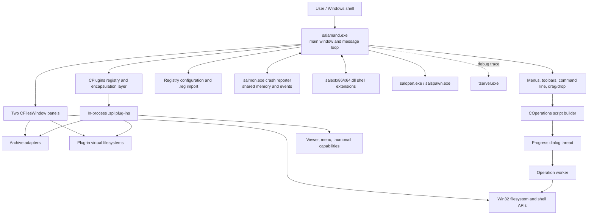
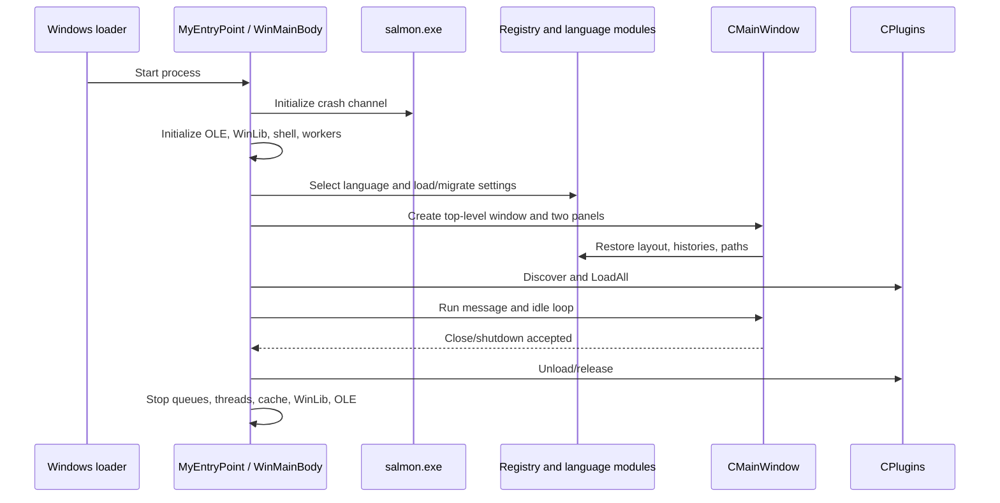
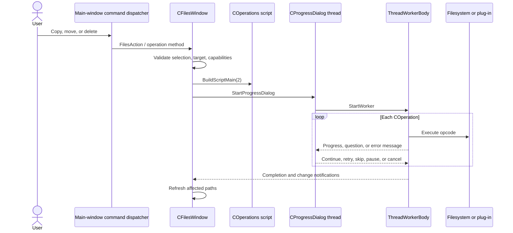

# Open Salamander Technical Architecture

## Document status and scope

This document describes the architecture present in repository commit `ab8a3e827ed7f58eebf3c95bc5c88141f12a69a9` on branch `main` (reviewed 2026-08-09). It is an implementation guide, not a target-state redesign. Statements are based on the solution graph, headers, entry points, core implementation files, plug-in SDK, build workflows, installer, and executable-level UI tests.

The primary system is Open Salamander, a two-panel Windows file manager. It is written as a native Win32 C/C++ application without MFC, Qt, or another UI framework. The code uses a substantial internal framework, a versioned in-process plug-in SDK, worker threads, helper executables, shell extensions, registry-backed configuration, and resource DLLs.

## Architectural summary

The most accurate high-level classification is a **Win32 modular monolith with a microkernel-style plug-in architecture**:

- `salamand.exe` owns the main message loop, two file panels, command routing, configuration, core disk operations, caches, and extension orchestration.
- In-process `.spl` plug-ins add archive, viewer, menu, thumbnail, and virtual-filesystem capabilities through abstract SDK interfaces in `src/plugins/shared`.
- Auxiliary processes and DLLs isolate specific operating-system integration concerns: crash capture, process launching, shell integration, tracing, translation, and self-extraction.
- Modules are grouped into cohesive translation-unit families, but they share large objects and global runtime state. The apparent UI/business/service/data layers are organizational rather than strict dependency boundaries.
- Control flow is message-driven. The UI thread owns most window and panel state; worker and cache threads synchronize through Win32 events, critical sections, and `WM_USER_*` messages.
- File operations use a two-stage **plan then execute** pipeline: panel code builds a `COperations` script of opcodes, and a worker interprets that script while a progress-dialog thread coordinates the user interaction.

## Verified repository snapshot

- Main solution: `src/vcxproj/salamand.sln`.
- Main executable project: `src/vcxproj/salamand.vcxproj`.
- Solution scale: 93 Visual C++ projects; roughly 958 `.cpp`, 1,134 `.h`, and 212 `.c` files in the repository.
- Shipped architectures: Win32 and x64 are represented in property sheets and the solution; the current installer workflow produces x64.
- Local project toolset: v145; hosted workflows override it with v143.
- UI test project: `tests/FileManager.UiTests`, targeting .NET 8 Windows with NUnit and FlaUI/UIA3.
- Configuration store: primarily versioned keys under `HKEY_CURRENT_USER`, with optional `config.reg` import from the executable directory or roaming AppData.
- Localization: the host and plug-ins load `.slg` language resource modules; resources and command identifiers are central to UI composition and automation.

## Architecture map

## Architectural boundaries at a glance

| Boundary | Primary types/files | Responsibility |
|---|---|---|
| Process bootstrap | `src/app_entry.cpp`, `src/app_globals.cpp`, `src/salmoncl.cpp` | Crash reporter startup, OLE/WinLib initialization, language and configuration discovery, subsystem startup, main loop, teardown |
| UI shell | `src/mainwnd.h`, `src/mainwnd_*.cpp` | Top-level window, active-panel ownership, layout, menus/toolbars, command routing, idle work, shutdown |
| Panel model/controller | `src/fileswnd.h`, `src/fileswindow_*.cpp` | Disk/archive/plug-in-FS navigation, listings, selection, sorting, filtering, item actions, refresh |
| Panel view/input | `src/filesbox.h`, `src/filesbox_*.cpp` | Owner-drawn virtual list, columns, keyboard/mouse interaction |
| Operation planning/execution | `src/worker.h`, `src/fileswindow_operations.cpp`, `src/fileswindow_delete.cpp`, `src/operations_core.cpp`, `src/async_copy.cpp` | Build opcode scripts, queue operations, execute filesystem changes, progress and cancellation |
| Plug-in host | `src/plugins.h`, `src/plugins_*.cpp` | Discovery, version negotiation, loading, interface encapsulation, menus, archive and filesystem adapters |
| Plug-in contract | `src/plugins/shared/spl_*.h` | ABI-stable abstract interfaces exposed between host and `.spl` modules |
| Archive service surface | `src/zip.h`, `src/zip_*.cpp` | Host services and directory structures supplied to archiver plug-ins |
| Common native framework | `src/common` | Window/dialog base classes, arrays, strings, handles, memory, trace, messages, regex, graphics helpers |
| Persistent settings | `src/cfgdlg.h`, `src/mainwnd_config.cpp`, `src/reglib`, plug-in `LoadConfiguration`/`SaveConfiguration` | Versioned host and plug-in settings, import, migration, debounced save |
| Background services | `src/cache.cpp`, `src/snooper.cpp`, `src/iconpool.*`, viewer/find queues | Temporary-file cache, directory monitoring, icon/thumbnail work, modeless window tracking |
| Auxiliary binaries | `src/salmon`, `src/salopen`, `src/salspawn`, `src/shellext`, `src/tserver`, `src/translator`, `src/sfx7zip` | Crash handling, process/shell integration, diagnostics, localization tooling, self-extraction |

## 1. Build, packaging, and process topology

### 1.1 Build organization

`src/vcxproj/salamand.sln` is the authoritative Visual Studio solution. It assembles the main executable, language resources, plug-ins, helper processes, shell extensions, third-party wrappers, and installer-support projects. This is a source-level modular monolith rather than one C++ project per architectural layer: most application subsystems compile into `salamand.exe`, while plug-ins and special OS integrations have their own binaries.

The common MSBuild policy is defined in `src/vcxproj/sal_base.props`:

- C++ compilation uses precompiled headers, parallel compilation (`/MP`), and the source/common/dependency include trees.
- `WINVER` and `_WIN32_WINNT` are set to Windows 7 (`0x0601`) for compatibility.
- Debug builds enable tracing and handle tracking; Release builds enable optimization and link-time code generation.
- Win32 and x64 builds are separated by platform-specific property sheets and output directories.
- The checked-in projects currently select toolset `v145`; CI intentionally overrides that to `v143`, so the effective toolset is environment-dependent.

The pull-request workflow compiles Debug Win32 and x64 configurations and treats warnings as errors. The release workflow builds x64 Release, stages the installer tree, and publishes artifacts. FTPS uses Windows SChannel rather than a bundled TLS runtime, so the installer does not download or ship OpenSSL DLLs. Installer scripts collect the executable, helper processes, shell extensions, language modules, toolbar assets, conversion tables, and plug-ins. Consequently, successful compilation of `salamand.exe` alone does not prove a distributable installation is complete.

### 1.2 Runtime processes and load boundaries

| Artifact | Runtime role | Communication boundary |
|---|---|---|
| `salamand.exe` | Main UI, panels, command dispatch, configuration, file-operation planning and execution | Win32 messages, shared process state, worker events |
| `*.spl` | Archive, virtual filesystem, viewer, thumbnail, menu, and tool plug-ins | Loaded in process with `LoadLibrary`; C++ abstract-interface ABI |
| `salmon.exe` | Crash capture, minidump/report generation, later report UI/upload | Named shared memory and synchronization events |
| `salopen.exe` | Isolated association/open helper | Command line and host-created shared state |
| `salspawn.exe` | Console/external command launcher and exit-status handling | Command line, inherited process handles, exit codes |
| `salextx86.dll`, `salextx64.dll` | Explorer context-menu/copy-hook integration | COM plus shared memory/events back to the application |
| `tserver.exe` | Debug trace collection and viewing | Named pipe and multi-process trace protocol |
| `translator.exe` | Language-resource authoring/validation tool | Files on disk; not part of normal application runtime |
| `sfx7zip` | Self-extracting installer support | Packaged executable boundary |

The helper processes are architectural isolation points. Plug-ins, by contrast, are not isolated: they execute in the main process and can affect its address space, UI thread, and stability.

### 1.3 Source tree map

| Path | Contents |
|---|---|
| `src/` | Main executable implementation; large subsystems are split across related translation units |
| `src/common/` | Native window/dialog framework, containers, memory, strings, handle wrappers, tracing, graphics, regular expressions |
| `src/plugins/shared/` | Public plug-in SDK and shared data structures |
| `src/plugins/<name>/` | Individual plug-in implementations and resources |
| `src/reglib/` | Registry/configuration support |
| `src/salmon/`, `src/salopen/`, `src/salspawn/` | Helper executables |
| `src/shellext/` | 32-bit and 64-bit Explorer integrations |
| `src/tserver/`, `src/translator/`, `src/sfx7zip/` | Diagnostics, localization, and packaging tools |
| `src/vcxproj/` | Solution, project files, and shared MSBuild properties |
| `tests/FileManager.UiTests/` | NUnit/FlaUI executable-level UI regression suite |
| `.github/workflows/` | Pull-request and release automation |

## 2. Application lifecycle

### 2.1 Bootstrap and initialization

The executable deliberately installs crash support before the normal C runtime entry. `/ENTRY:MyEntryPoint` is declared in `src/app_entry.cpp:50`; `MyEntryPoint` invokes `SalmonInit()` and then transfers control to `WinMainCRTStartup` (`src/app_entry.cpp:92`). `WinMain` wraps `WinMainBody` in structured exception handling and terminates the process if the protected body escapes unexpectedly (`src/app_entry.cpp:4185`).

`WinMainBody` (`src/app_entry.cpp:2967`) is the composition root. Its order matters:

1. Establish process error mode, thread bookkeeping, globals, OLE, dynamically used system APIs, OS characteristics, and integrity level.
2. Initialize the internal WinLib framework and the cross-process configuration mutex.
3. Discover, validate, and load the selected `.slg` language module as `HLanguage`.
4. Parse command-line options and optional `config.reg` import.
5. Locate/migrate registry configuration and enforce the configured single-instance policy.
6. Initialize shell/common controls and application services: packs, resources, check/find services, menus, disk cache, graphics, viewer support, worker support, icon pool, shell integration, overlays, and associations.
7. Construct `CMainWindow`, which creates the panels and top-level controls during `WM_CREATE`.
8. Load configuration, restore UI state, populate and refresh panels, and apply startup paths/options.
9. Discover/load plug-ins through `CPlugins::LoadAll` (`src/plugins_interface.cpp:3056`).
10. Register the process with the task-list/single-instance service and enter the message loop.

This is an explicit initialization graph rather than dependency-injection composition. Global objects are constructed statically, then activated in a carefully sequenced startup procedure.

### 2.2 Main event loop

The loop in `src/app_entry.cpp:3818` is a conventional Win32 dispatcher with application-specific routing:

- `GetMessage` supplies input and posted work.
- Menu tracking and modeless-dialog routing can consume a message before normal dispatch.
- `TranslateAccelerator`, `TranslateMessage`, and `DispatchMessage` provide keyboard and window-message dispatch.
- `CMainWindow::OnEnterIdle` performs deferred work when the foreground queue becomes idle.
- Commands forwarded by another application instance, delayed plug-in commands, and deferred plug-in unloads are drained at controlled points in the UI loop.

The message queue is therefore both the UI transport and a coordination mechanism between background work, plug-ins, modeless windows, and the main shell.

### 2.3 Shutdown

Shutdown begins in `CMainWindow::HandleShutdown` (`src/mainwnd_shutdown.cpp:96`). It coordinates confirmation, persistence, plug-in and child-window closure, and Windows session-ending rules. Final teardown in `src/app_entry.cpp:4119` waits for dependent windows and stops the safe-wait, viewer, icon, operation, find, check, graphics, and shell subsystems before releasing language resources and OLE.

The dominant lifecycle convention is paired `Initialize`/`Release` or `Create`/`Destroy` calls. Reverse-order teardown is essential because many services hold raw pointers, HWNDs, thread handles, or callbacks into services initialized earlier.

## 3. Native UI framework and command architecture

### 3.1 WinLib object model

The internal framework in `src/common/winlib.h` wraps Win32 without hiding the HWND/message model:

- `CWindowsObject` provides the common object identity and lifetime base.
- `CWindow` represents an attached or newly created HWND.
- `CDialog` adds modal/modeless dialog creation and data transfer.
- `CWindowsManager` maps HWND values to C++ objects.
- `CWindowQueue` tracks sets of modeless windows so owners can enumerate or close them safely.

`CWindow::Create` and `AttachToWindow` register objects with the manager. The shared window procedure resolves the object, attaches it during creation, and dispatches to the virtual `WindowProc` (`src/common/winlib.cpp:242`). On `WM_DESTROY`, it detaches and may delete the wrapper according to its `ObjectOrigin`. This is a thin object façade around native message dispatch, not a retained-mode UI framework.

`CDialog` uses two overridable hooks:

- `Validate(CTransferInfo&)` verifies user input.
- `Transfer(CTransferInfo&)` moves values between dialog controls and application state.

That protocol is used by configuration and operation dialogs and is a concrete Template Method pattern.

### 3.2 Main-window composition

`CMainWindow` (`src/mainwnd.h:373`) owns the shell-level state:

- `LeftPanel`, `RightPanel`, and the currently active panel;
- menu bars, rebar/toolbars, drive bars, directory lines, status lines, and command line;
- histories, associations, viewer masks, and configuration-dialog state;
- detached plug-in filesystems and modeless viewer/find window queues;
- queued change notifications and deferred refresh/configuration flags;
- shutdown, activation, taskbar, and single-instance coordination state.

Its implementation is partitioned by concern even though it remains one large class:

| Translation unit | Main concern |
|---|---|
| `mainwnd_init.cpp` | Construction, window creation, initial layout |
| `mainwnd_messages.cpp` | `WindowProc` and operating-system messages |
| `mainwnd_commands.cpp` | Resource-ID command dispatch and user actions |
| `mainwnd_config.cpp` | Settings load/save/migration |
| `mainwnd_panels.cpp` | Active/other panel coordination |
| `mainwnd_help.cpp` | Help integration |
| `mainwnd_shutdown.cpp` | Close/session-end lifecycle |

During `WM_CREATE`, the main window creates the menu/rebar, both `CFilesWindow` instances, the command line, and toolbars (`src/mainwnd_messages.cpp:714`). `HandleWmCommand` (`src/mainwnd_commands.cpp:2125`) is the central dispatcher for menu, toolbar, accelerator, and control notifications. It translates stable resource/control IDs into method calls on the main window or active panel.

### 3.3 Panel controller/model

`CFilesWindow` is the principal panel controller. Its base, `CFilesWindowAncestor` (`src/fileswnd.h:475`), carries the current path and source type. `CPanelType` makes the three operating modes explicit:

- `ptDisk`: a normal filesystem directory;
- `ptZIPArchive`: a path inside an archive exposed by an archiver plug-in;
- `ptPluginFS`: a virtual filesystem instance supplied by a plug-in.

The derived class adds presentation and interaction state: columns and view templates, list/status controls, sort/filter settings, quick search, focus and selection, drag-and-drop, history, icon/thumbnail caches, refresh flags, and worker synchronization.

Important navigation and refresh methods include:

| Method | Responsibility |
|---|---|
| `ReadDirectory` (`fileswindow_navigation.cpp:113`) | Enumerate and classify a disk directory |
| `ChangeDir` (`fileswindow_navigation.cpp:2035`) | Full path transition with validation and history behavior |
| `ChangeDirLite` (`fileswindow_navigation.cpp:2622`) | Lighter-weight transition for known/special cases |
| `ChangePathToArchive` (`fileswindow_execute.cpp:1997`) | Replace the panel source with archive contents |
| `ChangePathToPluginFS` (`fileswindow_execute.cpp:2692`) | Attach a plug-in filesystem and open its path |
| `CommonRefresh` (`fileswindow_init.cpp:2322`) | Coordinate a panel refresh while preserving UI state |
| `RefreshDirectory` (`fileswindow_quicksearch.cpp:2252`) | Re-read current source and reconcile selection/focus |
| `RefreshListBox` (`fileswindow_execute.cpp:3522`) | Update the displayed virtual list |
| `Execute` (`fileswindow_execute.cpp:54`) | Open a directory/archive/file according to source type |
| `ViewFile` / `EditFile` (`fileswindow_file_actions.cpp:703`, `:1230`) | Route content to internal, plug-in, associated, or external tools |

### 3.4 Panel view

`CFileListBox` and `CFileListHeader` in `src/filesbox.h` implement the owner-drawn virtual item view. The control reads panel-owned arrays instead of owning duplicate item objects. It supports Brief, Detailed, Icons, Thumbnails, and Tiles modes, plus column resizing, keyboard/mouse navigation, quick search, selection, drag/drop, and custom drawing.

This model/view separation is pragmatic rather than formal: the list box knows about panel state, while the panel owns the item model, selection semantics, and operations.

## 4. Core data structures and ownership

### 4.1 File and directory entries

`CFileData` (`src/plugins/shared/spl_com.h:203`) is the shared file-entry representation used by both the host and plug-ins. It carries the name, extension position, size, attributes, timestamps, and plug-in-specific data. Keeping it in the shared SDK lets archive and filesystem plug-ins populate entries directly, but also makes its layout part of the binary contract.

Panels store directories and files in `CFilesArray` collections. Disk listings allocate names from `CStringArena`, reducing many small allocations and allowing the whole listing's strings to be released together. Archive and plug-in listings may attach a `CPluginDataInterfaceAbstract` implementation to interpret or release per-item data.

`CQuadWord` is the SDK's portable 64-bit integer abstraction for sizes and counters. It appears throughout progress, archive, and file metadata interfaces.

### 4.2 Custom containers and manual ownership

The codebase predates modern C++ ownership idioms and deliberately uses its own containers:

- `TDirectArray<T>` stores objects inline.
- `TIndirectArray<T>` stores and owns pointers.
- specialized arrays add domain-specific search, sorting, or cleanup behavior.
- raw `new`/`delete`, Windows allocation APIs, handles, and explicit release calls express most ownership.

The important reading rule is that type, origin flag, and cleanup path jointly define ownership. A pointer in a collection is not necessarily borrowed merely because it is raw. `CWindow`'s `ObjectOrigin`, plug-in-data release callbacks, disk-cache locks, and `TIndirectArray` deletion behavior are examples of ownership encoded outside the C++ type system.

### 4.3 String and API-boundary conventions

Much of the historical core represents paths and text as narrow strings, generally UTF-8-aware application strings, then calls explicit wide-character wrappers at Windows boundaries. Language text is stored in resource-only `.slg` modules and accessed through the selected `HLanguage`. Code that crosses among application text, Windows UTF-16, archive formats, and remote filesystem encodings must preserve that conversion boundary.

### 4.4 Global state

Subsystem managers such as `Plugins`, `Configuration`, `DiskCache`, `WindowsManager`, `TaskList`, and `MainWindow` are globally reachable. They form an implicit service locator initialized by `WinMainBody`. This makes call sites concise and suits the message-oriented architecture, but dependencies and valid-use windows are established by convention and startup order rather than constructors.

## 5. Main modules and their contracts

### 5.1 File navigation and presentation

The navigation module turns a path plus source kind into a sorted, filtered panel listing. For disk panels it uses Win32 filesystem enumeration. For archives it navigates a plug-in-provided archive directory tree. For virtual filesystems it calls the mounted `CPluginFSInterfaceAbstract`. All three converge on the same file-list control and common focus/selection/status behavior.

Panel-to-panel methods on `CMainWindow` supply operations with the active source and target. This twin-panel contract is foundational: many commands interpret one panel as the selected source and the other as the default destination.

### 5.2 File-operation planner and worker

`src/worker.h` defines an operation instruction set. `COperation` describes one action—copy/move/delete a file, create/move/delete a directory, change attributes, count size, convert content, or preserve directory time. `COperations` is both the instruction list and the shared job state: totals, target capabilities, source/target paths, network characteristics, speed meters, errors, and synchronization.

The high-level panel code plans work before mutating the filesystem:

1. A panel action validates selection, source kind, target path, and plug-in capabilities.
2. `BuildScriptMain` or `BuildScriptMain2` (`src/fileswindow_operations.cpp:1123`, `:514`) walks the selection and emits `COperation` records.
3. `StartProgressDialog` (`src/dialogs_file_ops.cpp:350`) creates the operation UI on a dedicated dialog thread.
4. `CProgressDialog::StartWorker` starts the worker (`src/operations_core.cpp:1366`).
5. `ThreadWorkerBody` (`src/operations_core.cpp:921`) interprets opcodes and invokes `DoCopyFile`, `DoMoveFile`, `DoCreateDir`, `DoDeleteFile`, attribute/conversion, or count-size handlers.
6. Completion updates panels and posts path-change notifications.

`src/async_copy.cpp` contains the lower-level copy engine: synchronous/overlapped decisions, buffer sizing, alternate data streams, compression/encryption/security metadata, overwrite and retry policy, cancellation, and progress updates. A native copy reaches its durable commit point only after the output was opened with write-through where supported, `FlushFileBuffers` and `CloseHandle` both succeed, and the closed destination can be reopened with its file metadata and size verified. An overwrite then uses the write-through replace/rename commit; a cross-volume move may delete its source only after this boundary. Each `COperations` instance owns an interlocked lifecycle (`planned`, `running`, `cancel-requested`, `stopping`, `completed`, or `failed`) and a manual-reset cancellation event. The dialog and worker make idempotent requests and state transitions through this owner; debug builds stop on invalid transitions. `COperationsQueue` tracks disk operation windows and their paused/running state.

#### 5.2.1 Reparse-point operation policy

The operation planner treats every directory reparse point as a hard operation boundary. Copy, move, count, convert, and recursive attribute work do not enumerate a junction, symbolic link, mount point, cloud directory, or unknown directory tag. This prevents a target outside the selected root, a changed target, and an in-tree cycle from becoming part of the script. Reparse files are likewise not opened while planning non-delete work, so a cloud placeholder remains offline rather than being hydrated by an incidental metadata or size read.

Delete uses a separate handle-first path with `FILE_FLAG_OPEN_REPARSE_POINT` and the captured file identity. Directory deletion accepts only the mount-point and symbolic-link tags (a junction is a mount-point tag); an unknown tag fails with `ERROR_REPARSE_TAG_MISMATCH` instead of deleting or resolving its destination. The current conservative copy/move policy skips reparse entries rather than recreating them: preserving a link is a future explicit feature, not a reason to follow its target.

The UI integration suite builds disposable junction topologies with a target outside the selected root, a changed target, and a cycle. It verifies that copying preserves ordinary in-root content without materializing either target, and that deleting a junction deletes only the link. The native regression test also ratchets the no-hydration and unknown-tag rules; provider-owned cloud placeholders and volume mount points require an appropriate host/provider for live end-to-end setup.

#### 5.2.2 Metadata preservation contract

The engine distinguishes three preservation levels. **Required** metadata must pass the operation's durable-copy/identity checks before a cross-volume move can delete its source. **Best effort** metadata is copied or repaired when the target and current privilege allow it; a verified failure is recorded. **Unsupported** metadata is not represented by the target or is not copied by this engine; it is recorded as a known loss. The contract applies to native disk copy and move operations only; archive and virtual-filesystem plug-ins retain their own capability contracts.

| Operation and target | Required | Best effort | Unsupported |
|---|---|---|---|
| Copy to NTFS | Default data stream | Last-write time; displayed attributes when requested; owner/group/DACL when requested and permitted; ADS; NTFS compression/EFS | Creation and last-access times |
| Copy to ReFS | Default data stream | Last-write time; displayed attributes when requested; owner/group/DACL when requested and permitted; ADS | Creation and last-access times; NTFS compression/EFS |
| Copy to FAT/FAT32/exFAT | Default data stream | Last-write time and the supported attribute subset | Creation and last-access times; owner/group/DACL; ADS; NTFS compression/EFS |
| Copy to SMB | Default data stream | Last-write time, attributes, owner/group/DACL, ADS, and compression/EFS subject to server/share policy | Creation and last-access times |
| Same-volume move on NTFS/ReFS/FAT | The same filesystem object is renamed, so its data and supported metadata remain attached to that object | None | None introduced by the move |
| Same-volume move on SMB | Default data stream | All other metadata, subject to server/share rename semantics | None introduced by the engine |
| Cross-volume move | The target must pass the copy durable-commit check before source deletion | The target's corresponding copy row | The target's corresponding copy row |

For a cross-volume move, the worker records planned losses accepted while building the script (for example ADS or ACL loss), plus actual ADS, timestamp, attribute, ACL, and compression/EFS losses. Immediately before every source-file or source-directory deletion it displays any unacknowledged losses. The default **No** retains the source and lets the remaining move continue as a copy; only an explicit **Yes** allows source deletion. The account is held in `CProgressDlgData::MetadataLosses`, so a directory cleanup path cannot bypass a loss already found while copying a child.

##### Security descriptor privilege matrix

Security preservation is best effort on NTFS, ReFS, and SMB, and unsupported on FAT-family targets. The copy engine reads the complete owner/group/DACL descriptor before changing the target. It preserves the DACL protection bit (and therefore whether inheritance is enabled) and compares every explicit ACE after the write; this includes explicit deny ACEs. Inherited ACEs may differ when the target has a different parent, but they must remain inherited rather than becoming new explicit permissions.

| Source/target descriptor and token capability | Owner and group | DACL, inheritance, and explicit allow/deny ACEs | Result under the metadata contract |
|---|---|---|---|
| Descriptor readable; `SeRestorePrivilege` enabled | Apply and then verify | Apply and then verify | Success only after all components verify; otherwise restore the target snapshot and report a security metadata loss. |
| Descriptor readable; no restore privilege; target owner/group already match | Leave unchanged | Apply and then verify | Success only after DACL protection and explicit ACEs verify; a failure restores the prior DACL and reports a security metadata loss. |
| Descriptor readable; no restore privilege; owner or group differs | Do not change | Do not change | Do not take temporary ownership or install a permissive DACL. Report a security metadata loss and use the normal copy-permissions warning. |
| Source or target descriptor inaccessible | Do not change | Do not change | Report a security metadata loss; the normal warning can cancel, retry, or continue the copy without claiming ACL preservation. |
| FAT/FAT32/exFAT target | Unsupported | Unsupported | Record the known loss during planning; a cross-volume move requires the explicit metadata-loss confirmation before source deletion. |

An ACL write is never considered successful merely because `SetNamedSecurityInfoW` returns success. The post-write comparison prevents a partial component update from being represented as preserved. If restoration itself fails, the operation reports that error instead of silently treating the descriptor as copied.

The recycle-bin branch is deliberately different: supported disk deletions can call `SHFileOperationW` with `FO_DELETE`; permanent or unsupported deletions use the native operation script.

### 5.3 Plug-in host and SDK

`CPlugins` is the registry of known plug-ins. `CPluginData` represents one module and its configuration, menu, icon, capability, and load state. Encapsulation classes mediate calls so the host can attach plug-in identity, validate state, normalize error handling, and guard unload behavior.

Loading (`CPluginData::InitDLL`, `src/plugins_loading.cpp:2142`) follows this protocol:

1. Resolve the module path and load the DLL.
2. Obtain `SalamanderPluginEntry`, `SalamanderPluginGetReqVer`, and optional SDK-version exports.
3. Reject incompatible required versions (the current SDK constant is version 103).
4. Create the host-side `CSalamanderPluginEntry` gateway and call the plug-in entry point.
5. Obtain `CPluginInterfaceAbstract`, query capability subinterfaces, load configuration, and invoke `Connect`.
6. Register menus, file masks, archive formats, viewer associations, filesystem names, thumbnails, and icons through `CSalamanderConnectAbstract`.

`CPluginInterfaceAbstract` (`src/plugins/shared/spl_base.h:469`) is the root contract. Capability flags and getters expose optional archive, viewer, menu-extension, filesystem, and thumbnail-loader interfaces. Common callbacks cover configuration, lifecycle events, history clearing, password-manager events, and path changes.

The two largest capability families are:

- Archive (`spl_arc.h`): list an archive; unpack one, selected, or all items; pack; delete entries; approve archive closure; state cache policy.
- Filesystem (`spl_fs.h`): open/close a filesystem; navigate/list paths; expose supported services; view, rename, delete, copy, move, create directories, change attributes, show properties/context menus, search, and convert external/internal path forms.

Plug-ins use host gateway interfaces instead of directly reaching every internal object. These supply general services, GUI helpers, safe file operations, language loading, viewer integration, and filesystem-name registration. The SDK is still a C++ ABI: compiler/runtime compatibility, object lifetime, virtual-table layout, and exception behavior are part of the practical contract.

Representative plug-in families in the solution are:

- archive/compression: 7-Zip, ZIP, TAR, PAK, ARJ, CAB, CHM, FAT, ISO, LHA, MIME, OLE, and RAR readers/writers;
- virtual filesystems: FTP, Network Neighborhood, Folders, Registry Editor, portable devices, and Windows Mobile;
- viewers/analyzers: database, browser, multimedia, PE, image, disk-map, and file-comparison tools;
- utilities: automation, checksum, version check, renamer, and split/combine;
- SDK demonstrations: archive/menu/viewer/sample plug-ins.

### 5.4 Archive integration

The host retains the user-facing archive state while an archiver plug-in supplies format logic. `src/zip.h` and related files define host-side archive directory structures, selection enumeration, extraction targets, cache integration, and progress services. The archive plug-in returns a listing and implements mutations; the panel presents that tree using normal list controls.

Opening a file inside an archive illustrates the boundary: the plug-in unpacks the item through `UnpackOneFile`, the host assigns a temporary path in `CDiskCache`, and the viewer/editor/association layer opens the materialized disk file. Cache ownership records which plug-in must participate in cleanup.

### 5.5 Viewing, editing, and execution

`CFilesWindow::Execute` first classifies the focused item. Directories change panel path; archive files may enter archive mode; other files follow associations or execution templates. `ViewFile` resolves configured viewer masks and `Plugins.FindViewEdit` to choose among the internal viewer, a plug-in viewer, an external viewer command, or a Windows association. `EditFile` similarly resolves the configured editor.

For archive and virtual-filesystem sources, content is normally materialized into `CDiskCache`. Cache locks keep it alive while a viewer/editor is active, and change tracking can upload or copy modified content back when the source capability supports it.

### 5.6 Configuration and registry persistence

`CConfiguration` (`src/cfgdlg.h:176`) is the central settings aggregate. `CMainWindow::LoadConfig` and `SaveConfig` (`src/mainwnd_config.cpp`) serialize application state to the registry, apply defaults, and migrate older `ConfigVersion` layouts. Plug-ins receive private registry subkeys and use their own `LoadConfiguration`/`SaveConfiguration` callbacks.

Persistence has several coordination mechanisms:

- `CLoadSaveToRegistryMutex` serializes configuration work across processes.
- `CRegistryWorkerThread` performs registry work while the UI side continues pumping messages.
- `ScheduleConfigSave` debounces ordinary changes by 250 ms.
- `SaveConfig` prevents reentrant saves and remembers when another save is requested during the current one.
- `SaveConfig` writes the full snapshot to the inactive one of two `Configuration Generations`, verifies a checksum and completion marker, flushes it, then switches the root's `Active Generation` DWORD. That one value write is the commit point; the previous verified generation remains available until the next successful startup.
- Startup validates the selected generation before exposing it to the existing host and plug-in readers, and falls back to the other verified generation if the selected one is incomplete or has a checksum mismatch. Legacy direct trees remain readable and are migrated on their next save.
- Each transactional generation has a schema version. Startup runs the idempotent metadata migration, then validates required sections, supported configuration/schema versions, value ranges, and cross-field invariants before `LoadConfig` applies the profile. A rejected active generation falls back to the other verified profile; if neither profile is valid, the application uses defaults and reports the recovery to the user.
- The legacy `Save In Progress` and backup `Copy Is OK` markers remain only for recognising/recovering pre-transactional configuration trees.
- a `config.reg` beside the application can seed/import configuration.

Configuration is therefore a versioned state snapshot, not a collection of independent repositories. Changes to the aggregate, UI transfer code, defaults, migration, and persistence keys must remain synchronized.

### 5.7 Change detection and refresh

Disk panels use directory-snooper threads based on `FindFirstChangeNotification`. Shell notifications and explicit operation notifications also enter the application. `CMainWindow::PostChangeOnPathNotification` queues/coalesces changes and fans them out to both disk panels and interested plug-in filesystems.

`BeginStopRefresh`/`EndStopRefresh` form a nesting protocol that suspends disruptive refreshes during compound operations. Deferred changes are processed after the outermost scope ends. Debug builds retain call-stack information to detect mismatched pairs. Refresh tries to preserve focus, selection, scroll position, and quick-search state while reconciling the new listing.

### 5.8 Background and support services

| Service | Role and coordination |
|---|---|
| `CDiskCache` (`src/cache.cpp`) | Allocates temporary materialized files, tracks locks and plug-in cleanup ownership, removes stale data at shutdown |
| Directory snoopers (`src/snooper.cpp`) | Wait for filesystem change events and post refresh work to the UI |
| `CIconThreadPool` / panel icon thread | Extract icons and thumbnails away from direct paint handling; posts results back to panels |
| Find/viewer queues | Track modeless windows and make owner shutdown deterministic |
| `TaskList` control thread | Implements single-instance forwarding and shell copy/paste integration; protects command parameters with a critical section |
| Registry worker | Proxies potentially blocking registry operations while UI messages remain serviced |
| Progress-dialog and operation workers | Execute long file actions and marshal questions/progress/cancellation through messages and events |
| `Salmon` client | Signals a separate crash process and waits for dump/report handoff |

## 6. Representative application flows

### 6.1 Startup path restoration

1. Bootstrap loads the selected language and locates the registry configuration.
2. `CMainWindow` and both panels are created before saved panel state is applied.
3. `LoadConfig` restores layout, view modes, histories, filters, and left/right paths.
4. Each panel reads its source and populates `CFilesArray` collections.
5. Command-line paths and switches override applicable restored state.
6. Plug-ins load; archive and virtual-filesystem registrations become available.
7. Panels are shown/refreshed and the message loop begins.

### 6.2 Disk directory navigation

1. Keyboard, mouse, history, drive bar, or command line requests a path.
2. `ChangeDir` normalizes and validates it, handling unavailable media and error UI.
3. `ReadDirectory` enumerates entries into directory/file arrays and string storage.
4. Filtering and sort order are applied; parent entry and special items are synthesized where required.
5. `RefreshListBox` updates the virtual view and status line.
6. History, focus, selection, icon work, snooper registration, and dependent toolbars are updated.

### 6.3 Open archive and extract an item

1. `Execute` recognizes an archive through registered masks/format handlers.
2. The selected plug-in lists the archive into a host archive tree.
3. `ChangePathToArchive` switches panel state from disk to archive and renders the relevant directory.
4. Executing a contained file asks the plug-in to unpack it to a disk-cache path.
5. Viewer/editor/association dispatch opens the cached file.
6. Cache locks and viewer lifecycle decide when the temporary file can be removed or propagated back.

### 6.4 Open and navigate a virtual filesystem

1. A drive-bar item, path, menu command, or plug-in action selects a registered filesystem name.
2. The host calls the plug-in's `OpenFS` and wraps the resulting interface in host encapsulation.
3. `ChangePathToPluginFS` asks the filesystem to normalize/change path and list entries.
4. The panel renders returned `CFileData` items and consults supported-service flags to enable commands.
5. File actions delegate to the filesystem when supported; operations requiring a local file use cache/materialization helpers.
6. Leaving the filesystem either closes it or places it in the detached-filesystem collection when the contract permits reuse.

### 6.5 Copy or move between panels

1. The active panel supplies selected source items; the opposite panel supplies the default target.
2. The command determines the source/target combination: disk, archive, or plug-in filesystem.
3. Capability and path checks select native scripting or the relevant plug-in transfer method.
4. Native transfers build a `COperations` script and start progress/worker threads.
5. The worker processes items, marshaling overwrite, retry, skip, pause, cancellation, and error decisions to the progress UI.
6. Speed and byte/item totals are protected by `StatusCS` and displayed by the progress dialog.
7. A native copy reports success only after its durable commit point; affected paths then receive notifications and visible panels refresh.

### 6.6 Configuration change and persistence

1. A configuration dialog transfers current values into controls.
2. On acceptance, `Validate` checks input and `Transfer` writes the new values to `CConfiguration` or a feature-owned object.
3. The affected subsystem is updated immediately where appropriate.
4. `ScheduleConfigSave` coalesces repeated mutations.
5. The registry worker obtains the cross-process mutex and writes the versioned host snapshot plus plug-in configuration into the inactive generation.
6. The host computes and validates the staged generation's checksum, writes its completion marker, flushes it, and atomically changes `Active Generation`. An interrupted stage never becomes visible; the prior generation is retained until a successful startup.

### 6.7 Second-instance command forwarding

1. Startup parses paths/options before deciding whether this process should remain alive.
2. `CheckOnlyOneInstance` locates the existing instance through the task-list/shared-state mechanism.
3. Parsed command parameters are copied into synchronized shared/control-thread state.
4. The running instance is notified and activates itself as appropriate.
5. Its UI thread consumes the forwarded request during an idle-safe point and calls `ApplyCommandLineParams`.
6. The new process exits without constructing a second full application instance.

### 6.8 Crash capture

1. `MyEntryPoint` establishes the Salmon channel before entering the CRT/application body.
2. The main process and `salmon.exe` share process metadata, language selection, mappings, and events.
3. A fatal failure signals the crash event; the external process can inspect the failed process even when its UI/runtime state is compromised.
4. Salmon produces a minidump/report and later presents or uploads it according to configuration.
5. The protected `WinMain` boundary terminates the damaged process after handoff.

## 7. Concurrency and synchronization model

The UI thread owns nearly all HWND manipulation, panel state transitions, menus, and plug-in commands. Background threads perform waits, enumeration-adjacent work, registry I/O, icons/thumbnails, crash monitoring, and file operations. Communication is primarily by posted/sent Windows messages, Win32 events, queues, and critical sections.

Important concurrency invariants are:

- An HWND and its wrapper may disappear after a posted message; queues and shutdown flags must validate lifetime.
- Panel listing arrays must not be replaced while paint/input/icon work still references them.
- Worker threads do not directly run arbitrary UI logic; questions and progress are marshaled to a dialog/window.
- `COperations::StatusCS` guards mutable progress measurements shared with the dialog.
- Task-list command parameters are protected until the UI thread consumes them.
- Refresh suspension is reference-counted/nested; each begin must have a matching end.
- Plug-in unload is deferred until active callbacks, windows, filesystems, and plug-in-owned data are no longer in use.
- Shutdown stops producers before releasing the global objects and handles they use.

The design does not use a single scheduler or futures abstraction. Each subsystem owns its thread/event/message protocol, so callers must learn that protocol before changing lifecycle or error handling.

## 8. Architectural and implementation patterns

| Pattern | Where it appears | Consequence |
|---|---|---|
| Modular monolith | Most shell, UI, panel, config, and operation code in `salamand.exe` | Simple in-process calls; broad compile/runtime coupling |
| Microkernel / plug-in architecture | `CPlugins`, `.spl` modules, SDK interfaces | Features can be added by capability; ABI and in-process trust must be maintained |
| Capability interfaces | Archive/viewer/menu/FS/thumbnail flags and getters | Host enables commands based on supported services rather than plug-in type names |
| Façade/adapter | Plug-in encapsulation and host gateway classes | Central place for identity, validation, compatibility, and unload checks |
| Message-driven architecture | Window procedures, posted refresh/progress/control messages | Natural Win32 integration; payload and object lifetime are protocol obligations |
| Command dispatcher | `WM_COMMAND` and `CMainWindow::HandleWmCommand` | Menu/toolbar/accelerator IDs converge on one routing surface |
| Strategy/state by source kind | `CPanelType`, archive and plug-in-FS branches | One panel UI presents several backing stores; methods must handle all modes |
| Operation script + interpreter | `COperations` and `ThreadWorkerBody` | Planning is separated from execution and progress can be calculated up front |
| Template Method | `CWindow::WindowProc`, `CDialog::Validate/Transfer` | Native lifecycle remains centralized while derived windows customize behavior |
| Observer/event notification | Shell changes, snooper events, path notifications | Multiple panels/filesystems can react to mutations without direct caller knowledge |
| Producer/consumer | Operation, icon, registry, and trace queues | Blocking work leaves the UI thread but requires explicit shutdown/backpressure rules |
| Service locator / global managers | `Plugins`, `Configuration`, `DiskCache`, `TaskList`, `MainWindow` | Convenient access with implicit dependency and initialization contracts |
| Coarse aggregate state | `CConfiguration`, `CFilesWindow`, `COperations` | Closely related behavior is colocated, but safe changes often cross many fields/methods |
| Resource-based localization | Executable resources and `.slg` language modules | UI text is externalized; resource IDs and translated modules are compatibility assets |
| Version negotiation | plug-in required/current SDK versions, config versions | Old data/modules can be rejected or migrated explicitly |
| Explicit lifecycle pairs | init/release, attach/detach, lock/unlock, begin/end refresh | Deterministic native cleanup, with correctness enforced mostly by convention |
| Defensive native diagnostics | `TRACE`, call-stack messages, handle tracking, last-error propagation | Debug builds detect protocol violations without changing Release behavior |

There is no strict Clean Architecture layering: panels call Win32, shell, configuration, and plug-in services directly, while global managers are accessible across translation units. The strongest architectural boundaries are executable/DLL boundaries, SDK interfaces, HWND/message protocols, and the operation-script boundary.

## 9. Error handling, diagnostics, and resilience mechanisms

Most native APIs return `BOOL`, handles, or error codes. The code typically captures `GetLastError`, emits `TRACE`, shows a localized dialog at a user boundary, and selects retry/skip/cancel or an alternate path. Exceptions are not the general control-flow mechanism; the outer SEH boundary exists for crash capture rather than ordinary recovery.

Built-in diagnostic facilities include:

- `TRACE` and `CALL_STACK_MESSAGE` instrumentation;
- Debug handle wrappers and `HANDLES_ENABLE` leak/misuse tracking;
- custom allocation-failure handling and heap diagnostics;
- `tserver.exe` for cross-process trace collection;
- Salmon minidump/report generation;
- configuration in-progress/backup markers;
- worker progress, cancellation, retry, and error-dialog protocols;
- plug-in SDK/version validation before calling capability methods.

The repository's prioritized stability recommendations are documented separately in `refactoring.md`; this document describes the current mechanisms and contracts rather than proposing replacements.

## 10. Testing and verification architecture

The checked-in automated test suite is executable-level rather than native unit-level. `tests/FileManager.UiTests` uses NUnit and FlaUI UIA3 against a real built `salamand.exe`. Tests are non-parallel because they manipulate shared desktop and per-user application state.

The suite covers roughly 118 scenarios in eight families, including:

- main-window startup and basic commands;
- accessibility/control discovery;
- configuration cancel versus commit;
- persistence within the running process and after restart;
- FTP bookmark persistence.
- native create/copy/rename/move/delete commands for files and nested directory trees, including cancelled dialogs and expected failure paths.

Stable command/control IDs are the automation seam. `FILEMANAGER_UI_ISOLATED=1` is required so test launches use an isolated configuration context, and teardown kills only processes launched by the fixture. These tests validate user-visible integration across the native executable, registry persistence, and UI Automation tree.

There are currently no checked-in native unit-test projects for panel algorithms, operation scripts, plug-in ABI contracts, or worker failure paths. CI build coverage and executable UI scenarios are therefore the principal automated safety net; manual and plug-in-specific testing remain important for crash consistency, storage fault injection, and unusual OS integrations.

## 11. Extension and maintenance guides

### 11.1 Adding a main-window command

1. Allocate/reuse the correct resource and accelerator IDs.
2. Add routing in `CMainWindow::HandleWmCommand` or the appropriate control notification path.
3. Put source-specific behavior on `CFilesWindow` when it depends on disk/archive/plug-in-FS state.
4. Update command enable/check state in the relevant menu/toolbar refresh path.
5. Add localized strings/resources to language projects.
6. Add an executable-level scenario when a stable UI Automation seam exists.

Avoid assuming only disk panels: commands exposed in the common shell must either work for all `CPanelType` values or be disabled using capability information.

### 11.2 Adding a configuration option

1. Add the field and default to the appropriate configuration/feature owner.
2. Add load/save registry logic and increment or extend version migration when necessary.
3. Bind the dialog through `CTransferInfo`, including validation.
4. Apply the change to the live subsystem and schedule persistence.
5. Check cancel, accept, current-process behavior, and restart persistence.
6. Decide whether the key belongs to host configuration or a plug-in-private registry subtree.

### 11.3 Adding a background task

1. Define which thread owns input, mutable state, callbacks, and completion.
2. Use a message/event payload with explicit allocation and cleanup responsibility.
3. Marshal HWND/UI changes to the owning UI thread.
4. Add cancellation and a shutdown join/termination protocol.
5. Prevent callbacks after owner destruction and validate posted-message targets.
6. Expose progress/errors without blocking the main message loop.

### 11.4 Adding or changing a plug-in capability

1. Implement the smallest existing SDK interface that represents the feature.
2. Advertise the corresponding capability and supported-service flags.
3. Register masks, menus, filesystem names, viewers, thumbnails, or icons during `Connect`.
4. Honor host ownership and release callbacks for returned data.
5. Keep callbacks on documented threads and avoid retaining host pointers beyond their lifetime.
6. If the SDK must change, use version negotiation and preserve binary layout for old modules or explicitly reject them.
7. Supply and validate the plug-in's language module.

### 11.5 Changing file operations

1. Determine whether the change belongs in planning (`BuildScriptMain*`) or execution (`ThreadWorkerBody`/`Do*`).
2. Preserve aggregate size/item counts and operation flags used by progress UI.
3. Cover cancellation, pause, overwrite, retry, skip, low-space, partial-file, metadata, and cleanup paths.
4. Maintain refresh suppression and final path notifications.
5. Check disk-to-disk and any affected archive/virtual-filesystem delegation paths.
6. Verify source and target semantics for both left/right active-panel orientations.

## 12. Dependency and lifetime rules for maintainers

The following rules are implicit in the current implementation and should be treated as architectural contracts:

1. `WinMainBody` owns subsystem initialization order; do not call a global service before its initializer or after its release.
2. UI objects and HWNDs are UI-thread-owned unless a subsystem explicitly documents a cross-thread message protocol.
3. A panel source is a tagged state. Keep `CPanelType`, archive state, and plug-in-FS state synchronized during transitions.
4. Plug-in interfaces remain valid only while the owning `CPluginData` is loaded and its active references/windows/filesystems are retained.
5. `CFileData` and SDK virtual interfaces are ABI surfaces; field or virtual-method changes require compatibility analysis.
6. File-operation planning owns instruction payloads until transferred to the progress/worker lifecycle; error exits must release partially built scripts.
7. Cached files cannot be removed while viewer/editor/plug-in locks exist.
8. Every refresh-suspension begin, critical-section entry, event/handle acquisition, object attachment, and window-queue registration needs its matching release path.
9. Configuration mutations must account for defaults, migration, dialog transfer, persistence, and restart behavior together.
10. Resource and command IDs are shared contracts among code, menus, dialogs, language modules, and UI automation.

## 13. Practical code-reading index

| Question | Start here |
|---|---|
| How does the process start or stop? | `src/app_entry.cpp`, `src/mainwnd_shutdown.cpp`, `src/salmoncl.cpp` |
| Where is a menu/shortcut command handled? | `src/mainwnd_commands.cpp`, resource/accelerator definitions |
| How does a panel navigate or refresh? | `src/fileswnd.h`, `src/fileswindow_navigation.cpp`, `src/fileswindow_init.cpp` |
| How is the file list drawn and controlled? | `src/filesbox.h`, `src/filesbox_*.cpp` |
| How is a copy/move/delete performed? | `src/fileswindow_operations.cpp`, `src/fileswindow_delete.cpp`, `src/worker.h`, `src/operations_core.cpp`, `src/async_copy.cpp` |
| How is a file viewed or edited? | `src/fileswindow_file_actions.cpp`, viewer code, `src/cache.cpp` |
| How is a plug-in loaded? | `src/plugins_loading.cpp`, `src/plugins_interface.cpp`, `src/plugins/shared/spl_base.h` |
| What can archive plug-ins do? | `src/plugins/shared/spl_arc.h`, `src/zip.h` |
| What can virtual filesystems do? | `src/plugins/shared/spl_fs.h` |
| Where are settings stored? | `src/cfgdlg.h`, `src/mainwnd_config.cpp`, `src/regwork.cpp`, `src/reglib/` |
| How do filesystem changes reach panels? | `src/snooper.cpp`, main-window change-notification methods, panel refresh methods |
| How are native windows wrapped? | `src/common/winlib.h`, `src/common/winlib.cpp` |
| How is shipping verified? | `.github/workflows/`, installer scripts, `tests/FileManager.UiTests/` |

## 14. Architectural summary for change planning

Open Salamander's architecture is optimized around a responsive native twin-panel shell with long-lived compatibility. Its central design decisions are:

- keep the core close to Win32 and its message/handle model;
- present disk directories, archives, and remote/virtual stores through one panel interaction model;
- move extensible formats and tools behind a versioned plug-in SDK;
- plan multi-file mutations as scripts and execute them with progress/error coordination;
- isolate crash reporting and selected shell/process duties in helper binaries;
- persist a versioned registry snapshot and load UI text from language modules;
- use explicit ownership, lifecycle pairs, and message/event synchronization instead of modern C++ framework abstractions.

For maintainers, the most consequential boundaries are not folder names. They are the plug-in ABI, the UI-thread/HWND boundary, the panel's tagged source state, the operation-plan/worker boundary, the configuration snapshot, and the ordered lifecycle rooted in `WinMainBody`. Changes that preserve those contracts can remain local even in large classes; changes that cross them require end-to-end validation across startup, UI, workers, plug-ins, persistence, and shutdown.
