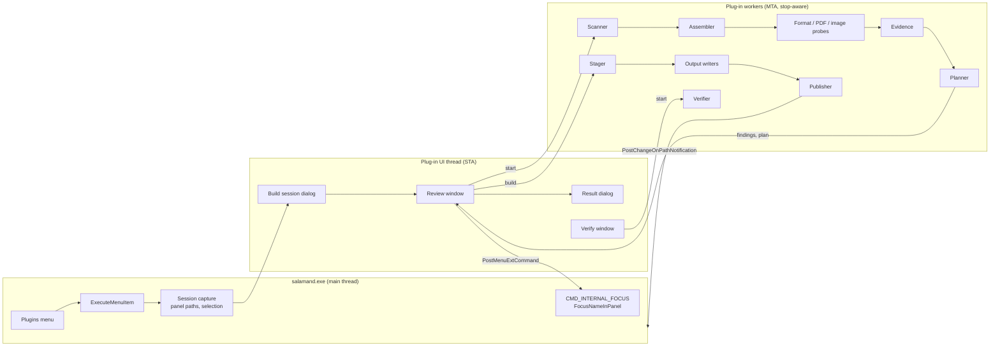
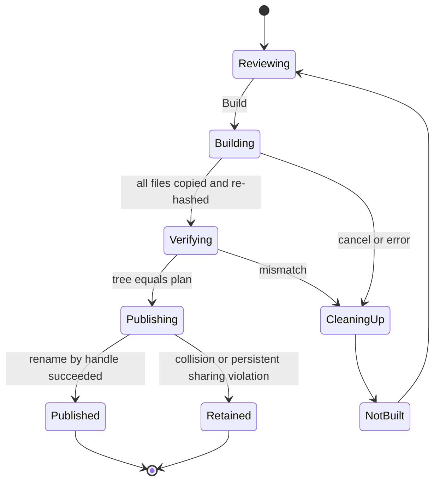

# Delivery Handoff — Implementation Specification

Build and verify a professional delivery package: one pane holds the working material, the other receives a staged delivery package that is assembled, checked, and listed according to a reusable delivery specification.

| Item | Value |
| --- | --- |
| Document | `handoff-spec.md` |
| Status | Ready for implementation (v1) |
| Date | 2026-10-03 |
| Baseline | `main` at `165a2c9` (Open Salamander 6.0 line) |
| Deliverable | New menu-extension plug-in `handoff.spl` (display name **Delivery Handoff**), its language modules, help, tests, CI and documentation updates |
| SDK impact | None. Uses the existing plug-in SDK (`LAST_VERSION_OF_SALAMANDER`); no ABI change |
| Supported OS | The installer floor, Windows 10 1809 (`Installer/setup.iss:38`, `MinVersion=10.0.17763`) and later; Win32 and x64 builds |

## Contents

- [How to use this document](#how-to-use-this-document)
- [Decision record](#decision-record)
- [Part A — Feature overview and user guide](#part-a--feature-overview-and-user-guide)
- [Part B — Implementation task list](#part-b--implementation-task-list)
- [Part C — Normative reference](#part-c--normative-reference)

## How to use this document

- **Part A** explains the feature and how professionals use it. Read it first; it defines the observable behavior.
- **Part B** is the implementation task list. Every `- [ ]` item is a unit of work that an implementer checks off when its acceptance criteria are met. Phases are ordered by dependency; tasks within a phase may run in parallel unless a dependency is stated.
- **Part C** is the normative reference — formats, algorithms, catalogues, UI control maps, and file inventories. Tasks cite it as `→ C.x.y`.
- The keywords MUST, MUST NOT, SHOULD, and MAY follow RFC 2119.
- Repository rules from `AGENTS.md` apply to every task and are not repeated per task:
  - every source change carries a concise nearby comment documenting its intent, invariant, or compatibility constraint;
  - `scripts/runtests.ps1` and the GitHub Actions pipelines stay in parity (toolchain, prerequisites, filters, ordering, skip policy);
  - completion requires a full `scripts/runtests.ps1` run under pipeline conditions, reported with its invocation and result;
  - builds use the Visual Studio 2026 developer environment (MSVC `v145`).
- When an implementation deviates from this document, update the document in the same change and record the reason in [C.13](#c13-risks-and-open-items).

## Decision record

| ID | Decision | Rationale |
| --- | --- | --- |
| D-01 | Implement the feature as an in-process **menu-extension plug-in** `handoff` (`src/plugins/handoff`). | The SDK already exposes everything required (panel paths, selection, focus, refresh notification, configuration persistence, help, language modules, UI-test menu IDs). The feature stays optional, isolated from core coupling, and needs no ABI change. Feasibility evidence: [C.1](#c1-feasibility-and-architecture). |
| D-02 | The delivery specification is **JSON** (`*.handoff.json`), strict RFC 8259 plus ignorable `$comment` members, read by a bounded reader inside the plug-in. | Chosen by the product owner. Diff-friendly, expresses nested rules; no new third-party dependency; bounded parsing suits untrusted, shareable files. |
| D-03 | A package contains **`manifest.json` + `manifest.csv` + `CONTENTS.txt`**. | Chosen by the product owner. Machine verification, spreadsheet review, and a plain client-facing contents list. |
| D-04 | PDF checks are a **bounded structural scan plus page count and page sizes through `Windows.Data.Pdf`**. | Chosen by the product owner. No PDF library to vendor; page-size rules (A1/A3/Letter/ARCH) are central for architects and print production. Validated by spike T0.3. |
| D-05 | v1 authoring is **text + validator + embedded templates**; a GUI rule editor is deferred. | Chosen by the product owner. Keeps the UI scope and test surface bounded. |
| D-06 | Working material is **never modified, moved, or renamed**. Staging is copy-only into a **new** package folder; an existing package is never overwritten. | Delivery must not put work at risk; reproducible revisions (`_R01`, `_R02`). |
| D-07 | Packages are built in a hidden **partial sibling folder**, verified, then **published by a handle-bound directory rename** that refuses to replace an existing entry. | An interrupted or failed build never leaves a half package under the final name; mirrors the repository's durable-commit discipline. |
| D-08 | Hashes are **SHA-256 through Windows CNG** (`BCrypt*`). | No third-party cryptography code; FIPS-validated provider. |
| D-09 | Specification templates are **embedded as `RCDATA` in `handoff.spl`**. | The installer stages only build outputs (`tools/prepare_installer.ps1:118-151`); data files beside the source tree would not ship. |
| D-10 | Client-facing outputs exclude absolute paths, user names, and machine names by default; an internal **build record** is written **beside** the package, not inside it. | Privacy and professional hygiene; full audit trail stays with the producer. |
| D-11 | The processing **engine is host-independent** (Windows SDK + C++ standard library only) and is compiled by the plug-in, by a native test executable, and by a `cl.exe` parser probe. | Deterministic native tests without the host; hosted nightly soak uses plain `cl.exe` like the cmark/bzip2 probes. |
| D-12 | The plug-in UI runs as a **modeless top-level window on a plug-in-owned UI thread**; scanning, probing, and building run on **stop-aware worker threads**. | Panels remain usable during review ("Show in panel"); long work never blocks the host message loop. |

---

# Part A — Feature overview and user guide

## A.1 Summary

Designers, architects, consultants, and production teams repeatedly hand off packages whose requirements are predictable: which documents must be present, how files are named, which formats and image sizes are acceptable, what must not be included, and which supporting assets (fonts, stock images, licences) travel with the deliverables. Today this is assembled by hand — copy, rename, open, check, write a contents list — and errors are common: a missing sheet, a superseded revision, a 72-dpi image, an unlicensed font, `Thumbs.db`, internal drafts.

**Delivery Handoff** turns that routine into one command. The active pane holds the working material; the inactive pane is the staging location. A reusable **delivery specification** describes the package. The plug-in assembles candidates from the working material, flags omissions and violations for review, copies the approved selection into a new package folder with conventional names, verifies every byte, and writes a manifest and contents list. The outcome is concrete: **a package ready for review and delivery**.

The motivating request:

> "Prepare the client delivery: approved PDFs, source artwork, licensed assets, and a contents list."

| Part of the request | Specification construct | What the plug-in checks |
| --- | --- | --- |
| approved PDFs | rule with `role: deliverable`, `formats: ["pdf"]`, `approval`, `select.latestRevision` | approval evidence and/or reviewer confirmation, valid unencrypted PDF, page count/sizes, latest revision only |
| source artwork | rule with `role: source`, formats `ai`, `psd`, `svg`, `eps`, … | content matches extension, raster dimensions, naming |
| licensed assets | rules with `role: asset` and `license.required` | licence sidecar or register entry, expiry, permitted scope; evidence copied with the asset |
| a contents list | `package.outputs` | `CONTENTS.txt`, `manifest.csv`, `manifest.json` with SHA-256 for every file |

## A.2 Users and professional scenarios

| Profession | Typical package | Requirements the specification encodes |
| --- | --- | --- |
| Brand / graphic design studio | Brand handoff: logos, guidelines PDF, fonts, campaign artwork | logo formats (SVG/AI/PNG at exact pixel sizes), font licences, latest guideline version, no working files |
| Architecture / engineering | Drawing issue: sheet PDFs, DWG/IFC models, drawing register, transmittal list | every sheet in the register present, latest revision only, sheet sizes (A1/A3, ARCH D), naming `PRJ-DISC-SHEET-REV` |
| Consultancy | Report delivery: final report PDF, appendices, data files | approved final only, no drafts/comments files, PDF not password-protected |
| Print and production | Print-ready files | page size with tolerance, raster images ≥ 300 dpi, CMYK colour model, no RGB in print folder |

## A.3 Goals and non-goals

Goals:

- **G1** Assemble a delivery package from working material according to a reusable specification, with no manual copying or renaming.
- **G2** Flag omissions (missing required documents or expected items) before anything is staged.
- **G3** Check naming conventions, formats, PDF page constraints, image dimensions/resolution/colour, allowed content, approvals, and licences.
- **G4** Let a reviewer see, include/exclude, approve, and acknowledge before building.
- **G5** Produce a staged package that is complete, byte-verified, and atomically published.
- **G6** Produce a machine-readable manifest and a human-readable contents list.
- **G7** Re-verify a staged package later (before upload or after it was handled by others).
- **G8** Make specifications reusable across projects and shareable across a team.

Non-goals for v1 (candidates for later versions are listed in [C.13](#c13-risks-and-open-items)):

- A graphical specification editor (D-05).
- Sources or targets in archives or plug-in file systems (ZIP, FTP, SFTP, portable devices). Both panes MUST be Windows file-system paths.
- Compressing, uploading, e-mailing, or transmitting the package (users can still use **Files → Pack** on the result).
- Changing content: resizing or converting images, flattening/optimizing PDFs, stripping metadata, embedding fonts.
- PDF/A or PDF/X preflight, font-embedding checks, and inspection of PDF content (annotations, layers, comments).
- Digital signing; multi-user approval workflows.
- Updating an already published package in place (a rebuild creates a new revision folder).

## A.4 Glossary

| Term | Meaning |
| --- | --- |
| Working pane / working root | The active (source) panel and its current Windows path. Working material is read-only to the plug-in. |
| Staging pane / staging location | The inactive (target) panel and its current Windows path. The package folder is created here. |
| Delivery specification (spec) | A `*.handoff.json` file describing variables, package naming, rules, naming policy, allowed content, and outputs ([C.4](#c4-delivery-specification-format-v1)). |
| Rule | One expected kind of content (for example "Approved PDFs"); selects candidates and constrains them. |
| Candidate | A working file selected by a rule. |
| Finding | A diagnostic with severity **error**, **warning**, or **info** and a stable code ([C.6](#c6-findings-catalogue)). |
| Omission | A finding that something required is missing (rule empty, count below minimum, expected item absent). |
| Evidence | Proof of approval or licence: path/name pattern, sidecar file, or register CSV entry. |
| Package | The published folder in the staging location containing the deliverables and outputs. |
| Manifest | `manifest.json` (authoritative) and `manifest.csv` listing every file with SHA-256. |
| Contents list | `CONTENTS.txt`, the client-facing listing. |
| Build record | `<package>.handoff-build.json` beside the package: internal audit trail (source paths, reviewer decisions, spec snapshot). |
| Partial folder | The hidden `.<package>.handoff-<id>.partial` folder in which a package is built before publication. |

## A.5 User guide

### A.5.1 Quick start: "Prepare the client delivery…"

Working material (left pane, `D:\Projects\ACME-Rebrand\`):

```text
ACME-Rebrand\
  .handoff\client-delivery.handoff.json      ← the reusable specification
  Approved\Brand-Guidelines_v3.pdf
  Approved\Brand-Guidelines_v4.pdf
  Approved\Stationery_v2.pdf
  Artwork\Final\Logo\ACME-logo-primary.ai
  Artwork\Final\Logo\ACME-logo-mono.svg
  Artwork\Final\Campaign\Hero.psd
  Artwork\WIP\Hero-explorations.psd          ← not selected by any rule
  Assets\Fonts\Inter-Regular.otf
  Assets\licences.csv                        ← licence register
  Assets\Stock\city-skyline.jpg
  Assets\Stock\city-skyline.licence.pdf      ← licence sidecar
  Thumbs.db
```

Staging location (right pane): `D:\Deliveries\`.

1. Navigate the left pane to `D:\Projects\ACME-Rebrand` and the right pane to `D:\Deliveries`. Keep the left pane active.
2. Choose **Plugins → Delivery Handoff → Build Delivery Package…**.
3. In **Build Delivery Package**, the specification `client-delivery.handoff.json` is preselected because it was found in the working folder's `.handoff` folder. Enter the variables the specification asks for — Client `ACME`, Project `Rebrand`, Revision `R01`. The package name preview shows `ACME-Rebrand_Delivery_2026-10-03_R01`. Choose **Scan…**.
4. **Review Delivery Package** opens while the plug-in scans and inspects candidates:
   - *Approved PDFs*: `Brand-Guidelines_v4.pdf` and `Stationery_v2.pdf` are selected; `Brand-Guidelines_v3.pdf` is shown as *superseded*. The specification requires reviewer confirmation, so both show *Awaiting approval*. Select the rule and choose **Approve all in rule**.
   - *Source artwork*: `Hero.psd` reports error `HO-IMG-013` — its long edge is 1 800 px, the rule requires at least 2 000 px. Replace the file in the working folder, then choose **Re-scan**.
   - *Licensed stock images*: `city-skyline.jpg` (4 000 × 2 667 px, 300 dpi) has licence evidence `city-skyline.licence.pdf`, which will be copied into the package.
   - *Licensed fonts*: `Inter-Regular.otf` matches the register row in `Assets\licences.csv` (licence *OFL-1.1*, scope *Unlimited*).
   - *Not included*: `Artwork\WIP\Hero-explorations.psd` and other unclaimed files are listed for information only; `Thumbs.db` is listed as forbidden content that will never be packaged.
5. When no errors remain, tick **I have reviewed all warnings** (only shown when warnings exist) and choose **Build**. A progress bar shows each file being copied and verified.
6. The result reads **Verified — ready for review**. The right pane refreshes and focuses the new folder:

```text
D:\Deliveries\
  ACME-Rebrand_Delivery_2026-10-03_R01\
    01_Approved_PDFs\ACME-Rebrand_Brand-Guidelines_v4.pdf
    01_Approved_PDFs\ACME-Rebrand_Stationery_v2.pdf
    02_Source_Artwork\Logo\ACME-logo-primary.ai
    02_Source_Artwork\Logo\ACME-logo-mono.svg
    02_Source_Artwork\Campaign\Hero.psd
    03_Licensed_Assets\Fonts\Inter-Regular.otf
    03_Licensed_Assets\Images\city-skyline.jpg
    03_Licensed_Assets\Licences\city-skyline.licence.pdf
    CONTENTS.txt
    manifest.csv
    manifest.json
  ACME-Rebrand_Delivery_2026-10-03_R01.handoff-build.json   ← internal record, not for the client
```

7. Before uploading the folder (or after someone else touched it), switch to the staging pane (Tab), focus the package folder, and choose **Plugins → Delivery Handoff → Verify Delivery Package…** (verification acts on the active pane).

### A.5.2 Commands

All commands are in **Plugins → Delivery Handoff**. No default hot keys are assigned (users can assign them in Plugins Manager → Keyboard Shortcuts).

| Command | Enabled when | What it does |
| --- | --- | --- |
| **Build Delivery Package…** | Both panes show Windows paths | Opens the build session for the active pane (working) and inactive pane (staging). |
| **Verify Delivery Package…** | The active pane shows a Windows path | Verifies the focused folder if it contains a manifest, otherwise the current folder; otherwise asks for a folder. |
| **Validate Specification…** | Always | Validates the focused `*.handoff.json` or a chosen file; lists errors with line and column. |
| **New Specification from Template…** | The active pane shows a Windows path | Writes a starter specification from an embedded template (default location `<current folder>\.handoff\`). |
| **Configuration** (Plugins Manager) | Always | Specification library folder, recent specifications, review and staging preferences. |

### A.5.3 Where specifications come from

The **Specification** list in the build dialog is populated in this order (duplicates by full path removed):

1. `*.handoff.json` in the nearest `.handoff` folder found by walking from the working root up to its volume root.
2. `*.handoff.json` directly in the configured **specification library** folder (for example a shared team folder).
3. Recently used specifications (up to 10) that still exist.
4. **Browse…** for any other file.

A specification is plain UTF-8 JSON. Edit it in any editor (for example focus it and press F4 in Open Salamander), then use **Validate**. **New Specification from Template…** creates a starting point: *Design studio handoff*, *Architecture drawing issue*, *Consultancy report delivery*, and *Client delivery (example)* — the last one implements the quick-start request.

### A.5.4 The review screen

- **Rules** list: each rule with role, required flag, selected/expected counts, and status (OK, Errors, Warnings, Missing).
- **Items** list for the selected rule (or all rules): include check box, source path, target path, size, details (pages, page size, pixel size, dpi), approval, licence, status.
- **Findings** list: severity, code, item, message. Double-click or **Show in panel** focuses the source file in the working pane.
- Filters: *All items*, *Problems only*, *Omissions*, *Not included*, *Superseded*.
- Actions: **Approve**, **Approve all in rule**, **Show in panel**, **Override…** (only when the specification allows reviewer overrides), **Re-scan**, **Save report…**.
- **Build** is disabled while errors exist (unless overridden as permitted) or while warnings are unacknowledged.
- Excluding a candidate is recorded; excluding all candidates of a required rule produces an omission error.

### A.5.5 What a build produces

- A new package folder named by the specification's `package.folderName` template in the staging location.
- Every included file copied (never moved) with its target name and folder; last-write time preserved by default; only the default data stream is copied.
- `manifest.json`, `manifest.csv`, `CONTENTS.txt` in the package root (names configurable by the specification; `manifest.json` is mandatory).
- The build record beside the package (unless the specification sets `package.buildRecord` to `"none"`).
- A summary: **Verified — ready for review**, or **Verified with warnings** (listed), or **Not built** (reason; the working material and staging location are unchanged).

### A.5.6 Verifying a package

Verification recomputes SHA-256 for every listed file and reports missing, modified, and unlisted files. When the specification used for the build can be found (build record beside the package, library folder, recent list, or **Browse…**), its content, naming, format, PDF, image, and count rules are re-checked against the package. A specification whose hash differs from the one recorded in the manifest is used with a warning. **Save report…** writes a plain-text report to a location the user chooses (never into the package).

### A.5.7 Configuration

| Setting | Default | Purpose |
| --- | --- | --- |
| Specification library folder | empty | Folder searched for `*.handoff.json` (team library). |
| Show files not included by any rule | on | Shows the *Not included* group in review. |
| Focus the new package in the staging pane | on | After publication, focuses the package folder. |
| Keep failed staging folders for diagnosis | off | When on, a failed or cancelled build keeps its hidden partial folder. |
| Clear recent specifications | — | Empties the recent list. |

### A.5.8 Troubleshooting

| Symptom | Cause and remedy |
| --- | --- |
| *Build* is disabled | Errors remain or warnings are not acknowledged. Filter *Problems only*. |
| "Package folder already exists" (`HO-SES-005`) | Increase the revision variable or remove the old package. Packages are never overwritten. |
| "Source changed since review" (`HO-BUILD-002`) | A working file was edited after the scan. Choose **Re-scan**. |
| "Publication blocked" (`HO-BUILD-006`) | Another program (indexer, antivirus, Explorer preview) held a file in the partial folder. Retry; the partial folder is kept and offered for cleanup next time. |
| "Page inspection unavailable" (`HO-PDF-030/031`) | Windows could not open the PDF for page inspection (damaged file, unusual encryption, or Windows PDF component unavailable). |
| Hidden `.…handoff-….partial` folder in the staging location | A build was interrupted (for example the process was terminated). The next build in that location offers to remove it. |

---

# Part B — Implementation task list

Check each box when its acceptance criteria are met. Task IDs are stable; cite them in commits and pull requests.

## Phase 0 — Foundations and spikes

- [x] **T0.1 Scaffold the plug-in** (→ [C.2](#c2-change-inventory-and-source-layout), [C.3](#c3-plug-in-host-integration))
  - [x] Create `src/plugins/handoff/` from the minimal menu-extension pattern in `src/plugins/demomenu/` and the entry/connect/config pattern in `src/plugins/checksum/checksum.cpp`.
  - [x] Add `vcxproj/handoff.vcxproj` (+ `.filters`, `handoff.props`) for `Debug|Win32`, `Debug|x64`, `Release|Win32`, `Release|x64`, importing `x86.props`/`x64.props`, `plugin_base.props`, `plugin_debug.props`/`plugin_release.props` exactly as `src/plugins/checksum/vcxproj/checksum.vcxproj:53-100` does.
  - [x] Set `<LanguageStandard>stdcpplatest</LanguageStandard>` (precedent `src/plugins/ftp/vcxproj/ftp.vcxproj:105`) and add `..\..\..` to `AdditionalIncludeDirectories` so `common/relative_file_operations.h` resolves (precedent `src/plugins/ftp/vcxproj/ftp.props:8`, `src/plugins/ftp/precomp.h:23`).
  - [x] Add `vcxproj/lang_handoff.vcxproj` + `lang_handoff.props` (`ShortProjectName=handoff`) and `vcxproj/lang_pl_handoff.vcxproj` mirroring `src/plugins/checksum/vcxproj/lang_*.vcxproj`; outputs are `plugins\handoff\lang\english.slg` and `polish.slg` (`src/plugins/shared/vcxproj/lang_base.props:7-18`, `lang_pl_base.props:7-19`).
  - [x] `handoff.def` exports `SalamanderPluginEntry` and `SalamanderPluginGetReqVer` (copy `src/plugins/checksum/checksum.def`).
  - [x] `versinfo.rh2` with plug-in version `1.0.0`, description "Delivery Handoff plugin for Open Salamander", copyright "Copyright © 2026 Taskscape Ltd".
  - [x] Add the three projects to `src/vcxproj/salamand.sln` with all four solution configurations mapped, next to the other plug-in projects.
  - [x] Add base addresses (Debug builds link with `/BASE:@file,key`, `src/plugins/shared/vcxproj/plugin_debug.props:19`): `handoff 0x0000010021b00000`, `lang_handoff 0x0000010031b00000`, `lang_pl_handoff 0x0000010044600000` in `baseaddr_x64.txt`; `0x21b00000`, `0x31b00000`, `0x44600000` in `baseaddr_x86.txt`. These slots are unused at `165a2c9`; confirm with `dumpbin /headers` that `handoff.spl` (Debug) does not overlap the next module and move it if it does.
    - *Implementation note:* Done with a correction: the Debug x64 image (5.5 MB, C++/WinRT and debug STL) overlapped `folders` at `0x22000000`, so `handoff` moved to `0x000001002a800000` / `0x2a800000` (free up to `lang`). See C.13.1.
  - Acceptance: the solution builds `Debug|Win32`, `Debug|x64`, `Release|x64` with no warnings (PR builds treat warnings as errors); the plug-in auto-installs from a fresh profile, appears in Plugins Manager, shows **About**, and unloads cleanly.

- [ ] **T0.2 Engine/host boundary** (→ [C.2.2](#c22-source-layout))
  - [x] Create `src/plugins/handoff/engine/`. Engine files MUST NOT include `precomp.h`, SDK headers (`spl_*.h`), `dbg.h`, or WinLib; only Windows SDK, C++ standard library, and `src/common/relative_file_operations.h`.
  - [x] Mark engine `.cpp` files `PrecompiledHeader=NotUsing` in the plug-in project.
  - [x] Engine code MUST NOT depend on `char` signedness: plug-ins compile with `/J` (`src/plugins/shared/vcxproj/plugin_base.props:16`), the parser probe does not.
  - [ ] Engine files compiled by the parser probe (C.12.2) MUST also build with the Visual Studio 2022 toolset at `/std:c++latest`, because the hosted nightly soak runs on `windows-2025` (`.github/workflows/nightly-parser-fuzz.yml`), where VS 2026 `v145` is unavailable.
    - *Implementation note:* Not verified: no VS 2022 toolset on the implementation machine. The probe command line defines `_REGEX_MAX_*` for older STLs (C.13.1).
  - [x] Add the host abstraction interfaces `IHandoffFileSystem`, `IHandoffClock`, `IHandoffProgress`, `IPdfPageInspector`, `IImageInspector` (→ [C.2.3](#c23-engine-interfaces)).
    - *Implementation note:* Implemented as `IHandoffFileSystem`, `IProgress`/`IBuildCallbacks`, `IPdfPageInspector`, and `IImageInspector`; time is passed in `BuildInput` instead of an `IHandoffClock` (C.13.1).
  - Acceptance: an empty native console project can compile every engine `.cpp` with only `/I src/plugins/handoff/engine /I src`.

- [ ] **T0.3 Spike: page inspection with `Windows.Data.Pdf`** (→ [C.5.4.3](#c543-pdf-pages))
  - [x] Implement `engine/pdf_pages_winrt.cpp` (C++/WinRT headers from the Windows SDK, no PCH, `#undef GetCurrentTime` before WinRT headers) on an MTA worker thread. Link `shcore.lib` and the import library C++/WinRT requires (`WindowsApp.lib` per C++/WinRT guidance, or `runtimeobject.lib` if `WindowsApp.lib` re-routes Win32 imports undesirably); record the choice in C.13.
  - [x] Open through `SHCreateStreamOnFileEx` (`\\?\` path, `STGM_READ | STGM_SHARE_DENY_WRITE`) → `CreateRandomAccessStreamOverStream` → `PdfDocument::LoadFromStreamAsync`, `wait_for(30 s)`, read `PageCount`, `IsPasswordProtected`, and each page's `Size` (DIPs).
  - [ ] Verify on Win32 and x64, in Debug and Release, on Windows 10 1809+ and Windows 11; run `tools/audit-pe-hardening.ps1` on the Release `handoff.spl`.
    - *Implementation note:* Windows 11: x64 Debug exercised by engine and UI tests; Win32/x64 Debug/Release build cleanly; `audit-pe-hardening.ps1` passes for the Release x64 `handoff.spl`. Windows 10 1809+ not verified.
  - [x] Record the outcome under [C.13](#c13-risks-and-open-items). If the API is unusable, keep D-04's structural scan and report page constraints as `HO-PDF-031`; update D-04.
  - Acceptance: a generated 3-page PDF (A4, A4, A3 landscape) reports 3 pages and sizes within 0.5 mm.

- [x] **T0.4 Spike: WIC header probe** (→ [C.5.4.4](#c544-raster-images))
  - [x] On an MTA worker: `IWICImagingFactory::CreateDecoderFromFilename(..., WICDecodeMetadataCacheOnDemand)`, frame 0 `GetSize`, `GetResolution`, `GetPixelFormat`, `IWICPixelFormatInfo2`, frame count, and GPS query for JPEG/TIFF.
  - [x] Confirm behaviour when HEIC/WebP/AVIF codecs are absent (decoder creation fails with `WINCODEC_ERR_COMPONENTNOTFOUND`).
  - Acceptance: PNG, JPEG, TIFF (CMYK), GIF fixtures generated at runtime report the expected size, dpi, colour model, alpha, and bit depth.

- [ ] **T0.5 Ratchet dry run**: run `tools/verify-no-new-raw-thread-creation.ps1`, `verify-no-new-terminatethread.ps1`, `verify-no-new-gettickcount.ps1`, `verify-no-new-max-path-buffers.ps1`, `verify-no-new-unsafe-string-calls.ps1` with `-BaseCommit origin/main` and `tools/test-unsafe-api-baseline.ps1` on the scaffold. Acceptance: all pass without baseline regeneration or exemptions.
  - *Implementation note:* The diff ratchets compare commits; the uncommitted work was checked with their exact patterns (no findings) and `test-unsafe-api-baseline.ps1` passes. Re-run the scripts after committing.

## Phase 1 — Engine: JSON and specification model

- [x] **T1.1 Bounded JSON reader** `engine/json_reader.{h,cpp}` (→ [C.4.1](#c41-file-rules-and-limits))
  - [x] Strict RFC 8259: one value, no trailing content, no comments, no trailing commas, no `NaN`/`Infinity`.
  - [x] Input is UTF-8; a leading BOM is accepted and skipped; invalid UTF-8 → `HO-SPEC-001`. `\u` escapes decode surrogate pairs; an unpaired surrogate and `\u0000` are errors.
  - [x] Duplicate member names in one object → `HO-SPEC-007`.
  - [x] Every value records line and column (1-based, columns in Unicode scalar values) and a JSON Pointer path.
  - [x] Numbers are kept as lexemes; the model converts them (integer members reject fractions and values outside ±2^53).
  - [x] Enforce the limits table per profile (spec / manifest); exceeding a limit → `HO-SPEC-006` with the limit named. No recursion deeper than the depth limit (iterative or depth-guarded).
  - Acceptance: corpus in `tests/handoff-specs/` passes (T8.2); malformed input never crashes, hangs, or allocates beyond 4× input size.

- [x] **T1.2 Specification model and validator** `engine/spec_model.{h,cpp}` (→ [C.4](#c4-delivery-specification-format-v1))
  - [x] Typed model for every member in C.4.2–C.4.13 with defaults applied.
  - [x] Validation emits `HO-SPEC-*` findings with JSON Pointer, line, and column; validation continues after errors to report as many as possible (cap 200 findings).
  - [x] Unknown members → `HO-SPEC-002` warning with a "did you mean `x`?" suggestion when a known member is within Levenshtein distance 2. `$comment` members are ignored at any level.
  - [x] Cross-checks: unique rule IDs; every template token resolvable; every format ID known or defined; output names valid and distinct; `count.min ≤ count.max`; severity overrides only for overridable codes; paths confined (C.10.1).
  - [x] Canonical spec hash: SHA-256 of the exact file bytes (BOM included), computed by `LoadSpecification` (C.2.3) with the CNG helper from T3.3 (implement T3.3 first or in parallel) — used in manifests and verification. `spec_model` itself stays hash-free so the parser probe needs no crypto.
  - Acceptance: each `HO-SPEC-*` code has at least one invalid corpus case producing it at the documented location.

- [x] **T1.3 Glob matcher** `engine/glob.{h,cpp}` (→ [C.4.6.1](#c461-globs))
  - Acceptance: table-driven tests for `*`, `**`, `?`, `[...]`, `[!...]`, `{a,b}`, case-insensitivity, separators, static-prefix extraction.

- [ ] **T1.4 Regular-expression guard** `engine/regex_guard.{h,cpp}` (→ [C.4.6.2](#c462-regular-expressions))
  - [x] Wrap `std::wregex` (`ECMAScript | icase | optimize`); compile at spec validation; reject patterns over 512 UTF-16 units; catch `std::regex_error` (including `error_complexity`, `error_stack`) at compile and match time and convert to findings.
  - [ ] Bound backtracking with MSVC's `_REGEX_MAX_COMPLEXITY_COUNT` and `_REGEX_MAX_STACK_COUNT`, defined **project-wide** with identical values in `handoff.props`, the engine test project, and the parser-probe command line (per-file definitions would violate the one-definition rule for the `<regex>` templates).
    - *Implementation note:* Superseded: the VS 2026 STL bounds backtracking itself (no `_REGEX_MAX_*` macros); only the parser probe defines them for older hosted toolsets. See C.13.1.
  - Acceptance: catastrophic patterns from the hostile corpus finish within 1 s per subject and produce `HO-SPEC-010` (at validation) or `HO-SEL-008` (at match time).

- [x] **T1.5 Units and dates** `engine/units.{h,cpp}`: size strings (`"20 GB"`, binary multiples), `{date:fmt}` subset (`yyyy`, `MM`, `dd`, `HH`, `mm`), ISO-8601 UTC formatting and `yyyy-MM-dd` parsing.

- [x] **T1.6 Name templates and sanitization** `engine/name_template.{h,cpp}` (→ [C.4.10](#c410-naming-policy-and-target-placement))
  - [x] Token expansion, NFC normalization (`NormalizeString`), transliteration table, replacement, trimming, case transform, truncation preserving the extension, reserved-name and trailing dot/space rejection.
  - Acceptance: golden tests for Polish, German, French, Czech, Nordic, and CJK names in `portable` and `unicode` modes.

- [x] **T1.7 Embedded templates validate cleanly** (→ [C.4.14](#c414-embedded-templates), [C.4.15](#c415-complete-example)): the four template files validate with zero findings in an engine test.

## Phase 2 — Engine: scanning, selection, inspection, evidence

- [ ] **T2.1 Scanner** `engine/scanner.{h,cpp}` (→ [C.5.2](#c52-scan))
  - *Implementation note:* Implementation and limit/cancellation tests done; the 100 000-entry timing budget has not been measured.
  - [x] Iterative breadth-first enumeration with `FindFirstFileExW(FindExInfoBasic, FIND_FIRST_EX_LARGE_FETCH)` on `\\?\` paths; never traverse directory reparse points; record file links and cloud placeholders; implicit exclusion of `.handoff/**`.
  - [x] Cooperative cancellation between directories and every 256 entries; progress every ≥ 100 ms (`GetTickCount64`).
  - [x] Limits and errors → `HO-SCAN-*`.
  - Acceptance: 100 000-entry synthetic tree scans in < 10 s on local NVMe; junction cycle and out-of-root junction are not traversed.

- [x] **T2.2 Assembler** `engine/assembler.{h,cpp}` (→ [C.5.3](#c53-match-and-select))
  - [x] Rule matching in specification order with first-match ownership (unless `select.shared`), global `content.forbid`, latest-revision selection, expectation keys (inline and register CSV), counts, unassigned and superseded lists, files consumed as evidence/registers excluded from *Not included*.
  - Acceptance: tests for every `HO-SEL-*` and `HO-REQ-*` code.

- [x] **T2.3 Format detection** `engine/format_detect.{h,cpp}` (→ [C.4.7](#c47-formats-and-signatures)): built-in signature table + custom formats; reads ≤ 4 KiB from the file start.

- [x] **T2.4 PDF structure probe** `engine/pdf_structure.{h,cpp}` (→ [C.5.4.2](#c542-pdf-structure)): header/version, `%%EOF`, `startxref`, `/Encrypt`, `/Linearized`; reads ≤ 2 × 64 KiB.

- [x] **T2.5 PDF page inspector** `engine/pdf_pages_winrt.cpp` behind `IPdfPageInspector` (from T0.3), plus `NullPdfPageInspector` used by the `cl.exe` parser probe.

- [x] **T2.6 Image inspector** `engine/image_probe.{h,cpp}` (→ [C.5.4.4](#c544-raster-images), [C.5.4.5](#c545-psd-and-psb)): WIC raster formats and PSD/PSB header parsing; GPS presence.

- [x] **T2.7 CSV reader** `engine/csv_reader.{h,cpp}` (→ [C.4.1](#c41-file-rules-and-limits)): RFC 4180, UTF-8 (BOM optional), header row required, quoted fields with embedded commas/quotes/newlines, limits.

- [x] **T2.8 Evidence** `engine/evidence.{h,cpp}` (→ [C.4.8](#c48-approval-evidence), [C.4.9](#c49-licence-evidence)): approval patterns, sidecars, registers; licence sidecars, registers, expiry, scope, evidence files to copy.

- [x] **T2.9 Findings and gating** `engine/findings.{h,cpp}` (→ [C.6](#c6-findings-catalogue)): finding model, severity resolution (default → spec override → reviewer override), non-overridable set, gate computation (`canBuild`, `needsAcknowledgement`).

## Phase 3 — Engine: planning, staging, outputs, publication

- [x] **T3.1 Planner** `engine/planner.{h,cpp}` (→ [C.5.5](#c55-plan-target-paths)): target paths from templates, `{seq}` allocation, collisions (case-insensitive, NFC), relative path length, output-name collisions, licence-evidence placement, totals and limits, free-space check.
- [x] **T3.2 File-system abstraction** `engine/file_system.{h,cpp}`: Win32 implementation of `IHandoffFileSystem` and a fault-injecting test double able to fail any call by ordinal and error code.
- [x] **T3.3 SHA-256** `engine/sha256_cng.{h,cpp}`: `BCryptOpenAlgorithmProvider(BCRYPT_SHA256_ALGORITHM)` once per worker, reusable hash objects (`BCRYPT_HASH_REUSABLE_FLAG`), link `bcrypt.lib`.
- [x] **T3.4 Stager** `engine/stager.{h,cpp}` (→ [C.5.7](#c57-build-and-publish)): partial folder and marker, per-file copy with identity check, hash-while-copy, flush, re-read verification, deferred probes, outputs, final tree verification, cancellation cleanup, stale-partial detection.
- [x] **T3.5 Output writers** `engine/output_writers.{h,cpp}` (→ [C.7](#c7-output-formats)): deterministic `manifest.json`, `manifest.csv` (formula guard), `CONTENTS.txt`.
- [x] **T3.6 Build record** `engine/build_record.{h,cpp}` (→ [C.7.4](#c74-build-record)).
- [x] **T3.7 Publisher** `engine/publisher.{h,cpp}` (→ [C.5.7](#c57-build-and-publish), steps 9–10): handle-bound directory rename via `RenameRelativePublicationFile` (`src/common/relative_file_operations.h:79`), identity check, bounded retry on sharing violations, never replace.
- Acceptance for Phase 3: engine tests in [C.12.1](#c121-native-engine-tests) group *Build* pass, including every fault-injection point leaving no final package and no unowned deletions.

## Phase 4 — Engine: verification

- [x] **T4.1 Manifest reader** `engine/manifest_reader.{h,cpp}`: strict `handoffManifest: 1` schema (C.7.1) using the manifest limit profile.
- [x] **T4.2 Specification resolution** for verification (→ [C.5.8](#c58-verify)): build record snapshot → library → recent list → user choice; hash comparison.
- [x] **T4.3 Verifier** `engine/verifier.{h,cpp}`: integrity (missing/modified/unlisted/outputs), rule re-check on package contents, status computation, text report.
- Acceptance: engine tests for each `HO-VER-*` code; a freshly built package verifies with zero findings beyond those recorded at build time.

## Phase 5 — Plug-in host integration

- [x] **T5.1 Entry point** `handoff.cpp` (→ [C.3.1](#c31-identity-entry-and-registration)): version check against `LAST_VERSION_OF_SALAMANDER`, `LoadLanguageModule(parent, "Handoff")`, `SetBasicPluginData(..., FUNCTION_CONFIGURATION | FUNCTION_LOADSAVECONFIGURATION, ..., "Handoff")`, help file `handoff.chm`, `InitializeWinLib("Handoff", DLLInstance)`, `SetupWinLibHelp`.
- [x] **T5.2 Connect**: menu items with the state masks in C.3.2, translator comment block for `export_mnu.py` (as in `src/plugins/checksum/checksum.cpp:243-252`), plug-in icon (`SetBitmapWithIcons`, `SetPluginIcon`, `SetPluginMenuAndToolbarIcon`).
- [x] **T5.3 `ExecuteMenuItem`** (→ [C.3.3](#c33-threading-and-lifetime)): main-thread session capture, single-session guard, start the UI thread; internal command `CMD_INTERNAL_FOCUS` for "Show in panel" and package focus (`FocusNameInPanel` is main-thread only, `spl_gen.h:1578-1584`).
- [x] **T5.4 Release and shutdown**: close modeless windows (`CWindowQueue`), request worker stop and join (`CThreadQueue::KillAll`), refuse non-forced unload while a build is running; on `IsCriticalShutdown()` cancel immediately without UI.
- [x] **T5.5 Configuration persistence** (→ [C.9](#c9-configuration-persistence)) and the Configuration dialog.
- [x] **T5.6 String boundary helpers** `ui/sdk_strings.{h,cpp}`: UTF-8 ↔ UTF-16 conversions with `MB_ERR_INVALID_CHARS`/`WC_ERR_INVALID_CHARS`, long-path normalization, heap buffers sized from SDK limits; no fixed `MAX_PATH` arrays (ratchet, `tools/max-path-buffer-exemptions.md`).
- [x] **T5.7 `HelpForMenuItem`** mapping command IDs to `IDH_*` topics.
- Acceptance: menu enablement matches C.3.2 for disk/archive/FS pane combinations; unloading from Plugins Manager during review closes the window; unloading during a build is refused unless forced; a forced unload leaves no package under the final name, and the partial folder is either removed or retained with its marker when cleanup cannot finish.

## Phase 6 — User interface

- [x] **T6.1 Build session dialog** `IDD_HO_SESSION` (→ [C.8.2](#c82-build-session-dialog)): paths, swap, scope, specification list/browse/validate/show, variables editor, live package-name preview and validation.
- [x] **T6.2 Review window** `IDD_HO_REVIEW` (→ [C.8.3](#c83-review-window)): resizable modeless window; rules, items, findings lists; filters; approve; include/exclude; show in panel; override; re-scan; save report; acknowledgement; build gating; progress area; persisted placement and column widths.
- [x] **T6.3 Build progress and cancellation** inside the review window: total and per-file progress, current file, **Cancel** with confirmation; retry/cancel prompt for I/O errors marshalled from the worker.
- [x] **T6.4 Result dialog** `IDD_HO_RESULT` (→ [C.8.4](#c84-result-dialog)).
- [x] **T6.5 Verify window** `IDD_HO_VERIFY` (→ [C.8.5](#c85-verify-window)).
- [x] **T6.6 New specification dialog** `IDD_HO_NEWSPEC` (→ [C.8.6](#c86-new-specification-dialog)); writes with `CREATE_NEW` and never overwrites.
- [x] **T6.7 Validate specification dialog** `IDD_HO_VALIDATE` (→ [C.8.7](#c87-validate-specification-dialog)).
- [x] **T6.8 Override dialog** `IDD_HO_OVERRIDE` (→ [C.8.8](#c88-override-dialog)).
- [x] **T6.9 Report export**: plain-text report (UTF-8 with BOM, CRLF) through `IFileSaveDialog` on the UI thread.
- [ ] **T6.10 Accessibility, DPI, theming** (→ [C.8.1](#c81-general-ui-rules)): keyboard-only operation, UIA names, severity as text + icon, system colours, per-monitor DPI at 100/150/200 %.
  - *Implementation note:* Mnemonics, label-before-control order, system colours, and severity icons with text are in place; 150 %/200 % DPI and Narrator runs are not verified.
- Acceptance: every control listed in C.8 exists with its frozen resource ID; FlaUI can discover and operate it (T8.3).

## Phase 7 — Content, localization, help, icon

- [x] **T7.1 Templates** `templates/*.handoff.json` embedded as `RCDATA` in `handoff.rc` (language-independent resources) (→ [C.4.14](#c414-embedded-templates)).
- [x] **T7.2 English resources** `lang/lang.rc`, `lang/lang.rc2`, `lang/lang.rh` with `#pragma code_page(65001)` (pattern `src/plugins/checksum/lang/lang.rc:3`): all dialogs, menu texts, findings messages (`IDS_HO_<code>`), contents-list labels.
  - [x] UI and worker code load text with `SalamanderGeneral->LoadStrW(HLanguage, id)` (any thread, `src/plugins/shared/spl_gen.h:3104-3121`) and copy it immediately into owned `std::wstring`s, because the returned buffer is shared and cyclic.
  - [x] Messages are formatted with bounded APIs (`StringCchPrintfW`/`_snwprintf_s`); `sprintf`-family calls are rejected by `tools/verify-no-new-unsafe-string-calls.ps1`. Placeholders are positional-safe for Polish word order (format pieces separately where order differs).
- [x] **T7.3 Polish resources** `lang/pl/lang_pl.rc`, `lang/pl/lang_pl.rc2` with complete parity. Acceptance: `tools/verify-language-resource-parity.ps1 -BuildDirectory .\src -IncludePattern '*\salamander\Debug_x64\*'` passes.
- [x] **T7.4 Help** `src/plugins/handoff/help/` (`handoff.hhp`, `handoff.hhc`, `handoff.hhk`, `compile.bat`, `hh/handoff/*.htm`): introduction, quick start, commands, specification reference (C.4 in user language), findings reference (C.6), verification, configuration. Add `handoff` to `PLUGIN_LIST` in `help/src/compileall.bat`; add the merge entry next to *Checksum* in `help/src/salamand.hhc:914-918`; map `IDH_*` in `handoff.rh2` and `[MAP]`/`[ALIAS]` of `handoff.hhp` (pattern `src/plugins/checksum/help/checksum.hhp:24-25`).
  - *Implementation note:* Help pages and project are generated and wired into `compileall.bat`, `salamand.hhc`, and `salamand.hhp`; CHM compilation was not run (HTML Help Workshop not installed).
- [x] **T7.5 Icon**: `src/res/toolbars/PluginHandoff.svg`, `24/PluginHandoff.svg`, `32/PluginHandoff.svg` (Fluent System Icons `box_checkmark` regular or the nearest available glyph; first line `<!-- Fluent System Icons: … -->`; one approved palette colour; exact `width/height/viewBox` per size); add `{"handoff.spl", "PluginHandoff"}` to `GetPluginSVGName` in `src/svg.cpp:200-232`; add a 16 × 16 menu bitmap `handoff.bmp`. Acceptance: `tools/verify-fluent-icon-coverage.ps1` passes.
  - *Implementation note:* Uses the vendored Fluent `box` glyph (also used by DriveDropbox) because `box_checkmark` is not in the vendored set; registered in `fluent-map.json` and `fluent-provenance.json`.
- [x] **T7.6 Other languages**: no `translations/*/handoff.slt` in v1; other UI languages fall back to English. Record in C.13.

## Phase 8 — Tests

- [x] **T8.1 Native engine tests** `tests/HandoffEngineTests/` (→ [C.12.1](#c121-native-engine-tests)): console executable compiling engine sources directly (pattern `tests/PictViewEngineTests/PictViewEngineTests.vcxproj:29-41`), all fixtures generated at runtime below a GUID directory under `%TEMP%`, removed afterwards; non-zero exit on any failure.
- [x] **T8.2 Parser probe and corpus** (→ [C.12.2](#c122-specification-parser-probe-and-corpus)): `tools/test-handoff-spec-parser.ps1`, `tools/handoff_spec_parser_probe.cpp`, `tests/handoff-specs/{valid,invalid,hostile}/` with expected-findings files; `-Architecture x64|x86` and `-Iterations N`.
- [x] **T8.3 UI tests** `tests/FileManager.UiTests/HandoffUiTests.cs` (category `UI`) (→ [C.12.3](#c123-ui-tests)).
  - [x] Generalize the private `WaitForFtpPluginCommand(int pluginCommand, string commandName)` (`Infrastructure/FileManagerUiTestBase.cs:506-541`) into `WaitForPluginCommand(string dllLeaf, int pluginCommand, string commandName)` reading `UiTestSettings.PluginCommandMapPath` for the launched `Application.ProcessId`; keep `WaitForFtpPluginCommand` as a thin wrapper (the root runner contract asserts its name, `tests/FileManager.UiTests/NativeSafetyRegressionTests.cs:53-55`).
  - [x] Add `RequireHandoffPluginRuntime()` that **fails** (not ignores) when `plugins\handoff\handoff.spl` or `plugins\handoff\lang\english.slg` is missing beside the executable under test — the runner always builds the plug-in, so absence is a defect, not a capability skip.
  - [x] Extend the focused runner `run-ui-tests.ps1` (`Test-FtpUiRuntime`/`New-FtpUiTestRuntime`, lines 55-125) so it stages `handoff.spl` and `lang\english.slg` from `src\plugins\handoff\vcxproj\salamander\<configuration>\plugins\handoff` into the disposable runtime when the filter can select Handoff tests.
  - [x] Reference dialog/control IDs with comments naming their `lang.rh` symbols (pattern `Infrastructure/NativeCommands.cs:493`).
- [x] **T8.4 Source-contract tests** `tests/FileManager.UiTests/HandoffSourceContractTests.cs` (non-UI): publication uses `RenameRelativePublicationFile`; the engine contains no `MOVEFILE_REPLACE_EXISTING` or `CopyFile*`; `DeleteFileW`/`RemoveDirectoryW` appear only in `engine/file_system.cpp` behind `DeleteOwned`; every template in `templates/` is embedded in `handoff.rc`; every `HO-*` code in C.6 has a string in both language files.

## Phase 9 — Runner/CI parity, packaging, documentation

- [x] **T9.1 `scripts/runtests.ps1`**
  - [x] Add `$handoffEngineProject` and `Invoke-HandoffEngineTests` mirroring `Invoke-PictViewEngineTests` (`scripts/runtests.ps1:444-475`), and `Invoke-AutomatedCheck -Name 'HandoffEngineTests (Debug x64)'` after the PictView check (`:893`).
  - [x] Run `tools\test-handoff-spec-parser.ps1` for `x64` and `x86` inside the existing `foreach ($architecture in @('x64', 'x86'))` probe loop used for zlib/bzip2.
  - [x] Keep skip policy unchanged: both checks are blocking and never skip when VS 2026 is present.
- [x] **T9.2 GitHub workflows**
  - [x] `.github/workflows/pr-msbuild.yml`: step "Exercise Handoff specification parser corpus" next to the cmark step, on the x64 matrix leg (`if: matrix.platform == 'x64'`, as `pr-msbuild.yml:125-135`), same invocation as the runner.
  - [x] `.github/workflows/build-installer.yml`: no new step — the release gate runs `runtests.ps1` (`:104`); confirm the new checks appear in its output.
  - [x] `.github/workflows/nightly-parser-fuzz.yml`: step "Replay Handoff specification hostile corpus" with `-Iterations 250`.
- [x] **T9.3 Runner contract**: extend `Root_test_runner_collects_every_documented_automated_test_layer` (`tests/FileManager.UiTests/NativeSafetyRegressionTests.cs:16`) with `Does.Contain("test-handoff-spec-parser.ps1")` and `Does.Contain("HandoffEngineTests")`.
- [x] **T9.4 Packaging**: add `'handoff\handoff.spl'` and `'handoff\lang\english.slg'` to `$requiredPluginPayloads` in `tools/prepare_installer.ps1:155-160` so a regression that drops the plug-in fails staging. No `setup.iss` change (it copies `plugins\*` recursively, `Installer/setup.iss:91`).
- [x] **T9.5 Documentation**
  - [x] `README.md`: "What's new in 6.0 → Plugins and network": one bullet for Delivery Handoff.
  - [x] `architecture.md` §5.3 "Representative plug-in families → utilities": add "delivery handoff".
  - [x] `testing.md`: catalog entries for `HandoffEngineTests`, `test-handoff-spec-parser.ps1`, `HandoffUiTests`, `HandoffSourceContractTests`; quick-start commands.
  - [x] `tests/FileManager.UiTests/README.md`: Handoff cases and their fixtures.
  - [x] No `doc/third_party.txt` change (no third-party code is added).

## Phase 10 — Final validation

- [x] **T10.1 Build matrix** in the VS 2026 developer environment: `Debug|Win32`, `Debug|x64`, `Release|x64` — zero warnings; report the exact commands and results.
  - *Implementation note:* VS 2026 (MSVC 14.51.36231, SDK 10.0.26100.0): the complete solution builds Debug|x64 and Debug|Win32 (the latter with `/warnaserror`, as the PR workflow) without warnings; the plug-in and both language projects build Debug|Win32, Release|x64, and Release|Win32 with `/warnaserror`.
- [ ] **T10.2 Regression run**: `.\scripts\runtests.ps1 -PrerequisiteOnly`, then `.\scripts\runtests.ps1` (release-pipeline default). Report invocation, passed/failed/skipped lists, and TRX path. Unexpected skips or failures block completion.
- [ ] **T10.3 Manual acceptance** ([C.12.4](#c124-manual-acceptance-script)) on Windows 10 and Windows 11, English and Polish UI.
- [ ] **T10.4 Close-out**: tick this document, record spike outcomes and deviations in C.13, attach a sample package (built from the example template fixture) to the pull request.

## B.11 Definition of done

- [x] The quick-start scenario in A.5.1 works end to end with the *Client delivery (example)* template.
- [x] Omissions (empty required rule, missing expected key, count below minimum) block the build and are listed.
- [x] Naming, format, PDF, image, allowed-content, approval, and licence rules produce the documented findings.
- [x] A built package contains exactly the planned files plus outputs; every hash re-verifies; the build record is beside the package.
- [x] Cancel, I/O failure, source change, name collision, and process termination never leave a package under the final name and never modify working material.
- [x] Verify detects missing, modified, and unlisted files and re-checks rules.
- [x] English and Polish resources are complete; help topics exist for every command.
- [ ] All new automated checks run in `runtests.ps1` and GitHub Actions with identical inputs; the full regression run passes.

---

# Part C — Normative reference

## C.1 Feasibility and architecture

### C.1.1 Verdict

The plug-in architecture is **practical and technically feasible** for the whole v1 scope. Evidence from the SDK and existing plug-ins:

| Need | SDK facility | Reference |
| --- | --- | --- |
| Command in Plugins menu, enable by pane kinds | `CSalamanderConnectAbstract::AddMenuItem` with `MENU_EVENT_DISK`, `MENU_EVENT_TARGET_DISK` | `src/plugins/shared/spl_base.h:211-233`, `:298-320` |
| Execute command, get operations interface | `CPluginInterfaceForMenuExtAbstract::ExecuteMenuItem` | `src/plugins/shared/spl_menu.h` |
| Read pane paths and kinds | `GetPanelPath` (`PATH_TYPE_WINDOWS`), main thread only | `src/plugins/shared/spl_gen.h:246-254`, `:1290-1297` |
| Read selection and focus | `GetPanelSelection`, `GetPanelSelectedItem`, `GetPanelFocusedItem`, `GetSourcePanel` | `spl_gen.h:1330-1356`, `:1411` |
| Focus a file in a pane | `FocusNameInPanel` (main thread) via `PostMenuExtCommand(id, TRUE)` from other threads | `spl_gen.h:1578-1584`, `:1868-1882`; precedent `src/plugins/checksum/dialogs.cpp:2079-2081` |
| Refresh panes after staging | `PostChangeOnPathNotification` (any thread) | `spl_gen.h:1940-1949` |
| Record working path in history | `SetUserWorkedOnPanelPath` | `spl_gen.h:2321` |
| Configuration persistence | `LoadConfiguration`/`SaveConfiguration` with `CSalamanderRegistryAbstract` | `spl_base.h:496-509`; precedent `src/plugins/checksum/checksum.cpp:170-213` |
| Localized UI and help | `LoadLanguageModule`, `LoadStr`, `OpenHtmlHelp`, `.slg` modules | `src/plugins/checksum/checksum.cpp:100-117` |
| Plug-in threads with cooperative stop | `CThreadQueue::StartThread(CThreadQueueStopBody, …)`, `CThread`, `CPluginThreadOwner` | `src/plugins/shared/auxtools.h:16`, `:38-110`; `src/plugins/shared/plugin_thread_owner.h` |
| Durable, non-replacing publication | Header-only `RenameRelativePublicationFile` (already reused by the FTP plug-in through `common/`) | `src/common/relative_file_operations.h:79-98`; `src/plugins/ftp/precomp.h:23` |
| UI-test access to plug-in commands | Runtime menu IDs published to `ui-test-plugin-commands.log` | `src/plugins_loading.cpp:3706-3709`, `src/path_checking.cpp:2372-2409`, `tests/FileManager.UiTests/Infrastructure/UiTestSettings.cs:43-44` |
| Shipping | Installer stages all plug-in build outputs recursively | `tools/prepare_installer.ps1:118-151`, `Installer/setup.iss:91` |

Constraints the design accommodates:

- SDK strings are UTF-8 `char*` with bounded buffers (panel paths up to `2 * MAX_PATH` bytes, `CFileData::NameLen` is 9 bits — `spl_com.h:230`). The plug-in converts at the boundary and works internally in UTF-16 with `\\?\` long paths, re-enumerating the file system itself rather than relying on panel listings.
- The SDK offers no copy engine to plug-ins (`CSalamanderForOperationsAbstract` exposes only progress and `MoveFiles`, `spl_com.h:848-897`). The plug-in implements its own copy with hash verification and atomic publication (C.5.7). Startup journal recovery of the core does not cover plug-in copies; the partial-folder design makes recovery unnecessary (an interrupted build is simply discarded).
- Plug-ins run in-process; the engine is defensive (bounded parsers, no recursion on input, cooperative cancellation, no unbounded waits on the UI thread).

### C.1.2 Alternatives considered

| Alternative | Assessment | Outcome |
| --- | --- | --- |
| Core feature in `salamand.exe` (new `CM_*` command, dialogs in `dialogs_*.cpp`, reuse of `COperations` copy scripts) | Reuses the durable copy engine and journaling, but adds a large, specialized feature to `CMainWindow`/`HandleWmCommand`, `CConfiguration`, migration, and core language resources; cannot be disabled or unloaded. | Rejected for v1. |
| SDK extension: new `CSalamanderGeneralAbstract` method to submit a copy plan to the core engine | Gives plug-ins the core copy engine but changes the ABI (`spl_vers.h` procedure, `doc\how_to_change.txt`), version negotiation, and every SDK consumer. Benefit is small because packages are new folders built privately. | Deferred; revisit only if more plug-ins need core copying. |
| Automation plug-in script (`src/plugins/automation`) | Fast to prototype, but no WIC/WinRT access from script hosts without COM shims, weak UI, no deterministic tests, scripting engines may be disabled. | Rejected. |
| Plug-in file system showing a virtual "package view" | Elegant browsing of planned contents, but large surface (`spl_fs.h`) and confusing semantics before publication. | Deferred (C.13). |

### C.1.3 Component view



## C.2 Change inventory and source layout

### C.2.1 Files to add or modify

| Path | Change | Purpose |
| --- | --- | --- |
| `src/plugins/handoff/**` | Add | Plug-in sources, engine, resources, templates, help, projects (C.2.2) |
| `src/vcxproj/salamand.sln` | Modify | Add `handoff`, `lang_handoff`, `lang_pl_handoff` |
| `src/plugins/shared/baseaddr_x64.txt`, `baseaddr_x86.txt` | Modify | Debug base addresses (T0.1) |
| `src/svg.cpp` | Modify | Plug-in icon mapping in `GetPluginSVGName` |
| `src/res/toolbars/PluginHandoff.svg`, `24/…`, `32/…` | Add | Plug-in icon |
| `help/src/compileall.bat`, `help/src/salamand.hhc` | Modify | Compile and merge plug-in help |
| `tests/HandoffEngineTests/**` | Add | Native engine tests |
| `tests/handoff-specs/**` | Add | Parser corpus and expected findings |
| `tools/test-handoff-spec-parser.ps1`, `tools/handoff_spec_parser_probe.cpp` | Add | `cl.exe` parser probe |
| `tests/FileManager.UiTests/HandoffUiTests.cs`, `HandoffSourceContractTests.cs` | Add | UI and source-contract tests |
| `tests/FileManager.UiTests/Infrastructure/FileManagerUiTestBase.cs` | Modify | Generic `WaitForPluginCommand`, `RequireHandoffPluginRuntime` |
| `run-ui-tests.ps1` | Modify | Stage the Handoff plug-in into the focused runner's disposable runtime |
| `tests/FileManager.UiTests/NativeSafetyRegressionTests.cs` | Modify | Runner contract assertions |
| `scripts/runtests.ps1` | Modify | Engine tests and parser probe |
| `.github/workflows/pr-msbuild.yml`, `nightly-parser-fuzz.yml` | Modify | Parser probe steps |
| `tools/prepare_installer.ps1` | Modify | Required payload guard |
| `README.md`, `architecture.md`, `testing.md`, `tests/FileManager.UiTests/README.md` | Modify | Documentation |

### C.2.2 Source layout

```text
src/plugins/handoff/
  handoff.cpp, handoff.h            entry point, CPluginInterface, CPluginInterfaceForMenuExt, config
  handoff.def                       exports
  handoff.rc, handoff.rc2           language-independent resources: version, menu bitmap, RCDATA templates
  handoff.rh, handoff.rh2           command IDs, IDH_* help IDs, RCDATA IDs
  handoff.bmp                       16×16 menu icon strip
  versinfo.rh2
  precomp.h, precomp.cpp            PCH for host-facing files only
  ui/
    session.cpp/.h                  session capture (main thread) and session object
    ui_thread.cpp/.h                plug-in UI thread, message loop, single-session guard
    dlg_session.cpp/.h              IDD_HO_SESSION
    dlg_review.cpp/.h               IDD_HO_REVIEW (+ progress area)
    dlg_result.cpp/.h               IDD_HO_RESULT
    dlg_verify.cpp/.h               IDD_HO_VERIFY
    dlg_newspec.cpp/.h              IDD_HO_NEWSPEC
    dlg_validate.cpp/.h             IDD_HO_VALIDATE
    dlg_override.cpp/.h             IDD_HO_OVERRIDE
    dlg_config.cpp/.h               IDD_HO_CONFIG
    worker_bridge.cpp/.h            worker start/stop, posted progress/finding messages, retry prompts
    listview_util.cpp/.h            list-view columns, persistence, sorting
    sdk_strings.cpp/.h              UTF-8/UTF-16 boundary, long paths
    report_text.cpp/.h              Save report…
  engine/                           host-independent (D-11)
    json_reader, spec_model, glob, regex_guard, units, name_template,
    scanner, assembler, format_detect, pdf_structure, pdf_pages_winrt (isolated TU),
    image_probe, csv_reader, evidence, findings, planner, file_system, sha256_cng,
    stager, output_writers, build_record, publisher, manifest_reader, verifier,
    handoff_engine.h                umbrella header with interfaces (C.2.3)
  templates/
    design-studio.handoff.json
    architecture-issue.handoff.json
    consultancy-report.handoff.json
    client-delivery-example.handoff.json
  lang/lang.rc, lang.rc2, lang.rh
  lang/pl/lang_pl.rc, lang_pl.rc2
  help/handoff.hhp, handoff.hhc, handoff.hhk, compile.bat, hh/handoff/*.htm
  vcxproj/handoff.vcxproj(.filters), handoff.props, lang_handoff.vcxproj, lang_handoff.props, lang_pl_handoff.vcxproj
```

### C.2.3 Engine interfaces

```cpp
// Host-independent seams; the plug-in supplies Win32 implementations, tests supply doubles.
struct IHandoffProgress {
    virtual void Phase(HandoffPhase phase, uint64_t total) = 0;   // scan, probe, copy, verify, publish
    virtual void Advance(uint64_t done, const std::wstring& currentItem) = 0;
    virtual bool StopRequested() = 0;                               // backed by the worker stop event
    virtual HandoffRetryChoice AskRetry(const HandoffIoError& error) = 0; // marshalled to the UI thread
};
struct IHandoffClock { virtual FILETIME NowUtc() = 0; virtual SYSTEMTIME TodayLocal() = 0; };
struct IPdfPageInspector { virtual PdfPagesResult Inspect(const std::wstring& path, DWORD timeoutMs) = 0; };
struct IImageInspector  { virtual ImageFacts Inspect(const std::wstring& path, FormatId format) = 0; };
struct IHandoffFileSystem; // CreateFile/Read/Write/Flush/Close/GetInformationByHandle/CreateDirectory/
                           // SetAttributes/Enumerate/RenameRelative/DeleteOwned/GetFreeSpace
```

Engine entry points (each runs on a worker thread and is cancellable):

```cpp
SpecLoadResult      LoadSpecification(const std::wstring& path);                 // parse + validate
ScanResult          ScanWorkingMaterial(const SessionInput&, const Spec&, IHandoffProgress&);
ReviewModel         AssembleAndInspect(const ScanResult&, const Spec&, const Variables&, Inspectors&, IHandoffProgress&);
PlanResult          PlanPackage(const ReviewModel&, const ReviewerDecisions&, const Spec&);
BuildResult         BuildPackage(const PlanResult&, IHandoffFileSystem&, IHandoffProgress&, IHandoffClock&);
VerifyResult        VerifyPackage(const std::wstring& packageRoot, const SpecResolver&, IHandoffProgress&);
```

## C.3 Plug-in host integration

### C.3.1 Identity, entry, and registration

| Item | Value |
| --- | --- |
| DLL | `plugins\handoff\handoff.spl` |
| Display name (`IDS_PLUGINNAME`) | "Delivery Handoff" (localized) |
| Internal name (language module, registry key, `/* do not translate! */`) | `Handoff` |
| Functions | `FUNCTION_CONFIGURATION \| FUNCTION_LOADSAVECONFIGURATION` (static menu; no dynamic menu) |
| Help file | `handoff.chm` |
| Home page | `www.taskscape.com` (as other first-party plug-ins) |
| Required version | `SalamanderPluginGetReqVer` returns `LAST_VERSION_OF_SALAMANDER`; entry rejects older hosts with `REQUIRE_LAST_VERSION_OF_SALAMANDER` |

### C.3.2 Menu commands

| ID (frozen) | Constant | Menu text (EN) | `callGetState` | `state_or` | `state_and` |
| --- | --- | --- | --- | --- | --- |
| 1 | `CMD_BUILD` | `&Build Delivery Package...` | FALSE | `MENU_EVENT_DISK` | `MENU_EVENT_DISK \| MENU_EVENT_TARGET_DISK` |
| 2 | `CMD_VERIFY` | `&Verify Delivery Package...` | FALSE | `MENU_EVENT_DISK` | `MENU_EVENT_DISK` |
| — | separator | | | | |
| 3 | `CMD_VALIDATE_SPEC` | `Validate &Specification...` | FALSE | `MENU_EVENT_TRUE` | `0` |
| 4 | `CMD_NEW_SPEC` | `&New Specification from Template...` | FALSE | `MENU_EVENT_DISK` | `MENU_EVENT_DISK` |
| 100 | `CMD_INTERNAL_FOCUS` | not in menu; run via `PostMenuExtCommand(CMD_INTERNAL_FOCUS, TRUE)` | — | — | — |

All items use `MENU_SKILLLEVEL_ALL` and hot key `0`. `ExecuteMenuItem` returns `FALSE` (never clears the panel selection) and calls `SetUserWorkedOnPanelPath(PANEL_SOURCE)` for `CMD_BUILD`, `CMD_VERIFY`, `CMD_NEW_SPEC`.

`CMD_INTERNAL_FOCUS` reads a request queued under a critical section: `{panel: PANEL_LEFT|PANEL_RIGHT, directory (UTF-8), name (UTF-8)}`. It calls `SkipOneActivateRefresh()` then `FocusNameInPanel`. Requests whose UTF-8 path does not fit the SDK limits are dropped with a status-line message in the plug-in window, never truncated (precedent `src/plugins/checksum/dialogs.cpp:2079-2087`).

### C.3.3 Threading and lifetime

1. **Main thread** (`ExecuteMenuItem`): read both pane paths with `GetPanelPath` (reject non-`PATH_TYPE_WINDOWS` → `HO-SES-001/002`); determine which physical pane is source with `GetSourcePanel()`; read the selection (names, is-dir) or focused item; read `SALCFG_ALWAYSONTOP` with `GetConfigParameter` (main thread only). Build an immutable `SessionInput` (UTF-16). No disk I/O on the main thread.
2. **Single session**: if a Handoff window exists, bring it to the foreground and return. One build session and one verify window MAY coexist; two build sessions MUST NOT.
3. **UI thread**: started through `CThread::Create(ThreadQueue)` (pattern `src/plugins/checksum/dialogs.cpp:2221-2310`); calls `CoInitializeEx(COINIT_APARTMENTTHREADED)`; creates modeless top-level windows with `CDialog::Create()` and **no owner** so the main window stays usable; honours always-on-top; registers windows in a `CWindowQueue`; runs its own `GetMessage`/`IsDialogMessage` loop; ends when its last window closes.
4. **Workers**: started from the UI thread through `CThreadQueue::StartThread(CThreadQueueStopBody, …)`; each calls `CoInitializeEx(COINIT_MULTITHREADED)` (WIC, WinRT). Workers never touch HWNDs except `PostMessage` to the owning window; results are transferred as heap objects owned by the message (receiver deletes). Retry prompts use a cross-thread `SendMessage` to the UI thread while no lock is held (`architecture.md` §7.1).
5. **Release**: `Release(parent, force)` closes windows (`CWindowQueue::CloseAllWindows(force)`); if a build is running and `force == FALSE`, return `FALSE` after telling the user; otherwise signal stop, wait (`CThreadQueue::KillAll(force, 5000, 2000)`), and the stager deletes owned files or leaves a marked partial folder. Under `IsCriticalShutdown()` no UI is shown.
6. The plug-in creates no threads except through `CThreadQueue`/`CPluginThreadOwner` (ratchet `verify-no-new-raw-thread-creation.ps1`) and never calls `TerminateThread`.

## C.4 Delivery specification format v1

### C.4.1 File rules and limits

- File name `*.handoff.json`; UTF-8 with optional BOM; strict RFC 8259 JSON; `$comment` members are ignored anywhere.
- Member names are case-sensitive. Unknown members produce `HO-SPEC-002` warnings (forward-compatible authoring) — an unsupported `handoffSpec` version is an error.
- All path matching is case-insensitive; separators in specifications are `/` (a `\` is accepted and normalized).
- Paths in a specification are relative. Absolute paths, drive letters, UNC prefixes, `..` segments, `:` (alternate data streams), and empty segments are rejected (`HO-SPEC-013`).

| Limit | Specification | Manifest (verify) | Register CSV |
| --- | --- | --- | --- |
| File size | 1 MiB | 32 MiB | 4 MiB |
| Nesting depth | 32 | 16 | — |
| String length (UTF-16 units) | 4 096 | 32 768 | 4 096 per cell |
| Members per object | 256 | 64 | — |
| Array elements | 1 024 (rules ≤ 256, patterns per list ≤ 64) | 200 000 | rows ≤ 50 000, columns ≤ 64 |
| Number lexeme | ≤ 32 characters | ≤ 32 characters | — |
| Regular expression pattern | ≤ 512 UTF-16 units | — | — |
| Findings reported per validation | 200 | 10 000 | — |

### C.4.2 Top-level object

| Member | Type | Required | Description |
| --- | --- | --- | --- |
| `handoffSpec` | integer | yes | Format version; MUST be `1`. |
| `id` | string | yes | Stable identifier, `^[a-z0-9][a-z0-9._-]{0,63}$`. Recorded in manifests; used to find the specification at verification. |
| `name` | string | yes | Display name, ≤ 128 characters. |
| `revision` | string | no | Author's revision label (for example `2026.1`). |
| `description` | string | no | Shown in the session dialog. |
| `variables` | object | no | Package variables (C.4.3). |
| `package` | object | yes | Package naming, outputs, limits (C.4.4). |
| `naming` | object | no | Naming policy for target names (C.4.10). |
| `content` | object | no | Allowed-content policy (C.4.11). |
| `formats` | object | no | Custom format definitions (C.4.7). |
| `rules` | array | yes | 1–256 rule objects, evaluated in order (C.4.5). |
| `severity` | object | no | Finding code → `"error"`, `"warning"`, `"info"`, or `"off"` (C.4.12). |
| `policy` | object | no | Build gating policy (C.4.12). |

### C.4.3 Variables

```json
"variables": {
  "client":   { "label": "Client code", "required": true, "pattern": "^[A-Z0-9]{2,12}$" },
  "project":  { "label": "Project code", "required": true },
  "revision": { "label": "Delivery revision", "default": "R01", "pattern": "^R\\d{2}$" },
  "purpose":  { "label": "Issue purpose", "default": "For review", "choices": ["For review", "For construction", "Final"] }
}
```

| Member | Type | Default | Notes |
| --- | --- | --- | --- |
| `label` | string | variable name | Shown in the session dialog. |
| `required` | bool | false | Empty value → `HO-SES-004`. |
| `default` | string | `""` | Initial value. |
| `pattern` | regex | none | Full-match validation of the value. |
| `choices` | array of strings | none | Value must be one of them; the editor shows a drop-down. |

Variable names match `^[A-Za-z][A-Za-z0-9]{0,31}$`; values are ≤ 128 characters. Built-in variables: `date` (local build date, `yyyy-MM-dd`, editable in the session dialog), `specId`, `specName`, `specRevision`. Reserved names that cannot be declared: the built-ins and the per-file tokens `stem`, `ext`, `name`, `key`, `rev`, `seq`, `rule`, `relDir`, `folder`, `dir`.

### C.4.4 Package

```json
"package": {
  "folderName": "{client}-{project}_Delivery_{date}_{revision}",
  "outputs": { "manifestJson": "manifest.json", "manifestCsv": "manifest.csv", "contents": "CONTENTS.txt" },
  "contents": { "title": "{client} {project} — delivery contents", "groupBy": "folder", "notes": ["Issued for: {purpose}"] },
  "limits": { "maxFiles": 5000, "maxTotalBytes": "20 GB", "maxRelativePathLength": 180 },
  "preserveModifiedTime": true,
  "buildRecord": "beside",
  "manifest": { "includeSourcePaths": false }
}
```

| Member | Type | Default | Notes |
| --- | --- | --- | --- |
| `folderName` | template | required | Package-level tokens only (variables, built-ins, `{date:fmt}`). Sanitized with the naming policy. |
| `outputs.manifestJson` | file name | `"manifest.json"` | Required; cannot be `null`. |
| `outputs.manifestCsv` | file name or `null` | `"manifest.csv"` | `null` disables. |
| `outputs.contents` | file name or `null` | `"CONTENTS.txt"` | `null` disables. |
| `contents.title` | template | `"{specName}"` | First line of `CONTENTS.txt`. |
| `contents.groupBy` | `"folder"` or `"rule"` | `"folder"` | Grouping in `CONTENTS.txt`. |
| `contents.notes` | array of templates | `[]` | Free lines after the header. |
| `limits.maxFiles` | integer | 10 000 | `HO-PKG-001`. |
| `limits.maxTotalBytes` | size | none | `HO-PKG-002`. |
| `limits.maxRelativePathLength` | integer | 200 | UTF-16 units of `folder/name` below the package root; `HO-NAME-013`. |
| `preserveModifiedTime` | bool | true | Copy last-write time to staged files. |
| `buildRecord` | `"beside"` or `"none"` | `"beside"` | C.7.4. |
| `manifest.includeSourcePaths` | bool | false | Adds working-root-relative `source` to manifest entries. |

Output names are plain file names (no folders), must satisfy the naming policy, must differ from each other, and must not collide with any planned file (`HO-SPEC-015` at validation, `HO-NAME-012` at planning).

### C.4.5 Rules

```json
{
  "id": "approved-pdfs",
  "title": "Approved PDFs",
  "role": "deliverable",
  "required": true,
  "count": { "min": 1, "max": 200 },
  "select": {
    "include": ["Approved/**/*.pdf"],
    "exclude": ["**/*draft*"],
    "nameRegex": "^[^ ]+\\.pdf$",
    "latestRevision": { "regex": "_v(\\d+)$", "scope": "name" }
  },
  "expect": { "keyRegex": "^(A\\d{3})_", "keys": ["A101", "A102"], "allowUnexpected": false },
  "formats": ["pdf"],
  "fileSize": { "min": "1 KB", "max": "200 MB" },
  "pdf": { "pages": { "min": 1 }, "allowPasswordProtected": false },
  "approval": { "mode": "evidenceAndConfirm", "evidence": { "pathRegex": "^Approved/" } },
  "target": { "folder": "01_Approved_PDFs", "name": "{client}-{project}_{stem}{ext}" },
  "severity": { "HO-NAME-010": "off" }
}
```

| Member | Type | Default | Notes |
| --- | --- | --- | --- |
| `id` | string | required | `^[a-z0-9][a-z0-9_-]{0,47}$`, unique. |
| `title` | string | `id` | Shown in review and `CONTENTS.txt`. |
| `description` | string | none | Shown as a tooltip/details. |
| `role` | `"deliverable"`, `"source"`, `"asset"`, `"document"`, `"supporting"` | `"deliverable"` | Recorded in outputs; no behavioural difference except default `CONTENTS.txt` ordering (in that order). |
| `required` | bool | false | Empty selection → `HO-REQ-001`. |
| `count.min` / `count.max` | integer | `required ? 1 : 0` / unlimited | `HO-REQ-002/003`. |
| `select` | object | required | C.4.6. |
| `expect` | object | none | C.4.6.4. |
| `formats` | array of format IDs | any | Detected format must be listed (`HO-FMT-001`). |
| `fileSize.min` / `.max` | size | none | `HO-CONT-005`. |
| `pdf` | object | none | C.4.7.1; applies to PDF candidates. When `formats` is present it must include `pdf` (else `HO-SPEC-016`). |
| `image` | object | none | C.4.7.2; applies to raster candidates only. When `formats` is present it must include at least one raster format (else `HO-SPEC-016`). |
| `approval` | object | `{ "mode": "none" }` | C.4.8. |
| `license` | object | none | C.4.9. |
| `target` | object | `{ "folder": "", "name": "{name}" }` | C.4.10. |
| `severity` | object | none | Rule-scoped overrides, same semantics as top level. |

### C.4.6 Selection

#### C.4.6.1 Globs

- Matched against the working-root-relative path with `/` separators, case-insensitively (ordinal comparison after simple case folding).
- `*` matches any run of characters except `/`; `**` as a whole segment matches zero or more segments; `?` matches one character except `/`; `[abc]`, `[a-z]`, `[!abc]` match one character; `{a,b,c}` expands alternatives (no nesting, ≤ 16 alternatives).
- The **static prefix** of a glob is the sequence of leading segments that contain none of `*?[{`; it defines `{relDir}` (C.4.10).
- `select.include` (1–64 globs, required), `select.exclude` (0–64 globs).
- `select.nameRegex` (on the file name) and `select.pathRegex` (on the relative path) further filter candidates.
- `select.shared` (bool, default false): when true, files already claimed by an earlier rule may also be claimed by this rule (copied twice under different targets); otherwise the first matching rule owns the file (`HO-SEL-002` informs about later matches).

#### C.4.6.2 Regular expressions

ECMAScript syntax of `std::wregex`, always case-insensitive. Patterns are compiled during specification validation.

| Full match (the whole subject) | Search (anywhere in the subject) |
| --- | --- |
| `select.nameRegex`, `select.pathRegex`, `naming.sourceNameRegex`, `variables.*.pattern` | `select.latestRevision.regex`, `expect.keyRegex`, `approval.evidence.nameRegex`, `approval.evidence.pathRegex` |

Subjects longer than 1 024 UTF-16 units are not matched and produce `HO-SEL-007`. Backtracking is bounded by MSVC's `_REGEX_MAX_COMPLEXITY_COUNT`/`_REGEX_MAX_STACK_COUNT` (T1.4); a match that exceeds them is treated as "no match" and produces `HO-SEL-008`.

#### C.4.6.3 Latest revision

`select.latestRevision` keeps only the newest revision of each document:

| Member | Default | Notes |
| --- | --- | --- |
| `regex` | required | Searched in the file **stem**; exactly one capturing group with the revision value (for example `_v(\d+)$`, `_R(\d{2})$`, `-rev([A-Z]+)$`). |
| `scope` | `"name"` | `"name"`: documents are grouped across folders by stem-without-revision; `"folder"`: grouped per folder. |
| `prefixOrder` | none | Ordered list of revision prefixes for status-coded schemes, for example `["P", "C"]` so that `C01` (construction) supersedes `P07` (preliminary) as in ISO 19650 practice. |

Comparison: values are split into a letter prefix and a remainder. When `prefixOrder` is given, the prefix rank decides first (an unlisted prefix ranks lowest and produces `HO-SEL-006`). Then remainders compare numerically when both are digits, otherwise by natural ordering where letters compare as revision letters (`A < B < … < Z < AA`). Older revisions are excluded with `HO-SEL-001` (visible in the *Superseded* filter). A stem without a match is kept and reported with `HO-SEL-006`. The captured value is available as `{rev}`.

#### C.4.6.4 Expected items

```json
"expect": {
  "keyRegex": "^([A-Z]-\\d{3})_",
  "keys": ["A-101", "A-102"],
  "registerCsv": { "path": "Register/drawing-register.csv", "column": "Sheet", "where": { "column": "Issue", "equals": "R04" } },
  "allowUnexpected": false
}
```

- `keyRegex` (required): searched in the file name; capture group 1 is the item key, available as `{key}`.
- Expected keys are the union of `keys` and the register values (`registerCsv.path` relative to the working root, header row required, `where` optional exact match, case-insensitive).
- Missing key → `HO-REQ-010` (one finding per key); several selected files with the same key → `HO-REQ-012`; key not expected → `HO-REQ-011` (warning unless `allowUnexpected`). Unreadable register → `HO-REQ-013`.

### C.4.7 Formats and signatures

A candidate's format is detected by **extension and content**: the extension selects the format and its content signature (if defined) must match, otherwise `HO-FMT-002`. An extension that belongs to no built-in or custom format yields format `unknown`: `HO-FMT-003` when `content.allowedFormats` is set, `HO-FMT-001` when the rule lists `formats`, otherwise `HO-FMT-004` (warning). Every extension maps to exactly one format. Built-in formats:

| ID | Extensions | Signature check (from file start unless noted) |
| --- | --- | --- |
| `pdf` | .pdf | `%PDF-` within the first 1 024 bytes |
| `ai` | .ai | `%PDF-` (PDF-compatible) or `%!PS-Adobe` |
| `eps` | .eps | `%!PS-Adobe-` … `EPSF`, or DOS EPS binary `C5 D0 D3 C6` |
| `psd` | .psd, .psb | `8BPS` + version 1 (PSD) or 2 (PSB) |
| `svg` | .svg | UTF-8/UTF-16 text whose first element (after BOM, XML declaration, comments, DOCTYPE) is `<svg` |
| `indd` | .indd | GUID `06 06 ED F5 D8 1D 46 E5 BD 31 EF E7 FE 74 B7 1D` |
| `png` | .png | `89 50 4E 47 0D 0A 1A 0A` |
| `jpeg` | .jpg, .jpeg, .jpe | `FF D8 FF` |
| `tiff` | .tif, .tiff | `49 49 2A 00`, `4D 4D 00 2A`, BigTIFF `49 49 2B 00`, `4D 4D 00 2B` |
| `gif` | .gif | `GIF87a` or `GIF89a` |
| `bmp` | .bmp | `BM` |
| `webp` | .webp | `RIFF` + 4 bytes + `WEBP` |
| `heic` | .heic, .heif | box `ftyp` at offset 4 with brand `heic`, `heix`, `mif1`, or `msf1` |
| `avif` | .avif | box `ftyp` at offset 4 with brand `avif` or `avis` |
| `zip` | .zip | `PK 03 04` or `PK 05 06` |
| `docx`, `xlsx`, `pptx` | .docx, .xlsx, .pptx | `PK 03 04` (container only) |
| `dwg` | .dwg | `AC10` + two digits |
| `dxf` | .dxf | ASCII: optional whitespace, `0`, line break, `SECTION` |
| `ifc` | .ifc | `ISO-10303-21;` |
| `otf` | .otf | `OTTO` |
| `ttf` | .ttf | `00 01 00 00` or `true` |
| `ttc` | .ttc | `ttcf` |
| `woff`, `woff2` | .woff, .woff2 | `wOFF`, `wOF2` |
| `mp4` | .mp4, .m4v | box `ftyp` at offset 4 with any brand except those listed for `heic`, `avif`, and `mov` |
| `mov` | .mov | box `ftyp` at offset 4 with brand `qt  ` |
| `txt` | .txt | no NUL bytes in the first 4 KiB and valid UTF-8 (or BOM-marked UTF-16) |
| `csv` | .csv | as `txt` |
| `md` | .md | as `txt` |

Raster formats (image constraints apply): `png`, `jpeg`, `tiff`, `gif`, `bmp`, `webp`, `heic`, `avif`, `psd`.

Custom formats:

```json
"formats": {
  "rvt": { "extensions": [".rvt"], "magic": [ { "offset": 0, "hex": "D0CF11E0A1B11AE1" } ], "label": "Revit model" },
  "log": { "extensions": [".log"], "text": true }
}
```

`magic` entries are alternatives (`hex` or `ascii`, offset ≤ 4 096 − length); `text: true` applies the `txt` check; no `magic`/`text` means extension-only. Custom IDs must not shadow built-in IDs, and custom extensions must not reuse an extension of a built-in or another custom format (`HO-SPEC-014`).

#### C.4.7.1 PDF constraints

```json
"pdf": {
  "version": { "min": "1.4", "max": "2.0" },
  "pages": { "min": 1, "max": 1 },
  "pageSizes": ["A1", "A3", { "widthMm": 841, "heightMm": 594 }],
  "orientation": "any",
  "toleranceMm": 2,
  "allPagesSameSize": false,
  "allowPasswordProtected": false
}
```

| Member | Finding | Notes |
| --- | --- | --- |
| `version.min` / `.max` | `HO-PDF-002` | Header version, `"1.0"`–`"2.0"`. |
| `allowPasswordProtected` | `HO-PDF-010` | Default `false`; `/Encrypt` or a password-protected load. |
| `pages.min` / `.max` | `HO-PDF-020` | Requires page inspection; unavailable → `HO-PDF-031`. |
| `pageSizes` | `HO-PDF-021` | Every page must match one entry; unknown name → `HO-SPEC-018`. |
| `allPagesSameSize` | `HO-PDF-022` | Default `false`. |
| `orientation` | `HO-PDF-023` | `"any"` (default), `"portrait"`, `"landscape"`. |

Named sizes (portrait width × height in mm): A0 841×1189, A1 594×841, A2 420×594, A3 297×420, A4 210×297, A5 148×210, A6 105×148, B1 707×1000, B2 500×707, B3 353×500, B4 250×353, Letter 215.9×279.4, Legal 215.9×355.6, Tabloid 279.4×431.8, ARCH-A 228.6×304.8, ARCH-B 304.8×457.2, ARCH-C 457.2×609.6, ARCH-D 609.6×914.4, ARCH-E 914.4×1219.2. A size matches either orientation unless `orientation` is `"portrait"` or `"landscape"`. `toleranceMm` (default 2, decimal allowed, 0–20) applies to each dimension.

#### C.4.7.2 Image constraints

```json
"image": {
  "width": { "min": 1200, "max": 10000 },
  "height": { "min": 800 },
  "longEdge": { "min": 3000 },
  "shortEdge": { "min": 2000 },
  "exact": [ { "width": 512, "height": 512 }, { "width": 1024, "height": 1024 } ],
  "aspectRatio": { "value": "16:9", "tolerance": 0.01 },
  "dpi": { "min": 300 },
  "colorModel": ["rgb", "cmyk"],
  "alpha": "any",
  "bitDepth": { "min": 8 },
  "frames": { "max": 1 },
  "forbidGps": true
}
```

| Member | Finding | Notes |
| --- | --- | --- |
| `width`, `height` | `HO-IMG-010` | pixels |
| `exact` | `HO-IMG-011` | one of the listed pixel sizes |
| `aspectRatio` | `HO-IMG-012` | `"W:H"` or decimal; relative tolerance (default 0.01) |
| `longEdge`, `shortEdge` | `HO-IMG-013` | pixels |
| `dpi.min` | `HO-IMG-020` (default warning) | horizontal and vertical resolution metadata; unknown resolution → `HO-IMG-032` |
| `colorModel` | `HO-IMG-021` | `rgb`, `cmyk`, `gray`, `indexed`, `lab` |
| `alpha` | `HO-IMG-022` | `"any"`, `"required"`, `"forbidden"` |
| `bitDepth.min` | `HO-IMG-023` | bits per channel |
| `frames.max` | `HO-IMG-024` | frames/pages/layers as reported by WIC (not PSD layers) |
| `forbidGps` | `HO-IMG-025` (default warning) | GPS latitude present in EXIF/XMP |

### C.4.8 Approval evidence

```json
"approval": {
  "mode": "evidenceAndConfirm",
  "evidence": {
    "pathRegex": "(^|/)05_Approved/",
    "nameRegex": "_APPROVED(?=\\.[^.]+$)",
    "sidecar": ["{stem}.approved", "{stem}.approval.txt"],
    "registerCsv": { "path": "Approvals.csv", "fileColumn": "File", "statusColumn": "Status", "approvedValues": ["Approved", "A"] }
  }
}
```

| `mode` | Meaning |
| --- | --- |
| `none` | No approval requirement. |
| `evidence` | At least one evidence kind must match; otherwise `HO-APP-001`. |
| `confirm` | The reviewer must approve each candidate (**Approve**/**Approve all in rule**); otherwise `HO-APP-002`. |
| `evidenceAndConfirm` | Both. |

Evidence kinds: `pathRegex` (relative path), `nameRegex` (file name), `sidecar` (file names relative to the candidate's folder; tokens `{stem}`, `{name}`; `*`/`?` allowed), `registerCsv` (row whose `fileColumn` equals the candidate's relative path, or its file name when the cell contains no `/`, and whose `statusColumn` is in `approvedValues`, case-insensitive). An unreadable register is `HO-APP-003`. Reviewer approvals record the Windows user name (`GetUserNameExW(NameSamCompatible)`, falling back to `GetUserNameW`) and UTC time in the build record only.

### C.4.9 Licence evidence

```json
"license": {
  "required": true,
  "sidecar": ["{stem}.licence.pdf", "{stem}.licence.txt", "LICENSE*.txt"],
  "registerCsv": {
    "path": "Assets/licences.csv",
    "fileColumn": "File", "licenceColumn": "Licence", "licensorColumn": "Licensor",
    "expiresColumn": "Expires", "scopeColumn": "Scope",
    "allowedScopes": ["Client delivery", "Unlimited"]
  },
  "includeEvidence": true,
  "evidenceFolder": "03_Licensed_Assets/Licences",
  "expiryWarningDays": 30
}
```

- Evidence is satisfied by a matching sidecar file or a register row (same matching as approval registers). Missing evidence with `required: true` → `HO-LIC-001`.
- `expiresColumn` values are `yyyy-MM-dd`; empty means perpetual. Expired before the build date → `HO-LIC-002`; within `expiryWarningDays` → `HO-LIC-003`. Unparseable date → `HO-LIC-005`.
- `allowedScopes`: when present, a register row whose scope is not listed → `HO-LIC-004`.
- `includeEvidence: true` copies sidecar evidence into the package (default folder: the asset's target folder; `evidenceFolder` overrides, package-relative template). Evidence files keep their source file name, sanitized with the naming policy, and take part in collision checks. They are manifest entries with role `licence-evidence` and a `licenceFor` link to the asset path(s). One evidence file used by several assets is copied once. Register rows are never copied; their licence data is written to the manifest entry of the asset.
- Files used as evidence or registers are not reported as *Not included*.

### C.4.10 Naming policy and target placement

```json
"naming": {
  "charset": "portable",
  "allowSpaces": false,
  "case": "keep",
  "maxNameLength": 100,
  "transliterate": true,
  "replacement": "_",
  "sourceNameRegex": "^[^ ]+$"
}
```

| Member | Default | Notes |
| --- | --- | --- |
| `charset` | `"portable"` | `portable`: `A–Z a–z 0–9 . _ -` (plus space if `allowSpaces`); `unicode`: any character valid in Windows names. |
| `allowSpaces` | false | |
| `case` | `"keep"` | `"lower"`, `"upper"` apply to the whole name including the extension. |
| `maxNameLength` | 120 | UTF-16 units; truncation shortens the stem and keeps the extension (`HO-NAME-015`). |
| `transliterate` | true | For `portable`: NFKD decomposition with combining marks removed, plus the table `Ł→L ł→l Đ→D đ→d Ø→O ø→o Æ→AE æ→ae Œ→OE œ→oe ß→ss Þ→Th þ→th ı→i`. |
| `replacement` | `"_"` | Single portable character replacing disallowed characters; runs collapse. |
| `sourceNameRegex` | none | Working file names not matching → `HO-NAME-001` (warning). |

Rule `target`:

| Member | Default | Notes |
| --- | --- | --- |
| `folder` | `""` (package root) | Template; `/`-separated; each segment sanitized. |
| `name` | `"{name}"` | Template for the file name. |
| `keepSubfolders` | false | When true, `{relDir}` (path below the matching include glob's static prefix) is appended to `folder`. |

Template tokens: package variables and built-ins; `{date:fmt}`; per file `{stem}`, `{ext}` (with dot, as in the source), `{name}`, `{key}`, `{rev}`, `{rule}`, `{relDir}`, `{seq}`/`{seq:000}` (1-based within the target folder after sorting by source relative path; the digits give zero padding). Unknown token → `HO-SPEC-012`; `{key}`/`{rev}` used without `expect`/`latestRevision` → `HO-SPEC-012`.

Sanitization pipeline (each segment and name): expand → NFC → transliterate (portable) → replace disallowed characters → collapse replacement runs → trim leading/trailing spaces, dots, and replacement characters → case transform → truncate → reject empty (`HO-NAME-011`), Windows-reserved names `CON PRN AUX NUL COM1–COM9 LPT1–LPT9` with any extension and trailing dot/space (`HO-NAME-014`). A result differing from the expanded template → `HO-NAME-010` (info, shows original and new).

### C.4.11 Allowed-content policy

```json
"content": {
  "allowedFormats": ["pdf", "ai", "psd", "svg", "png", "jpeg", "tiff", "otf", "ttf", "woff2"],
  "forbid": ["**/Thumbs.db", "**/.DS_Store", "**/desktop.ini", "**/~$*", "**/*.tmp", "**/*.bak", "**/__MACOSX/**", "**/.git/**"],
  "hidden": "forbid",
  "system": "forbid",
  "emptyFiles": "forbid",
  "maxFileSize": "4 GB",
  "duplicates": "warn",
  "unassigned": "info"
}
```

| Member | Default | Effect |
| --- | --- | --- |
| `allowedFormats` | any | Package-wide allowlist by detected format (`HO-FMT-003`). |
| `forbid` | `**/Thumbs.db`, `**/.DS_Store`, `**/desktop.ini`, `**/~$*`, `**/*.tmp`, `**/*.bak`, `**/__MACOSX/**`, `**/.git/**` | Globs. A specified list **replaces** the default (repeat default entries to keep them). Matching working files are never candidates (`HO-CONT-001`, info in *Not included*); matching package files fail verification (`HO-VER-006`). |
| `hidden` / `system` | `"forbid"` | Hidden/system candidates → `HO-CONT-002`/`003`. `"allow"` permits them. |
| `emptyFiles` | `"forbid"` | `"forbid"` error, `"warn"` warning, `"allow"` nothing (`HO-CONT-004`). |
| `maxFileSize` | none | `HO-CONT-005`. |
| `duplicates` | `"warn"` | Identical SHA-256 at different target paths, evaluated during build (`HO-CONT-006`); `"forbid"` fails the build before publication. |
| `unassigned` | `"info"` | Severity of *Not included* entries (`HO-SEL-003`); `"off"` hides them. |

Implicit, non-configurable content rules: directory links are never traversed (`HO-SCAN-002`); file links (symbolic links, hard-link-free reparse files other than cloud placeholders) are never candidates (`HO-SCAN-003`); only the default data stream is copied and sources with named streams get `HO-CONT-007` (info); names invalid on Windows and case/normalization collisions are errors.

### C.4.12 Severity overrides and policy

```json
"severity": { "HO-IMG-020": "error", "HO-NAME-010": "off" },
"policy": { "allowErrorOverride": false, "requireWarningAcknowledgement": true }
```

- Defaults: `policy.allowErrorOverride` is `false`; `policy.requireWarningAcknowledgement` is `true`.
- Resolution order: catalogue default → top-level `severity` → rule `severity` → reviewer override (errors only, when `allowErrorOverride`).
- Codes marked 🔒 in C.6 cannot be changed by `severity` (`HO-SPEC-017`) or overridden by reviewers.
- Reviewer overrides require a reason of at least 10 characters; they are recorded in the build record and counted in `summary.overrides` of the manifest.

### C.4.13 Validation output

The validator reports `HO-SPEC-*` findings as `path(line:column) CODE severity: message [JSON Pointer]`, for example:

```text
client-delivery.handoff.json(42:17) HO-SPEC-010 error: Invalid regular expression in /rules/0/select/latestRevision/regex: missing ')'.
client-delivery.handoff.json(57:5) HO-SPEC-002 warning: Unknown member "licence" in /rules/2 — did you mean "license"?
```

### C.4.14 Embedded templates

| Resource | Title | Highlights |
| --- | --- | --- |
| `design-studio.handoff.json` | Design studio handoff | logos (SVG/AI + PNG at exact sizes 512/1024/2048), guidelines PDF (latest version, approved), fonts with licence register, no working files |
| `architecture-issue.handoff.json` | Architecture drawing issue | sheet PDFs with `expect.registerCsv` from a drawing register, latest revision `_R(\d{2})`, sizes A1/A3, DWG and IFC models, naming `{project}-{key}-{rev}{ext}` |
| `consultancy-report.handoff.json` | Consultancy report delivery | final report PDF approved by sidecar `{stem}.approved`, appendices, CSV/XLSX data, forbid `*draft*`, `*comments*` |
| `client-delivery-example.handoff.json` | Client delivery (example) | exactly C.4.15 (the motivating request) |

Templates are stored in UTF-8 without BOM, validate with zero findings (T1.7), and are written by **New Specification from Template…** byte-for-byte.

### C.4.15 Complete example

```json
{
  "handoffSpec": 1,
  "id": "studio.client-delivery",
  "name": "Client delivery: approved PDFs, source artwork, licensed assets",
  "revision": "2026.1",
  "description": "Final client handoff with a contents list.",
  "variables": {
    "client":   { "label": "Client code", "required": true, "pattern": "^[A-Z0-9]{2,12}$" },
    "project":  { "label": "Project code", "required": true, "pattern": "^[A-Za-z0-9-]{2,32}$" },
    "revision": { "label": "Delivery revision", "default": "R01", "pattern": "^R\\d{2}$" }
  },
  "package": {
    "folderName": "{client}-{project}_Delivery_{date}_{revision}",
    "outputs": { "manifestJson": "manifest.json", "manifestCsv": "manifest.csv", "contents": "CONTENTS.txt" },
    "contents": { "title": "{client} {project} — delivery contents", "groupBy": "folder" },
    "limits": { "maxFiles": 2000, "maxTotalBytes": "10 GB", "maxRelativePathLength": 180 },
    "buildRecord": "beside"
  },
  "naming": { "charset": "portable", "allowSpaces": false, "case": "keep", "maxNameLength": 100 },
  "content": {
    "allowedFormats": ["pdf", "ai", "psd", "svg", "eps", "tiff", "png", "jpeg", "otf", "ttf", "woff2"],
    "forbid": ["**/Thumbs.db", "**/.DS_Store", "**/desktop.ini", "**/~$*", "**/*.tmp", "**/__MACOSX/**"],
    "hidden": "forbid",
    "emptyFiles": "forbid",
    "duplicates": "warn",
    "unassigned": "info"
  },
  "rules": [
    {
      "id": "approved-pdfs",
      "title": "Approved PDFs",
      "role": "deliverable",
      "required": true,
      "select": {
        "include": ["Approved/**/*.pdf"],
        "exclude": ["**/*draft*"],
        "latestRevision": { "regex": "_v(\\d+)$" }
      },
      "formats": ["pdf"],
      "pdf": { "pages": { "min": 1 }, "allowPasswordProtected": false },
      "approval": { "mode": "evidenceAndConfirm", "evidence": { "pathRegex": "^Approved/" } },
      "target": { "folder": "01_Approved_PDFs", "name": "{client}-{project}_{stem}{ext}" }
    },
    {
      "id": "source-artwork",
      "title": "Source artwork",
      "role": "source",
      "required": true,
      "select": { "include": ["Artwork/Final/**/*.{ai,psd,svg,eps}"] },
      "formats": ["ai", "psd", "svg", "eps"],
      "image": { "longEdge": { "min": 2000 } },
      "target": { "folder": "02_Source_Artwork", "keepSubfolders": true }
    },
    {
      "id": "licensed-fonts",
      "title": "Licensed fonts",
      "role": "asset",
      "select": { "include": ["Assets/Fonts/**/*.{otf,ttf,woff2}"] },
      "formats": ["otf", "ttf", "woff2"],
      "license": {
        "required": true,
        "registerCsv": {
          "path": "Assets/licences.csv",
          "fileColumn": "File", "licenceColumn": "Licence", "licensorColumn": "Licensor",
          "expiresColumn": "Expires", "scopeColumn": "Scope",
          "allowedScopes": ["Client delivery", "Unlimited"]
        }
      },
      "target": { "folder": "03_Licensed_Assets/Fonts" }
    },
    {
      "id": "licensed-images",
      "title": "Licensed stock images",
      "role": "asset",
      "select": { "include": ["Assets/Stock/**/*.{jpg,jpeg,tif,tiff,png}"] },
      "formats": ["jpeg", "tiff", "png"],
      "image": { "longEdge": { "min": 3000 }, "dpi": { "min": 300 }, "forbidGps": true },
      "license": {
        "required": true,
        "sidecar": ["{stem}.licence.pdf", "{stem}.licence.txt"],
        "includeEvidence": true,
        "evidenceFolder": "03_Licensed_Assets/Licences"
      },
      "target": { "folder": "03_Licensed_Assets/Images" }
    }
  ]
}
```

Matching register `Assets/licences.csv`:

```csv
File,Licence,Licensor,Expires,Scope
Inter-Regular.otf,OFL-1.1,The Inter Project Authors,,Unlimited
```

## C.5 Processing pipeline

### C.5.1 Session start and gating of the session dialog

1. Main thread captures `SessionInput` (C.3.3). Staging inside the working root, or the working root inside the staging location, → `HO-SES-003` (compare normalized full paths with `\\?\` removed, case-insensitively, on segment boundaries).
2. The session dialog loads the selected specification on a worker (`LoadSpecification`); any `HO-SPEC` error disables **Scan…** and offers **Validate**.
3. Variables are validated live; the package folder name is expanded and sanitized; if `<staging>\<name>` exists → `HO-SES-005`.
4. Stale partial folders in the staging location (C.5.7, step 2 naming, containing a `.handoff-partial` marker) are detected. A folder is **live** when opening it with `DELETE` access and no sharing fails with `ERROR_SHARING_VIOLATION` (its building session holds a handle without `FILE_SHARE_DELETE`, C.5.7 step 2). For non-live folders, `HO-SES-006` offers **Remove** (deletes only after confirmation; links inside are deleted as links, never followed).

### C.5.2 Scan

- Roots: the working root, or with scope *Selected items only*, each selected item (files are added directly; directories are enumerated). Relative paths are always computed from the working root, so globs behave identically in both scopes.
- Enumeration: iterative queue; `FindFirstFileExW(…, FindExInfoBasic, …, FIND_FIRST_EX_LARGE_FETCH)` on `\\?\`-prefixed paths; skip `.` and `..`; skip `.handoff` at any depth.
- Directory with `FILE_ATTRIBUTE_REPARSE_POINT` → not traversed, `HO-SCAN-002`. File with reparse tag `IO_REPARSE_TAG_SYMLINK` or other non-cloud tags → not a candidate, `HO-SCAN-003`. Cloud placeholders (`FILE_ATTRIBUTE_RECALL_ON_DATA_ACCESS` or `FILE_ATTRIBUTE_OFFLINE`, or `IO_REPARSE_TAG_CLOUD*`) are candidates whose content probes are **deferred to build** (`HO-SCAN-005`), so reviewing never hydrates them (consistent with `architecture.md` §5.2.1).
- Captured per file: relative path (UTF-16, `/`), name, size, attributes, last-write time, reparse tag. File identity (volume serial + file ID) is captured at build when the file is opened.
- Enumeration errors (`ERROR_ACCESS_DENIED`, etc.) → `HO-SCAN-001` with the folder and Windows error text; scanning continues.
- Limits: 1 000 000 entries, depth 64 → `HO-SCAN-004` (scan stops).

### C.5.3 Match and select

1. Drop files matching `content.forbid` (record for *Not included*).
2. For each rule in order: include ∧ ¬exclude ∧ `nameRegex` ∧ `pathRegex` ∧ (unclaimed ∨ `shared`).
3. Apply `latestRevision`; record superseded files.
4. Extract keys; evaluate `expect`.
5. Evaluate `count` and `required` (omissions).
6. Remaining unclaimed files minus evidence/register files → *Not included* (`HO-SEL-003`).
7. After inspection (C.5.4), evaluate per candidate: format rules (C.4.7), PDF and image constraints (C.4.7.1–C.4.7.2), file size and content policy (C.4.11), `naming.sourceNameRegex` (C.4.10), approval and licence evidence (C.4.8–C.4.9).
8. Reviewer decisions (exclude, approve, override) are applied on top and re-evaluated without rescanning.

### C.5.4 Inspect

#### C.5.4.1 Order and scheduling

Format detection for every candidate; PDF and raster inspection for candidates of those formats (also when the rule has no constraints, so details appear in the review and contents list). Inspections run on the worker sequentially in v1; each is cancellable between files. Cloud placeholders are skipped until build.

#### C.5.4.2 PDF structure

Read the first and last 64 KiB. Required: `%PDF-x.y` within the first 1 024 bytes, `startxref` and `%%EOF` within the last 1 024 bytes (allowing trailing whitespace/NULs) → else `HO-PDF-001`. Version from the header (a `/Version` in the catalogue of incremental updates is not parsed in v1). `/Encrypt` in the last 64 KiB → encrypted. `/Linearized` in the first 1 024 bytes → recorded as `linearized`.

#### C.5.4.3 PDF pages

`IPdfPageInspector::Inspect` (Windows.Data.Pdf, T0.3) with a 30 s timeout: page count and each page's `Size` in DIPs converted to millimetres (`mm = dip × 25.4 / 96`; `Size` already accounts for CropBox/MediaBox and rotation). A load failure with `ERROR_WRONG_PASSWORD`/`IsPasswordProtected` → encrypted. Any other failure or timeout → `HO-PDF-030` if the rule has no page constraints, `HO-PDF-031` if it has. Page sizes are named when within 2 mm of a named size (`"A1 landscape"`), otherwise `"594.0 × 420.0 mm"`.

#### C.5.4.4 Raster images

WIC on the worker (MTA): `CreateDecoderFromFilename` with `WICDecodeMetadataCacheOnDemand` (no pixel decode), `GetFrameCount`, frame 0 `GetSize`, `GetResolution`, `GetPixelFormat` → `IWICComponentInfo` → `IWICPixelFormatInfo2` (`GetChannelCount`, `GetBitsPerPixel`, `SupportsTransparency`). Colour model: CMYK pixel formats → `cmyk`; gray/black-white → `gray`; indexed → `indexed`; `GUID_WICPixelFormat*Lab*` if exposed → `lab`; else `rgb`. GPS: `IWICMetadataQueryReader::GetMetadataByName` for `/app1/ifd/gps/{ushort=2}` (JPEG), `/ifd/gps/{ushort=2}` (TIFF), and `System.GPS.Latitude` (photo metadata policy) — any present value → GPS present. A missing decoder (`WINCODEC_ERR_COMPONENTNOTFOUND`) → `HO-IMG-030` (no constraints) or `HO-IMG-031` (constraints present); other decode failures → `HO-IMG-001`.

#### C.5.4.5 PSD and PSB

Parse the 26-byte header: signature `8BPS`, version (1/2), channels (u16 BE @12), height (u32 BE @14), width (u32 BE @18), depth (u16 BE @22), colour mode (u16 BE @24: 1 gray, 2 indexed, 3 rgb, 4 cmyk, 9 lab). Resolution is read from image resource `0x03ED` when present (bounded walk of the image-resources section ≤ 1 MiB); otherwise unknown (`HO-IMG-032` when a dpi constraint exists). Alpha is "unknown" and treated as satisfying `"any"` only.

### C.5.5 Plan target paths

1. Expand `package.folderName`; sanitize.
2. For each included candidate (sorted by source relative path, ordinal case-insensitive): expand `target.folder` (+ `{relDir}` when `keepSubfolders`) and `target.name`; sanitize; allocate `{seq}` per target folder.
3. Add licence evidence files (deduplicated by source path).
4. Add outputs at the package root.
5. Collision detection on the full relative path after NFC + case folding (`CompareStringOrdinal(…, TRUE)` on normalized strings) → `HO-NAME-012` naming every source involved.
6. Relative path length → `HO-NAME-013`; totals → `HO-PKG-001/002`.
7. Free space: `GetDiskFreeSpaceExW` on the staging location must be ≥ total bytes × 1.05 + 16 MiB → else `HO-PKG-003`.

### C.5.6 Findings and gating

- `canBuild` ⇔ no unresolved error (after severity resolution and permitted overrides) ∧ plan computed ∧ no scan/inspection in progress.
- `needsAcknowledgement` ⇔ at least one warning ∧ `policy.requireWarningAcknowledgement`.
- **Build** is enabled when `canBuild` and (`¬needsAcknowledgement` or the acknowledgement box is ticked). Any change (re-scan, include/exclude, approval) clears the acknowledgement.

### C.5.7 Build and publish

1. **Re-validate**: staging location exists and is a directory; `<staging>\<packageName>` does not exist (else `HO-BUILD-001`).
2. **Partial folder**: create `<staging>\.<packageName>.handoff-<8 hex of session GUID>.partial` with `CreateDirectoryW`; immediately open it (`DELETE | FILE_READ_ATTRIBUTES | FILE_WRITE_ATTRIBUTES | SYNCHRONIZE`, share `FILE_SHARE_READ | FILE_SHARE_WRITE` — **no** `FILE_SHARE_DELETE` — with `FILE_FLAG_BACKUP_SEMANTICS | FILE_FLAG_OPEN_REPARSE_POINT`), verify it is a directory without the reparse attribute, record its file ID, and **retain this handle until publication or cleanup**. The retained handle prevents any other process or instance from renaming or deleting the folder and marks the build as live (C.5.1 step 4). Set `FILE_ATTRIBUTE_HIDDEN` through the handle. Create the identification marker `.handoff-partial` (`CREATE_NEW`) containing `{"handoffPartial":1,"session":"<GUID>","pid":<pid>,"startedUtc":"…"}` and close it.
3. **Copy** each planned file in plan order:
   1. Create intermediate folders below the partial folder (`CreateDirectoryW`; an existing entry that was not created by this session → `HO-BUILD-003`).
   2. Open the source: `CreateFileW(GENERIC_READ, FILE_SHARE_READ, OPEN_EXISTING, FILE_FLAG_SEQUENTIAL_SCAN)`; `GetFileInformationByHandle`; size and last-write time must equal the scan snapshot (else `HO-BUILD-002`, build stops). Sharing mode blocks writers during the copy.
   3. Create the target with `CREATE_NEW`, `GENERIC_WRITE`, share none, `FILE_ATTRIBUTE_NORMAL`.
   4. Loop: read 1 MiB → write → SHA-256 update → progress; check the stop event every chunk. Short read/write and errors → retry prompt (Retry/Cancel). **Retry** closes both handles, deletes the incomplete target (owned), and restarts that file from step 3.2, including the identity check; **Cancel** stops the build.
   5. Set last-write time when `preserveModifiedTime`; `FlushFileBuffers`; close; reopen the target for read and re-hash; mismatch → `HO-BUILD-004`.
   6. Deferred inspections (cloud placeholders, now hydrated) run on the staged copy; resulting errors stop the build (`HO-BUILD-005`).
4. **Duplicates**: evaluate `content.duplicates` from collected hashes.
5. **Outputs**: write `CONTENTS.txt`, then `manifest.csv`, then `manifest.json` (which records the other two hashes); each with `CREATE_NEW`, flush, close, re-read verification.
6. **Tree verification**: enumerate the partial folder; the set of files must equal plan ∪ outputs ∪ {marker} and the set of folders must equal the planned folders; sizes and recorded hashes must match. Any difference stops the build (`HO-BUILD-004`).
7. **Close** every handle below the partial folder (the retained folder handle stays open); delete the marker.
8. **Clear hidden attribute** of the partial folder through the retained handle (`SetFileInformationByHandle(FileBasicInfo)`).
9. **Publish**: open the staging folder (`FILE_LIST_DIRECTORY | SYNCHRONIZE`, `FILE_FLAG_BACKUP_SEMANTICS`); confirm through `GetFileInformationByHandleEx` that the retained handle still refers to the directory and file ID recorded in step 2; call `RenameRelativePublicationFile(retainedHandle, stagingHandle, packageName)` (`ReplaceIfExists = FALSE`). Sharing violations or access denied (another process holds a handle below the folder) are retried up to 10 times, waiting 500 ms on the stop event between attempts; persistent failure → `HO-BUILD-006`, partial folder retained (hidden attribute restored) and reported. Name collision → `HO-BUILD-001`, partial folder retained. Close the retained handle afterwards in every outcome.
10. **After publication**: write the build record `<staging>\<packageName>.handoff-build.json` (`CREATE_NEW`; failure → `HO-BUILD-007`, package remains valid); `PostChangeOnPathNotification(staging, FALSE)`; queue `CMD_INTERNAL_FOCUS` for the staging pane if configured and the pane still shows the staging location.
11. **Cancellation or failure before step 9**: delete created files and folders in reverse creation order using the session's creation list (never anything else), then delete the partial folder through the retained handle (`FileDispositionInfo`); incomplete cleanup → `HO-BUILD-008` with the retained path. With *Keep failed staging folders* enabled, keep the partial folder and its marker (re-created if already deleted) and close the handle. Working material is never touched.



### C.5.8 Verify

1. **Target**: the focused directory in the active pane if it contains a manifest; else the pane's current path if it contains one; else **Browse…** (`IFileOpenDialog` with `FOS_PICKFOLDERS`). A manifest is `manifest.json`, or the single root `*.json` (≤ 10 checked, ≤ 32 MiB) whose top-level member `handoffManifest` is `1`.
2. **Manifest**: strict schema (C.7.1); invalid → `HO-VER-001` and stop.
3. **Specification**: the first found of — build record beside the package (`spec.text` snapshot), library folder, recent list — with matching `spec.id`; prefer matching `spec.sha256`. Different hash → `HO-VER-010`. None → `HO-VER-011` (integrity and implicit content rules still run). The user MAY choose another specification with **Browse…**.
4. **Integrity**: every `files[]` and `outputs[]` entry exists, sizes and SHA-256 match (`HO-VER-002/003/005`); any other file below the package root → `HO-VER-004`. When the build record beside the package is found, its `package.manifestSha256` must equal the SHA-256 of the manifest file (`HO-VER-007`); without a build record the manifest itself cannot be authenticated, which the report states.
5. **Rule re-check** (when a specification is available): content policy (forbidden patterns → `HO-VER-006`), naming policy on package names, format detection, PDF and image constraints, counts per rule from `files[].rule`, expected keys from `files[].key`, licence evidence files present when `includeEvidence`. Approvals cannot be re-derived from a package; they are reported as recorded (`HO-VER-012`).
6. **Status**: *Verified* (no errors or warnings), *Verified with warnings*, *Failed*.

## C.6 Findings catalogue

Severity: **E** error, **W** warning, **I** info. 🔒 = cannot be changed by `severity` or overridden by reviewers. Every code has localized message strings `IDS_HO_<CODE>` with `%s` placeholders described in the message column.

| Code | Sev | 🔒 | Message (EN) |
| --- | --- | --- | --- |
| HO-SPEC-001 | E | 🔒 | JSON syntax error: %s. |
| HO-SPEC-002 | W | | Unknown member "%s"%s. |
| HO-SPEC-003 | E | 🔒 | Required member "%s" is missing. |
| HO-SPEC-004 | E | 🔒 | "%s" has an invalid type or value: %s. |
| HO-SPEC-005 | E | 🔒 | Specification format version %s is not supported (supported: 1). |
| HO-SPEC-006 | E | 🔒 | Limit exceeded: %s. |
| HO-SPEC-007 | E | 🔒 | Duplicate %s "%s". |
| HO-SPEC-010 | E | 🔒 | Invalid regular expression: %s. |
| HO-SPEC-011 | E | 🔒 | Invalid pattern: %s. |
| HO-SPEC-012 | E | 🔒 | Unknown or unavailable token "{%s}". |
| HO-SPEC-013 | E | 🔒 | Path "%s" must be relative and stay inside its folder. |
| HO-SPEC-014 | E | 🔒 | Unknown or conflicting format "%s". |
| HO-SPEC-015 | E | 🔒 | Output name "%s" is invalid or used twice. |
| HO-SPEC-016 | W | | Constraint "%s" does not apply to any format of rule "%s". |
| HO-SPEC-017 | E | 🔒 | Severity of "%s" cannot be changed. |
| HO-SPEC-018 | E | 🔒 | Unknown page size "%s". |
| HO-SES-001 | E | 🔒 | The working pane must show a folder on a disk or network share. |
| HO-SES-002 | E | 🔒 | The staging pane must show a folder on a disk or network share. |
| HO-SES-003 | E | 🔒 | The staging location and the working folder must not contain each other. |
| HO-SES-004 | E | 🔒 | Variable "%s": %s. |
| HO-SES-005 | E | 🔒 | Package folder "%s" already exists or is not a valid name. |
| HO-SES-006 | W | | %d unfinished package folder(s) from interrupted builds were found. |
| HO-SCAN-001 | W | | Folder could not be read: %s (%s). |
| HO-SCAN-002 | I | | Linked folder not scanned: %s. |
| HO-SCAN-003 | I | | Linked file skipped: %s. |
| HO-SCAN-004 | E | 🔒 | Too many items to scan (limit %s). |
| HO-SCAN-005 | I | | Online-only file; it will be downloaded and checked during the build. |
| HO-SEL-001 | I | | Superseded by revision %s. |
| HO-SEL-002 | I | | Also matches rule "%s"; assigned to "%s". |
| HO-SEL-003 | I | | Not included by any rule. |
| HO-SEL-004 | I | | Excluded by reviewer. |
| HO-SEL-006 | W | | Revision could not be read from the name. |
| HO-SEL-007 | W | | Path too long for pattern matching; not matched. |
| HO-SEL-008 | W | | Pattern "%s" was too complex to evaluate for this name; not matched. |
| HO-REQ-001 | E | | Required item missing: %s. |
| HO-REQ-002 | E | | %s: %d selected, at least %d required. |
| HO-REQ-003 | E | | %s: %d selected, at most %d allowed. |
| HO-REQ-010 | E | | Expected item "%s" is missing. |
| HO-REQ-011 | W | | Item "%s" is not in the expected list. |
| HO-REQ-012 | E | | Several files provide item "%s". |
| HO-REQ-013 | E | | Expected-items register cannot be read: %s. |
| HO-NAME-001 | W | | Name does not follow the naming convention. |
| HO-NAME-010 | I | | Renamed for delivery: "%s" → "%s". |
| HO-NAME-011 | E | 🔒 | Target name is empty or invalid after cleanup. |
| HO-NAME-012 | E | 🔒 | Target "%s" is produced by more than one file. |
| HO-NAME-013 | E | | Path in package is %d characters (limit %d). |
| HO-NAME-014 | E | 🔒 | "%s" is a reserved or invalid Windows name. |
| HO-NAME-015 | W | | Name shortened to %d characters. |
| HO-FMT-001 | E | | Format %s is not allowed for "%s". |
| HO-FMT-002 | E | | Content does not match the "%s" extension. |
| HO-FMT-003 | E | | Format %s is not allowed in this package. |
| HO-FMT-004 | W | | Unknown file format. |
| HO-PDF-001 | E | | Not a valid PDF file. |
| HO-PDF-002 | E | | PDF version %s is outside %s. |
| HO-PDF-010 | E | | PDF is password-protected or encrypted. |
| HO-PDF-020 | E | | %d pages; expected %s. |
| HO-PDF-021 | E | | Page %d size %s is not allowed (%s). |
| HO-PDF-022 | W | | Pages have different sizes. |
| HO-PDF-023 | E | | Page %d orientation is %s; expected %s. |
| HO-PDF-030 | W | | Page details could not be read. |
| HO-PDF-031 | E | | Page rules cannot be checked: %s. |
| HO-IMG-001 | E | | Image cannot be read: %s. |
| HO-IMG-010 | E | | Image is %d × %d px; expected %s. |
| HO-IMG-011 | E | | Image size %d × %d px is not one of %s. |
| HO-IMG-012 | E | | Aspect ratio %s; expected %s. |
| HO-IMG-013 | E | | %s edge is %d px; expected %s. |
| HO-IMG-020 | W | | Resolution %s dpi is below %d dpi. |
| HO-IMG-021 | E | | Colour model %s is not allowed (%s). |
| HO-IMG-022 | E | | Transparency requirement not met (%s). |
| HO-IMG-023 | E | | Bit depth %d is below %d. |
| HO-IMG-024 | E | | %d frames; at most %d allowed. |
| HO-IMG-025 | W | | Image contains GPS location data. |
| HO-IMG-030 | W | | No decoder installed for this image format. |
| HO-IMG-031 | E | | Image rules cannot be checked: no decoder installed. |
| HO-IMG-032 | W | | Resolution unknown; dpi rule not checked. |
| HO-APP-001 | E | | Approval evidence not found. |
| HO-APP-002 | E | | Awaiting reviewer approval. |
| HO-APP-003 | E | | Approval register cannot be read: %s. |
| HO-LIC-001 | E | | Licence evidence not found. |
| HO-LIC-002 | E | | Licence expired on %s. |
| HO-LIC-003 | W | | Licence expires on %s. |
| HO-LIC-004 | E | | Licence scope "%s" is not allowed. |
| HO-LIC-005 | E | | Licence register cannot be read: %s. |
| HO-CONT-001 | I | | Forbidden content; never packaged. |
| HO-CONT-002 | E | | Hidden file. |
| HO-CONT-003 | E | | System file. |
| HO-CONT-004 | E | | Empty file. |
| HO-CONT-005 | E | | File size %s is outside %s. |
| HO-CONT-006 | W | | Same content as "%s". |
| HO-CONT-007 | I | | Additional data streams are not copied. |
| HO-PKG-001 | E | | %d files; limit %d. |
| HO-PKG-002 | E | | Total size %s; limit %s. |
| HO-PKG-003 | E | 🔒 | Not enough free space in the staging location (%s needed). |
| HO-BUILD-001 | E | 🔒 | Package folder "%s" already exists. |
| HO-BUILD-002 | E | 🔒 | Source changed since review: %s. |
| HO-BUILD-003 | E | 🔒 | Cannot copy %s: %s. |
| HO-BUILD-004 | E | 🔒 | Copy verification failed: %s. |
| HO-BUILD-005 | E | 🔒 | Downloaded file failed its checks: %s. |
| HO-BUILD-006 | E | 🔒 | The package could not be published (%s); it was kept at %s. |
| HO-BUILD-007 | W | | Build record could not be written: %s. |
| HO-BUILD-008 | W | | Unfinished package folder could not be removed: %s. |
| HO-BUILD-009 | I | | Build cancelled. |
| HO-VER-001 | E | 🔒 | Manifest missing or invalid: %s. |
| HO-VER-002 | E | 🔒 | Listed file missing. |
| HO-VER-003 | E | 🔒 | File was modified after the build. |
| HO-VER-004 | E | 🔒 | File is not listed in the manifest. |
| HO-VER-005 | E | 🔒 | Contents list or CSV manifest was modified. |
| HO-VER-006 | E | | File matches forbidden content "%s". |
| HO-VER-007 | E | 🔒 | Manifest differs from the one recorded at build time. |
| HO-VER-010 | W | | The specification changed since the build. |
| HO-VER-011 | W | | Specification "%s" not found; rule checks skipped. |
| HO-VER-012 | I | | Approval recorded at build time: %s. |

Rule-scoped findings (`HO-REQ-*`, `HO-FMT-001`, constraints) honour rule `severity`; package-wide findings honour top-level `severity` only.

## C.7 Output formats

General: deterministic content for identical inputs (except timestamps and the session GUID); entries sorted by package-relative path (ordinal, case-insensitive); paths use `/`; timestamps ISO-8601 UTC with `Z` and second precision; sizes in bytes as integers.

### C.7.1 `manifest.json`

UTF-8 without BOM, LF line endings, two-space indentation, members in the order shown.

```json
{
  "handoffManifest": 1,
  "generator": { "name": "Open Salamander Delivery Handoff", "version": "1.0.0", "host": "6.0.1234" },
  "package": {
    "name": "ACME-Rebrand_Delivery_2026-10-03_R01",
    "createdUtc": "2026-10-03T14:22:05Z",
    "variables": { "client": "ACME", "project": "Rebrand", "revision": "R01", "date": "2026-10-03" }
  },
  "spec": { "id": "studio.client-delivery", "name": "Client delivery: approved PDFs, source artwork, licensed assets", "revision": "2026.1", "sha256": "…64 hex…" },
  "summary": { "status": "verified", "files": 8, "bytes": 123456789, "errors": 0, "warnings": 0, "overrides": 0 },
  "outputs": [
    { "path": "CONTENTS.txt", "bytes": 2048, "sha256": "…" },
    { "path": "manifest.csv", "bytes": 1536, "sha256": "…" }
  ],
  "files": [
    {
      "path": "01_Approved_PDFs/ACME-Rebrand_Brand-Guidelines_v4.pdf",
      "bytes": 2345678, "sha256": "…", "modifiedUtc": "2026-09-30T08:01:00Z",
      "rule": "approved-pdfs", "role": "deliverable", "format": "pdf", "revision": "4",
      "pdf": { "version": "1.7", "pages": 24, "pageSizes": ["A4 portrait"] },
      "approval": "evidence+confirmed"
    },
    {
      "path": "03_Licensed_Assets/Images/city-skyline.jpg",
      "bytes": 3456789, "sha256": "…", "modifiedUtc": "2026-08-14T10:00:00Z",
      "rule": "licensed-images", "role": "asset", "format": "jpeg",
      "image": { "width": 4000, "height": 2667, "dpi": [300, 300], "colorModel": "rgb" },
      "license": { "evidence": ["03_Licensed_Assets/Licences/city-skyline.licence.pdf"] }
    },
    {
      "path": "03_Licensed_Assets/Licences/city-skyline.licence.pdf",
      "bytes": 45678, "sha256": "…", "modifiedUtc": "2026-08-14T10:00:00Z",
      "role": "licence-evidence", "format": "pdf", "licenceFor": ["03_Licensed_Assets/Images/city-skyline.jpg"]
    }
  ],
  "findings": []
}
```

A non-empty `findings` array holds objects `{ "severity": "warning" | "info", "code": "HO-…", "path": "<package-relative path or empty>", "message": "…" }`; `summary.warnings` equals the number of warning entries and `summary.status` is then `"verifiedWithWarnings"`.

| Member | Rules |
| --- | --- |
| `summary.status` | `"verified"` or `"verifiedWithWarnings"` (a package is never published with unresolved errors). |
| `outputs` | Every enabled output except `manifest.json` itself. |
| `files[].key`, `revision`, `pdf`, `image`, `approval`, `license`, `licenceFor`, `source` | Present only when applicable. `approval` is `"evidence"`, `"confirmed"`, or `"evidence+confirmed"`. `license` has `licence`, `licensor`, `expires`, `evidence` when known. `source` only with `includeSourcePaths`. |
| `findings` | Warnings and infos remaining at build (excluding `HO-SEL-003`, `HO-SEL-001`, `HO-SCAN-*`). Messages are in the UI language at build time. |

### C.7.2 `manifest.csv`

UTF-8 **with** BOM (spreadsheet detection), CRLF, RFC 4180 quoting. Columns: `Path, Bytes, SHA-256, Modified (UTC), Rule, Role, Format, Key, Revision, Pages, Page sizes, Width (px), Height (px), DPI, Colour model, Approval, Licence, Licensor, Licence expires`. Multi-valued cells are joined with `; `. **Formula-injection guard**: a cell beginning with `=`, `+`, `-`, `@`, TAB, or CR is prefixed with `'`. Header labels are English (stable for tooling).

### C.7.3 `CONTENTS.txt`

UTF-8 with BOM, CRLF, monospace layout; labels from the plug-in language module.

```text
ACME Rebrand — delivery contents
Package:        ACME-Rebrand_Delivery_2026-10-03_R01
Date:           2026-10-03
Specification:  Client delivery: approved PDFs, source artwork, licensed assets (2026.1)
Files:          8 (117.7 MB)

01_Approved_PDFs/
  ACME-Rebrand_Brand-Guidelines_v4.pdf      2.2 MB   PDF, 24 pages, A4             Approved PDFs
  ACME-Rebrand_Stationery_v2.pdf            1.1 MB   PDF, 3 pages, A4              Approved PDFs
02_Source_Artwork/Campaign/
  Hero.psd                                 88.0 MB   PSD, 6000 × 4000 px           Source artwork
…
03_Licensed_Assets/Fonts/
  Inter-Regular.otf                         310 KB   OpenType font, OFL-1.1        Licensed fonts

SHA-256 checksums for every file are listed in manifest.csv and manifest.json.
```

Sizes are formatted by the engine itself (it does not call the host) with binary multiples and one decimal (`310 KB`, `2.2 MB`), consistent with how Open Salamander displays sizes. With `groupBy: "rule"` sections are rule titles instead of folders. Variables are written only when they are used in `contents.title`/`notes` or the package name.

### C.7.4 Build record

`<staging>\<packageName>.handoff-build.json`, UTF-8 without BOM. Internal; documented as not for the client.

```json
{
  "handoffBuildRecord": 1,
  "package": { "name": "…", "path": "D:\\Deliveries\\…", "manifestSha256": "…" },
  "session": { "id": "<GUID>", "user": "DOMAIN\\name", "machine": "WS-042", "startedUtc": "…", "finishedUtc": "…", "host": "6.0.1234", "plugin": "1.0.0" },
  "workingRoot": "D:\\Projects\\ACME-Rebrand",
  "scope": "all",
  "spec": { "path": "D:\\Projects\\ACME-Rebrand\\.handoff\\client-delivery.handoff.json", "sha256": "…", "text": "<complete specification text>" },
  "decisions": [ { "action": "approve", "source": "Approved/Stationery_v2.pdf", "user": "DOMAIN\\name", "utc": "…" },
                 { "action": "exclude", "source": "…", "user": "…", "utc": "…" },
                 { "action": "override", "code": "HO-…", "source": "…", "reason": "…", "user": "…", "utc": "…" } ],
  "files": [ { "source": "Approved/Brand-Guidelines_v4.pdf", "target": "01_Approved_PDFs/ACME-Rebrand_Brand-Guidelines_v4.pdf", "sha256": "…" } ],
  "findings": [ … all findings including info … ]
}
```

## C.8 User interface

### C.8.1 General UI rules

- Dialog templates live in the language modules (`lang/lang.rc`, `lang/pl/lang_pl.rc`); command/RCDATA IDs in `handoff.rh`; dialog and control IDs in `lang/lang.rh`. IDs below are names; numeric values are assigned once in `lang.rh` (dialogs `IDD_HO_*` from 100, controls `IDC_HO_*` from 1000, strings `IDS_*` from 2000, finding strings `IDS_HO_*` from 3000) and then **frozen** — UI tests depend on them.
- All windows are keyboard-operable (mnemonics, tab order, Enter/Esc, F1 help via `SetupWinLibHelp`); list views use `LVS_REPORT`, full-row select, header labels, and `LVS_EX_CHECKBOXES` where noted; severity is text plus a system icon (never colour alone); system colours only.
- Static labels precede their controls in tab order so UIA names are derived correctly.
- Long work runs on workers; windows stay responsive; progress updates are throttled to ≤ 10 per second.
- Positions persist (`Review Placement`, `Verify Placement`) and are restored only when visible on a current monitor (`MultiMonEnsureRectVisible`-equivalent check on the UI thread).
- Window titles: "Build Delivery Package", "Review Delivery Package — <package name>", "Verify Delivery Package — <folder name>".

### C.8.2 Build session dialog

`IDD_HO_SESSION`, modeless, fixed size.

```text
┌ Build Delivery Package ─────────────────────────────────────────────┐
│ Working folder:  D:\Projects\ACME-Rebrand                   [Swap]   │
│ Staging folder:  D:\Deliveries                                       │
│ Scope: (•) Entire working folder   ( ) Selected items only (3)       │
│ Specification: [client-delivery.handoff.json (.handoff) ▾] [Browse…] │
│                [Validate] [Show in panel]                            │
│ Client delivery: approved PDFs, source artwork, licensed assets      │
│ 4 rules · revision 2026.1                                            │
│ Variables:  ┌Variable──────────┬Value──────┬Required┐                │
│             │Client code       │ACME       │yes     │                │
│             │Project code      │Rebrand    │yes     │                │
│             │Delivery revision │R01        │        │                │
│             │Date              │2026-10-03 │        │                │
│             └──────────────────┴───────────┴────────┘                │
│ Value: [ACME                        ]                                │
│ Package folder: ACME-Rebrand_Delivery_2026-10-03_R01   ✓ available   │
│                                        [Scan…] [Cancel] [Help]       │
└──────────────────────────────────────────────────────────────────────┘
```

| Control | ID | Behaviour |
| --- | --- | --- |
| Working path | `IDC_HO_WORKING_PATH` | Read-only edit. |
| Staging path | `IDC_HO_STAGING_PATH` | Read-only edit. |
| Swap | `IDC_HO_SWAP` | Swaps working/staging (and the physical panes used for focus); re-validates. |
| Scope radios | `IDC_HO_SCOPE_ALL`, `IDC_HO_SCOPE_SELECTION` | Selection radio disabled when nothing was selected; shows the count. |
| Specification | `IDC_HO_SPEC_COMBO` | Drop-down list in the discovery order of A.5.3; display "file name (origin)". |
| Browse | `IDC_HO_SPEC_BROWSE` | `IFileOpenDialog`, filter `*.handoff.json`. |
| Validate | `IDC_HO_SPEC_VALIDATE` | Opens `IDD_HO_VALIDATE` for the selected file. |
| Show in panel | `IDC_HO_SPEC_SHOW` | Focuses the spec file in the working pane (`CMD_INTERNAL_FOCUS`). |
| Summary | `IDC_HO_SPEC_SUMMARY` | Name, rule count, revision, description, or the first validation error. |
| Variables | `IDC_HO_VARIABLES` | List view: Variable, Value, Required. |
| Value | `IDC_HO_VARIABLE_VALUE`, `IDC_HO_VARIABLE_CHOICE` | Edit for free values, drop-down for `choices`; bound to the selected row; validated live. |
| Package name | `IDC_HO_PACKAGE_NAME`, `IDC_HO_PACKAGE_STATUS` | Live preview and status text (available / exists / invalid). |
| Scan | `IDOK` | Enabled when spec valid, variables valid, name available; opens the review window and closes this dialog. |

### C.8.3 Review window

`IDD_HO_REVIEW`, modeless, resizable (min 800 × 560 DIP at 96 dpi).

| Control | ID | Behaviour |
| --- | --- | --- |
| Status banner | `IDC_HO_STATUS_BANNER` | "Scanning… 12 345 items", "2 errors, 3 warnings", "Ready to build", "Building… 3 of 8". |
| Rules | `IDC_HO_RULES` | Columns: Rule, Role, Required, Selected, Expected, Status. First row "All rules". |
| Filter | `IDC_HO_FILTER` | All items, Problems only, Omissions, Not included, Superseded. |
| Items | `IDC_HO_ITEMS` | Check-box list: Include, Source, Target, Size, Details, Approval, Licence, Status. Space toggles include; Enter = Show in panel. Not-included/superseded rows have no check box (state image index 0). |
| Findings | `IDC_HO_FINDINGS` | Severity, Code, Item, Message; double-click selects the item and focuses it in the working pane. |
| Approve | `IDC_HO_APPROVE` | Approves selected items of rules with `confirm`. |
| Approve all in rule | `IDC_HO_APPROVE_ALL` | Approves all included items of the selected rule. |
| Show in panel | `IDC_HO_SHOW_IN_PANEL` | Focuses the source in the working pane. |
| Override | `IDC_HO_OVERRIDE` | Visible only with `policy.allowErrorOverride`; enabled for an overridable error. |
| Re-scan | `IDC_HO_RESCAN` | Rescans and re-inspects; keeps decisions for unchanged files (same path, size, time). |
| Save report | `IDC_HO_SAVE_REPORT` | Text report of rules, items, and findings. |
| Acknowledge | `IDC_HO_ACK_WARNINGS` | "I have reviewed all warnings"; visible when needed; cleared on change. |
| Progress | `IDC_HO_PROGRESS_TOTAL`, `IDC_HO_PROGRESS_FILE`, `IDC_HO_PROGRESS_TEXT` | Visible during scan/inspection/build (`CSalamanderGUIAbstract::AttachProgressBar`). |
| Build | `IDOK` | Gated by C.5.6; during a build it is disabled. |
| Close / Cancel | `IDCANCEL` | Closes; during scan or build it cancels after confirmation. |

### C.8.4 Result dialog

`IDD_HO_RESULT`, modal to the review window. Controls: `IDC_HO_RESULT_ICON`, `IDC_HO_RESULT_TEXT` ("Verified — ready for review", "Verified with warnings", "Not built"), `IDC_HO_RESULT_PATH`, `IDC_HO_RESULT_TOTALS`, `IDC_HO_FINDINGS`, `IDC_HO_FOCUS_PACKAGE` ("Show package"), `IDC_HO_SAVE_REPORT`, `IDOK` ("Close"). Closing after success also closes the review window.

### C.8.5 Verify window

`IDD_HO_VERIFY`, modeless, resizable. Controls: `IDC_HO_VERIFY_PATH`, `IDC_HO_VERIFY_SPEC` (static with origin and hash state), `IDC_HO_VERIFY_SPEC_BROWSE`, `IDC_HO_STATUS_BANNER`, `IDC_HO_PROGRESS_TOTAL`, `IDC_HO_PROGRESS_TEXT`, `IDC_HO_FINDINGS`, `IDC_HO_SHOW_IN_PANEL` (focuses the package file in the pane that shows the package), `IDC_HO_SAVE_REPORT`, `IDC_HO_VERIFY_AGAIN`, `IDCANCEL` ("Close").

### C.8.6 New specification dialog

`IDD_HO_NEWSPEC`, modal. Controls: `IDC_HO_TEMPLATES` (list box of C.4.14 titles), `IDC_HO_TEMPLATE_DESC`, `IDC_HO_NEWSPEC_PATH` (default `<current folder>\.handoff\<template file name>`), `IDC_HO_NEWSPEC_BROWSE`, `IDOK` ("Create"), `IDCANCEL`, `IDHELP`. Creates `.handoff` if needed; writes with `CREATE_NEW`; an existing file → message and no write; on success focuses the new file in the working pane.

### C.8.7 Validate specification dialog

`IDD_HO_VALIDATE`, modal. Controls: `IDC_HO_VALIDATE_PATH`, `IDC_HO_VALIDATE_BROWSE`, `IDC_HO_FINDINGS` (Line, Column, Code, Message), `IDC_HO_VALIDATE_AGAIN`, `IDC_HO_COPY` (copy findings as text), `IDOK` ("Close").

### C.8.8 Override dialog

`IDD_HO_OVERRIDE`, modal. Controls: `IDC_HO_OVERRIDE_FINDING` (static: code, item, message), `IDC_HO_OVERRIDE_REASON` (multi-line edit, ≥ 10 characters to enable OK), `IDOK`, `IDCANCEL`.

### C.8.9 Configuration dialog

`IDD_HO_CONFIG`, modal (from Plugins Manager). Controls: `IDC_HO_CFG_LIBRARY`, `IDC_HO_CFG_LIBRARY_BROWSE`, `IDC_HO_CFG_SHOW_UNASSIGNED`, `IDC_HO_CFG_FOCUS_PACKAGE`, `IDC_HO_CFG_KEEP_PARTIAL`, `IDC_HO_CFG_CLEAR_RECENT`, `IDOK`, `IDCANCEL`, `IDHELP`. Uses `CDialog::Validate`/`Transfer` (`architecture.md` §3.1).

## C.9 Configuration persistence

Stored in the plug-in's private registry key through `LoadConfiguration`/`SaveConfiguration` (`CSalamanderRegistryAbstract`). `regKey == NULL` loads defaults. Writes happen only in `SaveConfiguration` (the host schedules saves; the plug-in never writes the registry directly).

Paths are stored as `REG_BINARY` holding UTF-8 bytes without a terminator and read with `GetSize` + `GetValue`. `REG_SZ` is not used for paths because the host wrapper writes it through the ANSI `RegSetValueEx` (`src/regwork.cpp:530-536`), which would lose characters outside the active code page. A value that is not valid UTF-8 is ignored (default used).

| Value | Type | Default | Notes |
| --- | --- | --- | --- |
| `Version` | DWORD | 1 | `CURRENT_CONFIG_VERSION`. |
| `Spec Library` | REG_BINARY (UTF-8) | absent | Absolute folder path. |
| `Recent Spec 1` … `Recent Spec 10` | REG_BINARY (UTF-8) | absent | Most recent first; missing files are pruned when the session dialog loads. |
| `Show Unassigned` | DWORD | 1 | |
| `Focus New Package` | DWORD | 1 | |
| `Keep Failed Staging` | DWORD | 0 | |
| `Review Placement`, `Verify Placement` | REG_BINARY | absent | `WINDOWPLACEMENT`. |
| `Review Columns`, `Verify Columns` | REG_BINARY | absent | Column widths (DIP). |

The plug-in creates no files at startup or load; nothing is written outside folders the user selected, the staging location, or (for **New Specification**) the chosen path — required by the UI-test sandbox (`testing.md`, *Native UI tests*).

## C.10 Security, privacy, and reliability

### C.10.1 Untrusted input

- Specifications, registers, and manifests are untrusted (they are shared between people and organizations). Parsers are bounded (C.4.1), non-recursive beyond the depth limit, and fuzzed (T8.2).
- Specifications cannot execute anything, access the network, expand environment variables, or reference absolute paths. Register paths resolve against the working root; target paths against the package root. After `GetFullPathNameW`, the result must remain below its root on a segment boundary, else `HO-SPEC-013`.
- Regular expressions are length-bounded, compiled once, and every `std::regex_error` is converted to a finding.
- The plug-in never follows directory links during scanning or deletion, never writes through an existing entry (every file it creates — package content and outputs inside the private partial folder, the build record, a new specification — uses `CREATE_NEW`, and folders use `CreateDirectoryW`), and publishes by handle with no replacement.

### C.10.2 Privacy

- Client-facing outputs contain no absolute paths, user names, or machine names by default (`includeSourcePaths` adds only working-root-relative paths).
- The build record contains internal paths, user and machine names, and the full specification; it is written beside the package so the user decides whether it travels. Help documents this.
- Images with GPS metadata are flagged when `forbidGps` is set; the plug-in does not strip metadata (non-goal).
- No telemetry and no network access.

### C.10.3 Reliability

- Working material is opened read-only with `FILE_SHARE_READ` during copy; nothing in the working root is created, modified, or deleted.
- A published package is complete and verified or does not exist under its final name.
- Process termination during a build leaves only a hidden, marked partial folder that the next session offers to remove.
- Every handle, COM object, and WinRT object is released on all paths (RAII wrappers; `wil` is available in `src/common/dep/wil` and MAY be used).
- Debug builds use `CALL_STACK_MESSAGE*` and `TRACE_*` in host-facing code (not in the engine).

## C.11 Performance budgets

| Operation | Budget |
| --- | --- |
| Scan of 100 000 entries on local NVMe | < 10 s; UI responsive; cancel honoured within 250 ms |
| Format detection | ≤ 4 KiB read per candidate |
| PDF structure | ≤ 128 KiB read per PDF |
| PDF pages | ≤ 30 s timeout per file; typical < 200 ms |
| Raster inspection | header/metadata only; typical < 20 ms per image |
| Copy | ≥ 80 % of `CopyFile2` throughput on the same volume pair (1 MiB buffers), plus one verification read of every target |
| Memory | ≤ 2 KiB per candidate plus findings; no file content kept in memory beyond buffers |

## C.12 Test plan

### C.12.1 Native engine tests

`tests/HandoffEngineTests/HandoffEngineTests.exe` (Debug x64, built by `runtests.ps1`). Groups and minimum cases:

| Group | Cases |
| --- | --- |
| JSON | valid documents; every syntax error with line/column; BOM; invalid UTF-8; surrogates; duplicate keys; each limit at limit−1/limit/limit+1; deep nesting does not overflow |
| Spec | every `HO-SPEC-*`; defaults; `$comment`; did-you-mean; templates validate cleanly |
| Glob/regex | C.4.6 tables; static prefix; brace expansion; full-match versus search members; catastrophic regex bounded (`HO-SEL-008`); long subjects (`HO-SEL-007`) |
| Templates/naming | tokens; `{seq:000}`; transliteration (Polish, German, French, Czech, Nordic); CJK in `unicode` mode; reserved names; truncation; collisions (case and NFC) |
| Scanner | junction cycle; junction outside root; directory symlink (when privilege available, otherwise explicit skip); file symlink; access-denied folder; `.handoff` excluded; limits; cancellation |
| Selection | first-match ownership; `shared`; latest revision numeric/letters/mixed/no-match/`prefixOrder` (`P07` < `C01`); expect inline/register/where/unexpected/ambiguous; counts; not-included excludes evidence and registers |
| Formats | every signature positive and negative; custom formats; extension/content mismatch |
| PDF | generated PDFs: valid 1/3 pages, A4/A3/A1, landscape, mixed sizes, encrypted (`/Encrypt` + password), truncated, no `%%EOF`; WinRT unavailable path via test double |
| Images | WIC-encoded PNG/JPEG/TIFF/GIF at given sizes and dpi; CMYK TIFF; gray PNG; alpha PNG; multi-frame TIFF/GIF; JPEG with GPS EXIF; PSD/PSB synthetic headers with and without resolution resource |
| Evidence | approval path/name/sidecar/register; licence sidecar/register/expired/expiring/scope/bad date; evidence copy dedup |
| Planner | output collisions; path length; limits; free-space shortfall (test double) |
| Build | happy path byte-exact; timestamps; fault injection at each I/O call (create dir, open source, identity mismatch, create target, read, write, flush, close, reopen, re-hash mismatch, outputs, marker, attribute clear, rename sharing violation ×N then success, rename collision); Retry restarts a file from scratch; cancellation at each phase; verify no final folder and only owned deletions; stale-partial detection for a live folder (retained handle) and a dead one; a second instance cannot delete or rename a live partial folder |
| Outputs | golden `manifest.json`, `manifest.csv` (formula guard, quoting, BOM), `CONTENTS.txt` (both groupings) |
| Verify | missing, modified (same size different bytes), unlisted, outputs modified, forbidden content (`HO-VER-006`), manifest edited versus build record (`HO-VER-007`), spec changed, spec missing, manifest invalid; fresh package verifies clean |

### C.12.2 Specification parser probe and corpus

- `tools/handoff_spec_parser_probe.cpp`: compiles `json_reader.cpp`, `spec_model.cpp`, `glob.cpp`, `regex_guard.cpp`, `units.cpp`, `name_template.cpp` with `cl.exe /std:c++latest /EHsc /W4 /WX /sdl /guard:cf`; reads each corpus file, compares produced codes/locations with `<file>.expected` (one `CODE line:column` per line), and with `-Iterations N` applies deterministic seeded mutations (byte flip, truncation, duplication, deep nesting insertion) asserting no crash and < 1 s per input.
- `tests/handoff-specs/valid/` (templates + edge cases), `invalid/` (one per `HO-SPEC-*`), `hostile/` (huge strings, deep nesting, regex bombs, BOM/UTF-16 confusion, NULs).
- `tools/test-handoff-spec-parser.ps1 [-Architecture x64|x86] [-Iterations N]` follows `tools/test-bzip2-compatibility.ps1`: it locates `VsDevCmd.bat` itself through `vswhere` (as `tools/test-zlib-compatibility.ps1:12-25`), builds in a temporary directory, runs, deletes its outputs, and exits non-zero on any mismatch. This lets `runtests.ps1` call it from its Windows PowerShell probe loop and the hosted nightly workflow call it with `-Iterations 250`.

### C.12.3 UI tests

`tests/FileManager.UiTests/HandoffUiTests.cs`, `[Category("UI")]`, fixtures below the guarded `filemanager-testdata` root, panes set with `-l`/`-r`, commands issued through `WaitForPluginCommand("handoff.spl", <id>)`:

| Test | Asserts |
| --- | --- |
| `Build_creates_verified_package_with_manifest_and_contents` | Example spec in `.handoff`; variables entered; approve all; build; package tree equals expected; manifest hashes equal file hashes; CSV/TXT present; build record beside; no partial folder; staging pane focused on package |
| `Missing_required_item_blocks_build_and_lists_omission` | Remove required file; `HO-REQ-001` listed; Build disabled; no folders created in staging |
| `Image_below_minimum_is_reported` | Generated 1 800 px PSD/PNG; `HO-IMG-013` shown |
| `Superseded_revision_is_excluded` | `_v3`/`_v4`; only v4 staged |
| `Existing_package_name_is_refused` | Pre-create folder; `HO-SES-005`; Scan disabled |
| `Cancel_during_build_leaves_no_package` | Large generated file; cancel; no final and no partial folder; working files unchanged (hash) |
| `Verify_detects_modified_and_unlisted_files` | Build, then modify one file and add one; Verify lists `HO-VER-003` and `HO-VER-004` |
| `Invalid_specification_reports_line_and_column` | Validate dialog shows `HO-SPEC-001` with location |
| `New_specification_from_template_never_overwrites` | Create twice; second refused; content equals template |
| `Unicode_and_long_paths_are_staged` | Polish/CJK names and > 260-character working paths; portable transliteration in targets |

Control lookups use the frozen IDs with comments naming their `lang.rh` symbols. Tests must not depend on localized text except where they assert localized messages, and must clean up only below their GUID fixture folder.

### C.12.4 Manual acceptance script

1. Quick-start A.5.1 end to end (English UI), then repeat in Polish UI.
2. 100 %, 150 %, 200 % DPI on one and two monitors; move the review window between monitors.
3. Working folder on OneDrive with online-only files: review shows `HO-SCAN-005`, no hydration during review, build hydrates and verifies.
4. Staging on an SMB share and on a FAT32/exFAT USB drive (no ACL/ADS): build and verify succeed; `HO-CONT-007` appears for sources with streams.
5. Explorer window open inside the partial folder during publication → retry then `HO-BUILD-006`; next session offers cleanup.
6. Terminate `salamand.exe` during a build (Task Manager) → restart → stale partial cleanup offered and works.
7. Unload the plug-in from Plugins Manager during review and during a build.
8. Keyboard-only run through every dialog; Narrator reads list headers and statuses.

### C.12.5 Parity matrix

| Check | `runtests.ps1` | `pr-msbuild.yml` | `build-installer.yml` | `nightly-parser-fuzz.yml` |
| --- | --- | --- | --- | --- |
| Plug-in build (Debug Win32/x64) | via solution build | yes (matrix) | via `runtests.ps1` | — |
| Plug-in build (Release x64) | release mode | — | Build Installer job | — |
| `HandoffEngineTests` | yes | — (as `PictViewEngineTests`) | via `runtests.ps1` | — |
| `test-handoff-spec-parser.ps1` x64/x86 | yes | x64 | via `runtests.ps1` | x64, 250 iterations |
| `HandoffUiTests`, `HandoffSourceContractTests` | NUnit project | — | via `runtests.ps1` | — |
| Language parity, icon coverage | existing checks | existing steps | via `runtests.ps1` | — |

## C.13 Risks and open items

| ID | Item | Mitigation / status |
| --- | --- | --- |
| R-01 | `Windows.Data.Pdf` behaviour in an in-process desktop plug-in (first WinRT use in the repository), Win32 build, and on Windows 10 1809 | Spike T0.3; isolated translation unit; fallback to structural checks with `HO-PDF-030/031`. *Outcome: to be recorded.* |
| R-02 | WIC codec availability (HEIC/WebP/AVIF) varies by machine | `HO-IMG-030/031`; documented. |
| R-03 | Directory rename blocked by open handles (indexer, antivirus, Explorer preview) | Bounded retry; partial folder retained; cleanup flow. |
| R-04 | `std::wregex` performance and stack use on hostile patterns | Length limits, compile-time validation, exception capture, hostile corpus; replace with a linear-time engine if T8.2 shows unbounded cases. |
| R-05 | Debug base-address slot size for a WinRT-using module | T0.1 `dumpbin` check. |
| R-06 | `CONTENTS.txt` labels follow the producer's UI language, not the client's | v1 limitation; future `contents.language`. |
| R-07 | No translations beyond English and Polish | Fallback to English; add `translations/*/handoff.slt` later. |
| O-01 | Future: GUI specification editor (D-05) | Deferred. |
| O-02 | Future: package as ZIP with manifest, transmittal PDF, e-mail/upload | Deferred. |
| O-03 | Future: incremental re-staging (`_R02` from `_R01` diff) and a virtual "package view" file system | Deferred. |
| O-04 | Future: PDF content checks (annotations, layers, fonts), PDF/A/X | Deferred; requires a PDF library decision. |

### C.13.1 Implementation record (2026-10-03)

Spike outcomes:

- **T0.3 Windows.Data.Pdf**: works in-process from multithreaded-apartment workers through `SHCreateStreamOnFileEx` → `CreateRandomAccessStreamOverStream` → `LoadFromStreamAsync` with a 30 s wait. The plug-in links `runtimeobject.lib` (not `WindowsApp.lib`, which would re-route Win32 imports) together with `shcore.lib` and `oleaut32.lib` (required by the C++/WinRT error helpers). Generated PDFs report page counts and sizes within 0.5 mm (engine tests).
- **T0.4 WIC**: header and metadata inspection works on MTA workers; an absent codec yields `HO-IMG-030/031`. PSD/PSB headers are parsed directly.
- **Base address (R-05)**: the Debug x64 image is 5.5 MB, so the planned `0x21b00000` slot overlapped `folders`; `handoff` now uses `0x000001002a800000` (x64) and `0x2a800000` (x86).

Deviations from this specification:

| Area | Implemented behaviour | Reason |
| --- | --- | --- |
| Module layout (C.2.2) | Engine units are consolidated: `json`, `spec` (model + validator), `patterns` (glob + regex guard), `name_template`, `formats`, `csv`, `scanner`, `review` (assembler, evidence, findings evaluation), `plan`, `file_system` (Win32 file system + CNG SHA-256), `build` (stager, publisher, build record), `outputs`, `verify` (manifest reader + verifier), `inspect.h` with `pdf_structure`, `pdf_pages_winrt`, `image_probe`, `text_util` (units, dates, paths). UI files follow C.2.2 plus `wdialog`, `spec_source`, `build_session.h`, `handoff_ui.h`; configuration lives in `config.{h,cpp}`. | Fewer translation units with the same responsibilities. |
| Engine interfaces (C.2.3) | `IProgress` (report + stop) and `IBuildCallbacks` (adds `AskRetry`); no `IHandoffClock` — the session's local time is captured once and passed in `BuildInput`. | Deterministic tests and stable names across midnight. |
| Regex bounds (T1.4) | The VS 2026 STL bounds backtracking (`error_complexity`/`error_stack`) and has no `_REGEX_MAX_*` macros; they are defined only on the parser-probe command line for older hosted toolsets. | Project-wide definitions are inert with v145. |
| JSON limits (C.4.1) | An extra `MaxValues` limit (65 536 specification / 2 000 000 manifest values) bounds memory instead of the "4× input size" criterion. | A value count is enforceable while parsing. |
| Templates (C.4.10) | `{seq}` is rejected in folder templates. | Folder-level numbering would be ambiguous. |
| CSV registers (T2.7) | `;` is auto-detected as the delimiter when the header has no comma. | European spreadsheet exports. |
| Scanner (C.5.2) | Directories with cloud reparse tags are traversed; other directory reparse points are skipped (`HO-SCAN-002`). | OneDrive folders are ordinary content. |
| Manifest (C.7.1) | Manifest findings exclude `HO-SEL-002/004` and use package-relative paths. | Client-facing output must not expose working paths. |
| Verification (C.5.8) | Package names are checked with `HO-NAME-001`; `HO-PDF-001` applies to every PDF; register-based expectations are not re-checked (registers stay in the working folder). | Data available inside a package. |
| Localized text (T7.2) | Messages use positional `{0}`…`{9}` placeholders rendered by the engine, not printf formats. | Word order in Polish; no format-string risk. |
| Dialogs (C.8.1, C.8.9) | A Unicode W dialog base (`ui/wdialog`) replaces WinLib `CDialog`, including the configuration dialog. | WinLib dialogs are ANSI and lose characters outside the code page. |
| Progress (C.8.3) | Standard progress controls in the review window instead of `AttachProgressBar`. | Works in the Unicode dialog base. |
| Review items (C.8.3) | The include check box sits on the *Source* column; omissions (missing items, empty required rules) appear as *Missing* rows; Enter on a list shows the item in the panel instead of building. | Accessible names and keyboard safety. |
| Spec discovery (C.5.1) | Discovery and loading of specifications run on the plug-in UI thread (bounded 1 MiB reads), not on a worker. | Small bounded I/O; the main window stays responsive. |
| UI-test bootstrap | The UI-test sandbox pre-assigns plug-in menu IDs for `ftp.spl` and `handoff.spl` in one root pass (`CPlugins::InitUiTestPluginMenuItems` takes a list). | A second root pass would invalidate FTP's published IDs. |
| Icon (T7.5) | Fluent `box` glyph. | `box_checkmark` is not vendored. |
| Resources | Templates are RCDATA in `handoff.rc2`. | Matches the other hand-edited resources. |

Open items found during implementation:

- `HO-SES-004` reasons (for example "a value is required") are English fragments inside an otherwise localized message.
- Not verified on this machine: Windows 10, the Polish UI walk-through, 150 %/200 % DPI, unloading from Plugins Manager during review/build, menu enablement for archive and plug-in file-system panes, a VS 2022 probe build, the 100 000-entry scan budget, and CHM compilation.

## C.14 References

Repository (baseline `165a2c9`):

- `AGENTS.md` — build environment, CI parity, regression-run and comment rules.
- `README.md` — product overview, building, plug-in list, update detection.
- `architecture.md` — §2 lifecycle, §3.1 WinLib, §5.2.1 reparse-point policy, §5.3 plug-in host and SDK, §7 concurrency and lock ordering, §11.4 adding a plug-in capability.
- `testing.md` — runner, UI lanes, catalog, pull-request ratchets.
- `src/plugins/shared/spl_base.h` (`:211-233` menu events, `:298-320` `AddMenuItem`, `:430-438` `FUNCTION_*`, `:472-` `CPluginInterfaceAbstract`), `spl_menu.h`, `spl_gen.h` (`:246-254`, `:1290-1356`, `:1578-1584`, `:1868-1882`, `:1940-1949`, `:2321`), `spl_com.h` (`:215-245` `CFileData`, `:848-897` operations), `spl_vers.h` (`:129-`), `auxtools.h`, `plugin_thread_owner.h`, `winliblt.h/.cpp` (`CDialog::Execute`/`Create`, `:429-442`).
- `src/plugins/checksum/` — entry, connect, configuration, dialog thread, focus command, UTF-8 file helpers (`precomp.h`, `misc.cpp`).
- `src/plugins/demomenu/` — minimal menu-extension project layout.
- `src/plugins/ftp/precomp.h:23-25`, `vcxproj/ftp.props:8`, `vcxproj/ftp.vcxproj:105` — reuse of `src/common` headers and C++ standard setting.
- `src/common/relative_file_operations.h` — handle-bound open/rename without replacement.
- `src/common/conditional_file_publication.h` — repository pattern for durable publication (reference).
- `src/svg.cpp:200-232` — plug-in SVG icon mapping.
- `src/plugins_loading.cpp:3706-3709`, `src/path_checking.cpp:2372-2409` — UI-test plug-in command map.
- `src/plugins/shared/baseaddr_x64.txt`, `baseaddr_x86.txt`, `vcxproj/plugin_*.props`, `vcxproj/lang_*.props`.
- `tests/PictViewEngineTests/` — native plug-in engine test pattern.
- `tests/FileManager.UiTests/Infrastructure/UiTestSettings.cs:43-44`, `NativeCommands.cs`, `NativeSafetyRegressionTests.cs:16-`.
- `scripts/runtests.ps1:444-475`, `:889-893`; `.github/workflows/pr-msbuild.yml`, `build-installer.yml:100-105`, `nightly-parser-fuzz.yml`.
- `tools/prepare_installer.ps1:118-165`, `Installer/setup.iss:38`, `:91`.
- `tools/verify-language-resource-parity.ps1`, `tools/verify-fluent-icon-coverage.ps1`, `tools/verify-no-new-*.ps1`, `tools/max-path-buffer-exemptions.md`, `tools/test-unsafe-api-baseline.ps1`.
- `help/src/compileall.bat`, `help/src/salamand.hhc:914-918`, `src/plugins/checksum/help/`.

External (Microsoft Learn and standards):

- RFC 8259 (JSON), RFC 4180 (CSV), RFC 2119 (requirement keywords), ISO 216 and ANSI/ASME Y14.1 (paper and architectural sheet sizes).
- `Windows.Data.Pdf` — `PdfDocument.LoadFromStreamAsync`, `PdfDocument.PageCount`, `PdfPage.Size`.
- C++/WinRT — consuming APIs from desktop apps; `winrt::init_apartment`; `IAsyncOperation::wait_for`.
- `CreateRandomAccessStreamOverStream` (shcore.h), `SHCreateStreamOnFileEx`.
- Windows Imaging Component — `IWICImagingFactory::CreateDecoderFromFilename`, `IWICBitmapFrameDecode::GetResolution`, `IWICPixelFormatInfo2`, *Photo Metadata Policies* (`System.GPS.Latitude`), metadata query language.
- CNG — `BCryptOpenAlgorithmProvider`, `BCryptCreateHash` with `BCRYPT_HASH_REUSABLE_FLAG`.
- File management — `FindFirstFileExW` (`FIND_FIRST_EX_LARGE_FETCH`), `FILE_RENAME_INFO`, `SetFileInformationByHandle`, `FILE_ATTRIBUTE_RECALL_ON_DATA_ACCESS`, maximum path length limitation (`\\?\`).
- `NormalizeString`, `CompareStringOrdinal`, `GetUserNameExW`.
- `IFileOpenDialog`/`IFileSaveDialog` (`FOS_PICKFOLDERS`).
