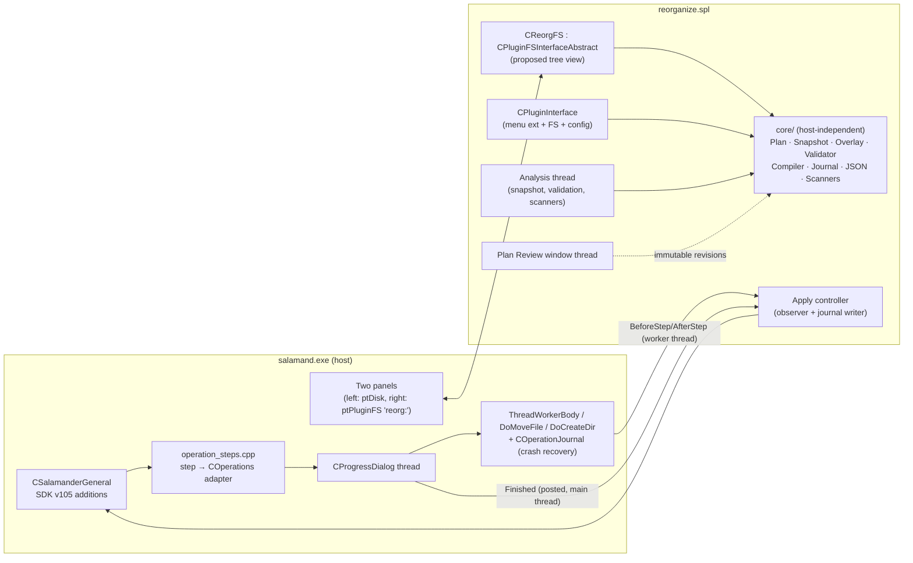
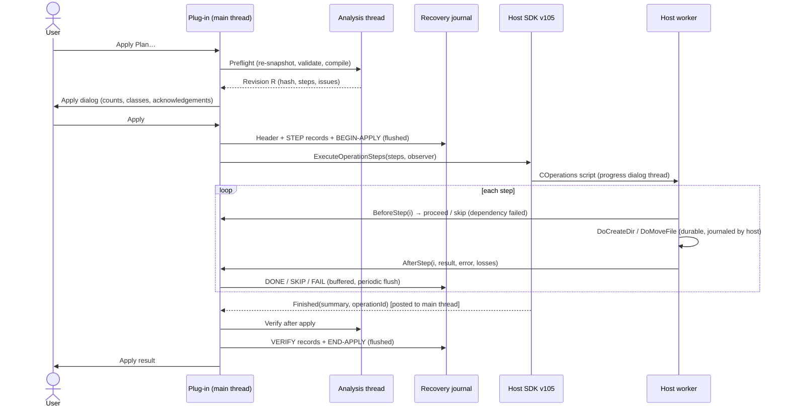

# Reorganization Preview — Feature Specification

| | |
|---|---|
| Status | Ready for implementation |
| Date | 2026-10-03 |
| Base commit | `165a2c9` (`main`) |
| Feature | Preview an entire reorganization before applying it |
| Delivery vehicle | New `reorganize` plug-in plus a small host SDK extension (SDK version 105) |

This document is the implementation contract. Sections 1–5 describe the change and how it is used. Section 6 is the task list, ordered by milestone. Sections 7–8 are the normative reference material the tasks point to (file formats, APIs, algorithms, check catalogs). Sections 9–11 cover verification, acceptance, and code references.

Tick tasks (`- [x]`) as they land. Task IDs (`T3.4`) are stable, so use them in commit messages and pull requests.

---

## 0. Decisions already taken

| Topic | Decision | Consequence |
|---|---|---|
| Architecture | **Hybrid**: plug-in + host SDK service | The plug-in owns the plan, the proposed-tree view, validation, plan files, and the recovery journal. The host executes compiled steps through its existing durable `COperations` engine. |
| v1 operations | **Move, rename, create folder, conflict resolution** (keep both / skip / replace / merge folders), plus optional cleanup of emptied folders | No copy. No permanent delete. "Replace" and "cleanup" move the displaced item into a per-apply **recovery store** on the same volume. |
| Plan file format | **UTF-8 JSON**, extension `.reorgplan` | Human-readable and diffable. The plug-in carries a small bounded JSON reader/writer. The recovery journal stays an append-only line format. |
| Broken references | **Detect only**, through pluggable scanners | Scanners for `.lnk`/`.url`, application paths, and an opt-in relative-path text scan. Nothing is rewritten in v1. |

---

## 1. Summary of the change

Users build a **reorganization plan**: an ordered, inspectable set of moves, renames, folder creations, and conflict resolutions. While they build it, nothing on disk changes.

- The **left panel** is the ordinary disk panel and shows the actual filesystem.
- The **right panel** shows a virtual filesystem, `reorg:`, rendering the **proposed result**. Every item says whether it changes, how, and why.
- A **Plan Review** window lists every change, conflict, unavailable destination, possibly broken reference, and every operation that cannot be fully reversed.
- The plan can be **saved** (`.reorgplan`), reopened, re-validated against the current disk state, and **applied** as one reviewable operation.
- Apply writes a durable **recovery journal**. Displaced and emptied items go to a recovery store, never to deletion. A later **Revert** builds a new plan from the journal; it is previewed and applied like any other plan.
- Operations that cannot be reversed exactly (cross-volume moves, cloud-synced items, recovery-store purge) are labelled before apply and need explicit acknowledgement.

The differentiator is a coherent, inspectable plan with recovery, not a bare Undo button. The feature uses no AI and no network services.

### 1.1 Goals

- [ ] G1 — Users can stage at least 100,000 item changes without touching disk, and the proposed tree navigates as fast as a normal panel.
- [ ] G2 — Every change shows *what* (old → new path), *why* (provenance), and *risk* (issues, reversibility).
- [ ] G3 — Collisions, unavailable destinations, and possibly broken references are found before apply.
- [ ] G4 — Apply goes through the host's durable commit, metadata-loss, and crash-recovery contracts (architecture.md §5.2).
- [ ] G5 — Every applied plan has a recovery journal that is enough to resume, revert, or reconcile manually, even without the application.
- [ ] G6 — No v1 operation destroys data. Purging the recovery store is a separate, explicit, labelled action.

### 1.2 Non-goals (v1)

- Copy, permanent delete, attribute and timestamp edits, and content conversion.
- Rewriting references, for example retargeting shortcuts (detection only; see §12).
- Archive (`ptZIPArchive`) or plug-in filesystem (`ptPluginFS`) sources or destinations. Disk paths only: local, removable, and SMB.
- Multi-user concurrent editing of one plan file.
- More than one open plan per application instance. Opening a plan closes the current one, asking to save first; both panels may show `reorg:` views of the same open plan.
- Scheduling or unattended apply.

### 1.3 Glossary

| Term | Meaning |
|---|---|
| **Plan** | A persisted document: scope, options, rules, edits, resolutions, acknowledgements, baseline, and apply history. |
| **Edit** | One user-level instruction (move, rename, create folder, unstage, exclude; revert plans also use remove-empty-folder) with a sequence number and provenance. |
| **Rule** | A filter plus a destination template that produces moves for every matching item. |
| **Snapshot** | The in-memory listing of the real items in the scope and destination roots, with identity fingerprints. |
| **Overlay / proposed tree** | The result of applying rules and edits to the snapshot. The `reorg:` filesystem renders it. |
| **Revision** | An immutable analysed state of the plan (overlay, issues, compiled steps), produced after each edit. |
| **Issue** | A validation finding with a code (§7.4), a severity (Error / Warning / Info), and a stable key. |
| **Step** | An executable operation produced by the compiler (§7.6): create-dir, move, copy-dir-time, or remove-empty-dir. One step is one host operation item. |
| **Apply** | One execution of a plan's compiled steps. It has an `applyId` and a journal. |
| **Recovery store** | A per-apply hidden folder on the same volume. It receives replaced and emptied items as plain renames. |
| **Finalize** | Purging an apply's recovery store. It makes the affected operations irreversible. |
| **Reversibility class** | `Exact`, `WithLoss`, `UntilFinalized`, or `NotReversible` (§7.5). |

---

## 2. User guide (how to use)

### 2.1 Commands

All commands are under **Plugins → Reorganize**. None has a default hotkey; users can assign hotkeys through the existing plug-in hotkey mechanism. The plug-in also registers a **Change Drive** menu item, *Reorganization plan*, which opens the plan in a panel (Alt+F1/Alt+F2).

| Command | Effect |
|---|---|
| **New Plan…** | Asks for a name, a scope root (default: source panel path), and a destination root (default: target panel path). Opens `reorg:<destination root>` in the target panel. |
| **Open Plan…** / recent plans | Loads a `.reorgplan`, re-snapshots, shows drift (§2.7), and opens the proposed tree. |
| **Save Plan** / **Save Plan As…** | Writes the plan (§7.1). |
| **Plan Review…** | Opens the review window (§2.5). |
| **Add Rule…** / **Manage Rules…** | Rule-based bulk moves (§2.4). |
| **Import Mapping (CSV)…** | Bulk explicit moves from a mapping file (§2.4). |
| **Go to Proposed Location** | For the focused item in the disk panel, navigates the `reorg:` panel to where the item will end up and focuses it. |
| **Go to Original** | For the focused item in the `reorg:` panel, navigates the disk panel to the item's real location and focuses it. |
| **Select Changed Items in Source Panel** | Selects the items in the current disk-panel directory that the plan moves, renames, or displaces. |
| **Undo Plan Edit** / **Redo Plan Edit** | Steps through the edit history. Disk is never touched. |
| **Validate Now** | Forces a re-snapshot of the touched directories and a full validation. |
| **Apply Plan…** | Preflight, confirmation, and execution (§2.8). |
| **Recovery Journals…** | Lists applies: status, Resume, Revert, Finalize, open report (§2.9). |
| **Close Plan** | Closes the plan, asking to save if it has unsaved edits. |

### 2.2 The two panes

- **Left: actual filesystem.** This is the normal disk panel and it behaves exactly as today. The user navigates it to pick sources.
- **Right: proposed result (`reorg:`).** The path in the directory line is `reorg:` followed by the absolute proposed path, for example `reorg:D:\Agency\Standard\Clients`. Listings merge three things: the real content of that directory, minus the items leaving it, plus the items arriving and the new folders.
  - Extra columns: **Change**, **From**, **Issues**, **Reversible** (§7.7.4).
  - Directories that contain changes somewhere below show `Contains changes (n)` in **Change**.
  - The info line for the focused item reads: `Moved from D:\Inherited\X\a.pdf · rule "PDF invoices" · Exact`.
  - `..` above a drive or share root shows a virtual **Plan roots** listing of every scope and destination root.
  - Navigating to any disk path inside `reorg:` is allowed. Paths outside the plan's roots are listed read-only from disk until something is staged into them; staging adds them as destination roots automatically.

### 2.3 Staging edits

The keys follow the host's existing semantics, so users don't need to learn new ones:

| Action | Where | Effect on the plan (never on disk) |
|---|---|---|
| **F6** (Move) or drag and drop | From the disk panel to the `reorg:` panel | Stages a move of the selected items into the proposed directory. If the selection's parent is not inside a scope root yet, it becomes one; a background snapshot runs first, with progress shown when it takes longer than 1 s. |
| **F6** | Inside the `reorg:` panel, to a `reorg:` path | Stages a move inside the proposed tree. |
| **F6** to a target that names a non-existing leaf, with one item selected | Either | Move with rename (host convention). |
| **Quick rename** (F2) | `reorg:` panel | Stages a rename. |
| **F7** (Create directory) | `reorg:` panel | Stages a new folder. Folder paths are allowed (`2024\Q1`). |
| **F8** / **Delete** | `reorg:` panel | **Remove from plan**: undoes the staged change for the selected items. The dialog title and text say clearly that no files are deleted. On unchanged items it reports "Nothing to remove; deletion isn't part of reorganization plans." |
| **F5** (Copy) | Into or out of `reorg:` | Not supported. The service is not advertised, so the host shows its standard "not supported" message. |
| **F6** from `reorg:` to a disk path | — | Rejected with "Plan edits stay in the plan. Use Apply Plan to change the disk." |
| **Enter** | `reorg:` panel | Directories: navigate. Files: **Go to Original** (v1). |

Every edit records its provenance (`user`, `rule:<id>`, `mapping:<file>:<row>`, `resolution`, `compiler`, `revert`). Provenance is shown as the reason for the change.

If an edit would create a cycle, such as moving a folder into its own descendant, it is refused immediately with an explanation and never stored.

### 2.4 Bulk tools

**Rules** (*Add Rule…*): name, enabled flag, order, match criteria (scope root, relative-path glob, name mask, extension list, size range, modified/created date range, attributes), and a destination template, for example `{dest:Standard}\Finance\{modified:yyyy}\{name}{ext}`. Rules are evaluated in order against the snapshot. The first matching rule wins. An explicit edit on an item always overrides a rule. The template tokens are listed in §7.8.

**Mapping import** (*Import Mapping (CSV)…*): UTF-8 CSV (BOM optional), RFC 4180 quoting, header row `source,destination[,note]`. Paths are absolute, or relative to the chosen scope and destination roots. A `destination` ending in `\` means "into this folder, keep the name"; otherwise it is the full new path. Every row becomes a `move` edit with provenance `mapping:<file name>:<row>`. A per-row result list (accepted / rejected with reason) appears before the import commits, and the import can be cancelled at that point.

### 2.5 Reviewing (Plan Review window)

A modeless window on its own UI thread. It consists of:

- A **summary header**, for example: *1,248 files and 87 folders change; 18,752 unchanged. 3 errors block apply. 12 warnings need acknowledgement. 40 operations are not exactly reversible. References from outside the scanned folders cannot be detected.*
- **Filter tabs**: *All changes · Errors · Warnings · Conflicts · Destinations · References · Not exactly reversible · Unchanged in scope*, plus a text filter on paths.
- A **virtual list** (one row per change or issue) with the columns: Kind (Move, Rename, Move+Rename, New folder, Replace, Keep both, Merge, Cleanup), Original path, Proposed path, Reason, Reversible, and Issues.
- A **details pane** for the selected row. It shows the full explanation (provenance chain, each issue with code and text, the predicted metadata losses from architecture.md §5.2.2) and resolution buttons where they apply: *Keep both · Skip · Replace · Merge folders · Rename… · Exclude · Acknowledge*. Each button can be applied to "all similar issues".
- Double-clicking a row runs **Go to Proposed Location** for that row.
- **Export Report…** writes CSV and/or HTML (§7.9) for sign-off.

### 2.6 Resolving conflicts

The plan option *Conflict default* selects the policy:

- `Ask` (default): conflicts stay as Errors until each one is resolved.
- `KeepBoth`: the incoming item is renamed with the plan's pattern, default `{name} ({n}){ext}`.
- `Skip`: the conflicting item stays where it is.

**Replace** is only ever an explicit per-item (or per-group) choice. It never becomes a silent default. The displaced item moves to the recovery store, and its row reads `Reversible: Until finalized`.

**Merge folders** (only for directory-onto-directory) moves the children individually. Each child conflict then becomes its own issue.

### 2.7 Saving, reopening, and drift

Saving writes the plan file atomically: the file is written to a temp sibling, flushed, and then replaced with `MoveFileEx(MOVEFILE_REPLACE_EXISTING | MOVEFILE_WRITE_THROUGH)`.

Reopening re-snapshots and compares against the stored baseline. A **Drift** banner then lists any missing sources, changed items, new items picked up by rules, and changed destinations. Rules are re-evaluated, so a reopened plan can differ from the reviewed one.

The review is bound to the **compiled-plan hash**. `review.compiledSha256` is recorded when the user confirms the Apply dialog or presses **Mark as reviewed** in Plan Review. When the current hash differs from the recorded one (PLN-003), Apply shows a step diff (added, removed, and changed steps) and asks for the review to be confirmed again.

### 2.8 Applying

1. **Apply Plan…** runs a preflight: it re-snapshots the touched directories, fully validates, compiles, and checks free space, locks, and identity.
2. The **Apply** dialog shows counts per kind and per reversibility class, the recovery-store locations, and options:
   - On error: **Stop** (default) or **Skip the item and everything that depends on it**.
   - **Verify after apply** (default on).
3. **Apply** stays disabled until there are zero Errors, every Warning is acknowledged, and, if any non-`Exact` operation exists, the user ticks *"I understand that N operations cannot be reversed exactly"*.
4. The host's standard progress dialog runs the steps. Pause, cancel, and error prompts work as they do for F6.
5. The **Apply result** dialog shows done / skipped / failed / not-started counts, verification mismatches, and the buttons *Open report*, *Revert…*, and *Close*. The plan's status becomes `Applied`, and the `reorg:` panel shows the result with **Change** = `Applied`.

### 2.9 After applying: Revert, Resume, Finalize

- **Revert…** builds a new plan of kind `revert` from the journal (§7.6.7). Its edits are the inverses of the completed steps, in reverse order, each checked against the identities recorded at apply. It opens in the `reorg:` panel like any plan, so the user previews exactly what reverting will do. Items changed since apply appear as conflicts.
- **Resume** applies to an interrupted or stopped apply. It reconciles uncertain steps (§7.6.6), then offers to run the steps that are not done.
- **Finalize…** purges the apply's recovery store. The default sends it to the Recycle Bin; *Delete permanently* is a separate option behind a second confirmation. The confirmation names how many Replace and Cleanup operations become irreversible. Finalize is recorded in the journal.
- The recovery store keeps a human-readable `index.tsv` (original path ↔ stored path) and a `README.txt`, so recovery is possible without the application.
- **Retention**: stores are never deleted automatically. After *RecoveryRetentionReminderDays* (default 30), the Recovery Journals window marks the apply as "consider finalizing".

### 2.10 Interrupted apply

If the process ends during an apply (crash, power loss, kill), the next start finds a journal without `END-APPLY`. While such a journal exists, the plug-in keeps its load-on-start flag set.

After the host's own operation recovery prompt has finished, the plug-in shows **Reorganization interrupted**: *Apply of "Acme migration" stopped after step 8,412 of 12,003.* The choices are:

- **Resume** — reconcile, then continue.
- **Revert completed steps** — opens the revert plan for preview.
- **Leave as is** — keep the journal and decide later.

### 2.11 Worked example: an agency with 20,000 inherited files

1. Navigate the left panel to `\\nas\clients\Inherited` and the right panel to `\\nas\clients\Standard`. Choose **New Plan…** and name it *Acme migration*.
2. Use **Import Mapping (CSV)…** with the 600-row mapping agreed with the client. The result list shows 3 rejected rows (missing sources); fix them and re-import.
3. **Add Rule…**: `*.psd;*.ai → {dest:Standard}\Design\{relDir}`, and `**\Invoices\** → {dest:Standard}\Finance\{modified:yyyy}`.
4. Browse `reorg:\\nas\clients\Standard` to confirm the structure. Use F7 to add `Admin\Contracts` and F6 to drag the remaining folders over by hand.
5. In **Plan Review**, filter on *Conflicts*: 41 name clashes. Choose *Keep both* for all similar. Two folders need *Merge folders*. The *References* tab shows 17 `.lnk` files pointing at moved items; acknowledge them.
6. **Export Report…** to HTML for the account manager. **Save Plan**.
7. The next morning, **Open Plan**. The drift banner shows that 5 new files were picked up by the rules; review them. **Apply Plan**. Same-volume renames finish in about a minute. The result shows 0 failed and verification passed.
8. Two weeks later, after sign-off, choose **Finalize…**.

---

## 3. Architecture

### 3.1 Components



### 3.2 Why the hybrid design

- The host's `COperations` script engine already provides the durable commit boundaries, the metadata-loss accounting and confirmation, the reparse-point policy, the cross-volume move protection, and the startup crash recovery of temporary files (architecture.md §5.2, §5.2.1, §5.2.2; `src/operation_journal.h`). Re-implementing any of that in a plug-in would split the safety contract in two.
- The plug-in filesystem SDK (`src/plugins/shared/spl_fs.h`) already supplies a panel for a virtual tree, F6/F2/F7/F8 routing, drag and drop, custom columns, info lines, and change notifications. That is everything the "right pane shows the proposed result" needs, with no new panel type in the host.
- The host change is small and additive: three appended virtual methods, one step adapter file, an optional observer hook in the worker loop, and five new opcode flags. The plug-in ABI stays compatible (append-only vtable; `LAST_VERSION_OF_SALAMANDER` 104 → 105).

**Alternatives considered.** A pure plug-in has no SDK change, but it would need its own cross-volume copy engine outside the durable contracts, so it was rejected. A core host feature would add a fourth panel source kind across all `CFilesWindow` code, contrary to architecture.md §11.1 guidance, so it was rejected too.

### 3.3 Threading model

| Thread | Owns | Talks to others by |
|---|---|---|
| Main UI thread | Mutable plan (`CPlanDocument`), edit history, FS object, menu commands | Posting `WM_APP_REORG_*` to a hidden plug-in message window |
| Analysis thread (one per open plan) | Snapshot enumeration, validation, scanners, compile | Takes an immutable `CPlanInput`; posts back a `std::shared_ptr<const CPlanRevision>` |
| Review window thread | Review UI | Reads `shared_ptr<const CPlanRevision>`; sends resolution requests to the main thread as posted messages |
| Host worker thread | Step execution | Calls `BeforeStep`/`AfterStep` on the plug-in observer, which only appends journal records and reads an immutable dependency table |
| Host progress-dialog thread | Progress UI | — |

Rules for these threads:

- No plug-in lock is held across a cross-thread `SendMessage`, a modal UI call, or a host SDK call (architecture.md §7.1).
- The plug-in's own locks are leaf-level critical sections: the journal writer and the revision pointer swap.
- Every new thread uses the repository's approved creation path (`src/plugins/shared/plugin_thread_owner.h`). It must pass `tools/verify-no-new-raw-thread-creation.ps1` and `tools/verify-no-new-terminatethread.ps1`.

### 3.4 Apply sequence



---

## 4. Plug-in layout

```
src/plugins/reorganize/
  reorganize.cpp/.h        plug-in entry, CPluginInterface, menu, Connect, config
  reorgfs.cpp/.h           CReorgFS (CPluginFSInterfaceAbstract), CReorgFSInterface
  reorgdata.cpp/.h         CPluginDataInterfaceAbstract: columns, icons, info line
  commands.cpp/.h          menu command handlers, panel helpers (Go to…, Select changed…)
  dlg_newplan.cpp          New Plan dialog
  dlg_review.cpp/.h        Plan Review window (own thread)
  dlg_apply.cpp/.h         Apply, Apply result, Interrupted dialogs
  dlg_recovery.cpp/.h      Recovery Journals window
  dlg_rules.cpp/.h         Rule editor, Mapping import
  dlg_config.cpp/.h        configuration dialog
  apply.cpp/.h             apply controller, SDK observer, verification
  core/                    host-independent; also compiled into NativeSafetyTests
    plan.h/.cpp            CPlanDocument, edits, rules, resolutions, options
    json.h/.cpp            bounded JSON reader/writer
    planio.h/.cpp          .reorgplan (de)serialization (§7.1)
    snapshot.h/.cpp        CSnapshot, identity capture (§7.7.1)
    overlay.h/.cpp         proposed tree (§7.7)
    rules.h/.cpp           rule matching, template expansion (§7.8)
    mapping.h/.cpp         CSV mapping parser
    validate.h/.cpp        validation engine (§7.4)
    reversibility.h/.cpp   classification (§7.5)
    compiler.h/.cpp        step compiler (§7.6)
    journal.h/.cpp         recovery journal writer/reader (§7.2)
    reconcile.h/.cpp       interrupted-apply reconciliation (§7.6.6)
    revert.h/.cpp          revert-plan builder (§7.6.7)
    recoverystore.h/.cpp   recovery-store layout (§7.6.4)
    report.h/.cpp          CSV/HTML report writer (§7.9)
    scanners/              IReferenceScanner + shortcut, url, apppaths, text
    fsprobe.h/.cpp         IFileSystemProbe (real + test fake): enumerate, identity, volume info, free space
  lang/                    lang.rc, lang.rh, lang.rc2, pl/ (Polish)
  help/                    reorganize.hhp/.hhc/.hhk + hh/*.htm
  res/                     icons, bitmaps
  vcxproj/                 reorganize.vcxproj(.filters), reorganize.props, lang_reorganize.vcxproj, lang_pl_reorganize.vcxproj, lang_reorganize.props
  reorganize.def, reorganize.rc, reorganize.rc2, reorganize.rh, reorganize.rh2, versinfo.rh2, precomp.h/.cpp
```

`core/` must not include `spl_*.h` or call the host. It may use `src/common` utilities that have no host dependency, such as `recovery_evidence.h`, `crc32.h`, and `wide_path.h`. All filesystem access goes through `IFileSystemProbe`, so the core is unit-testable with a fake filesystem and with real temporary directories.

---

## 5. Cross-cutting rules (apply to every task)

- [ ] X1 — Every source change carries a concise nearby comment that states its intent, invariant, or compatibility constraint, not a restatement of the code (AGENTS.md "Source-change documentation").
- [ ] X2 — Source files are UTF-8 with BOM and formatted with the repository `.clang-format`; `normalize.ps1` is clean.
- [ ] X3 — No new `MAX_PATH` buffers. Paths are `std::wstring`/`CPathW` internally and are converted at SDK boundaries. `tools/verify-no-new-max-path-buffers.ps1` passes.
- [ ] X4 — No new unsafe string calls, `GetTickCount`, raw thread creation, or `TerminateThread`. All `tools/verify-no-new-*.ps1` ratchets pass against the PR base.
- [ ] X5 — All UI text lives in the language resources (English and Polish). `tools/verify-language-resource-parity.ps1` passes.
- [ ] X6 — Every Win32 failure keeps its `GetLastError()` code through to the issue, journal record, or report. No silent fallbacks.
- [ ] X7 — Debug builds emit `TRACE_I`/`TRACE_E` at plan load/save, analysis start/finish, compile, apply start/finish, and each journal error, and they use `CALL_STACK_MESSAGE` in entry points.
- [ ] X8 — Before declaring any milestone complete, run `scripts/runtests.ps1` under pipeline conditions (§9.4) and record the invocation and result in the PR.
- [ ] X9 — **Parallel branches.** A `handoff` plug-in is being developed at the same time (branch `feature/handoff-plugin`, worktree `.claude/worktrees/handoff`, also based on `165a2c9`). It appends entries to the same shared registration points: `salamand.sln`, both base-address files, `src/svg.cpp` `GetPluginSVGName`, `scripts/runtests.ps1`, the root-runner contract in `NativeSafetyRegressionTests.cs`, `tools/prepare_installer.ps1`, `pr-msbuild.yml`, and `nightly-parser-fuzz.yml`. In those files, only **append** and never reorder. Rebase onto whichever branch merges first and re-run T9.2 and T9.4b afterwards. The UI suites share the `filemanager-testdata` registry key and the interactive desktop, so before starting `scripts/runtests.ps1` or `dotnet test`, check that no other `salamand.exe` or `dotnet test` run is active.

---

## 6. Implementation task list

### Milestone M0 — Scaffolding and packaging

- [ ] **T0.1** Create `src/plugins/reorganize/` following the `renamer` plug-in layout (§4). The `SalamanderPluginEntry` calls `SetBasicPluginData("Reorganize", FUNCTION_CONFIGURATION | FUNCTION_LOADSAVECONFIGURATION | FUNCTION_FILESYSTEM, "1.0", …, "REORGANIZE", NULL, "reorg")`.
- [ ] **T0.2** Return `LAST_VERSION_OF_SALAMANDER` (105, see T4.2) from `SalamanderPluginGetReqVer`. An older host rejects the plug-in with `REQUIRE_LAST_VERSION_OF_SALAMANDER`.
- [ ] **T0.3** Add `reorganize.vcxproj`, `lang_reorganize.vcxproj`, and `lang_pl_reorganize.vcxproj` (copy the `renamer` props pattern; see `src/vcxproj/salamand.sln:103,105,189`) to `src/vcxproj/salamand.sln` for Debug/Release × Win32/x64. Build with toolset `v145`.
- [ ] **T0.4** Append these Debug base addresses (agreed with the parallel `handoff` plug-in branch, which holds `0x…21b00000` / `0x…31b00000` / `0x…44600000`):

  | Module | `baseaddr_x64.txt` | `baseaddr_x86.txt` |
  |---|---|---|
  | `reorganize` | `0x0000010021c00000` | `0x21c00000` |
  | `lang_reorganize` | `0x0000010031c00000` | `0x31c00000` |
  | `lang_pl_reorganize` | `0x0000010044800000` | `0x44800000` |

  These follow the files' stepping: plug-in and `lang_` slots in 1 MiB steps after `automation` (`0x…21a00000`); Polish slots in 2 MiB steps after `lang_pl_zip` (`0x…44400000`). Add the plug-in lines next to the other plug-in pairs and the Polish line at the end of the Polish block. Re-check for overlaps after rebasing onto any branch that also appends slots.
- [ ] **T0.5** Confirm that the plug-in output lands in `plugins\reorganize\` so that `tools/prepare_installer.ps1:118-151` (recursive plug-in staging and the `plugins.ver` manifest) and `src/vcxproj/!populate_build_dir.cmd` pick it up. Add explicit copy lines only for non-binary assets (help `.chm`). `$requiredPluginPayloads` (`tools/prepare_installer.ps1:155`) lists only auxiliary DLLs that plug-ins load. The reorganize plug-in has none, so it needs no entry there.
- [ ] **T0.5a** Plug-in icon: append `{"reorganize.spl", "PluginReorganize"}` to the table in `GetPluginSVGName` (`src/svg.cpp:200`). It feeds the plug-in bar and the Change Drive menu. Add `PluginReorganize.svg` to `src/res/toolbars` and every optical-size directory, using only the allowed palette. `tools/verify-fluent-icon-coverage.ps1` checks every mapped name, so it fails without the asset.
- [ ] **T0.6** Register the menu items (§2.1) with `AddMenuItem` in `Connect`, plus `SetChangeDriveMenuItem("Reorganization plan", icon)`. Implement `GetMenuItemState` (for example, *Apply* is enabled only with an open plan and no running analysis).
- [ ] **T0.7** Create the `core/` static-library-style item group, shared between `reorganize.vcxproj` and `tests/NativeSafetyTests/NativeSafetyTests.vcxproj` (T9.1). It must compile without `INSIDE_SALAMANDER` or SDK headers.
- [ ] **T0.8** Implement `IFileSystemProbe` with a real Win32 implementation (`FindFirstFileExW` with `FIND_FIRST_EX_LARGE_FETCH`, `GetFileInformationByHandleEx(FileIdInfo)` with a fallback to `GetFileInformationByHandle`, `GetVolumeInformationByHandleW`, `GetDiskFreeSpaceExW`, `\\?\` long paths) and an in-memory fake for tests.
- [ ] **T0.9** Add the empty help project (`help/reorganize.hhp`) and call `SetHelpFileName("reorganize.chm")`.

### Milestone M1 — Plan model, snapshot, proposed tree, editing, persistence

**Plan model**

- [ ] **T1.1** `CPlanDocument` (core/plan.h) holds the fields of §7.1: id, name, kind, scope and destination roots, options, rules, edits (ordered by `seq`), resolutions, acknowledgements, baseline, applies, and a `dirty` flag. GUIDs are generated with `CoCreateGuid`.
- [ ] **T1.2** Edit operations are `move`, `rename`, `createFolder`, `unstage`, and `exclude` (exclude a child from a parent's rule or a directory move; it stays at its original location in the proposed tree). `removeEmptyFolder` is also accepted, but **only** in `kind=revert` plans (§7.6.7). Validation at edit time rejects cycles (§2.3), illegal names (DST-006, immediate), and non-disk targets.
- [ ] **T1.3** Undo/redo history over edits, rules, and resolutions (command pattern; bounded at 10,000 entries; history is not persisted).
- [ ] **T1.4** Stable `NodeKey` for real items: original absolute path, normalized (§8.2). The volume serial and file ID are stored in the baseline for identity checks.

**Snapshot**

- [ ] **T1.5** `CSnapshot` (§7.7.1) enumerates the scope and destination roots fully on the analysis thread. Other directories are enumerated lazily on navigation or lookup. Enumeration is cancellable, with progress posted every 250 ms (monotonic clock).
- [ ] **T1.6** Identity capture: the volume serial and the 128-bit file ID are read per item. To keep a 20k snapshot fast, IDs are read only for items referenced by edits or rules, and for all items at preflight. Size, last-write time, attributes, and reparse tag come from the enumeration. `.reorg-recovery` directories are excluded from snapshots.
- [ ] **T1.7** Per-directory case sensitivity: query `FileCaseSensitiveInfo` for each directory with a mutation target; the default is case-insensitive.

**Overlay and the `reorg:` filesystem**

- [ ] **T1.8** `COverlay` (§7.7): placement map, parent→children index, proposed path cache with generation counter, change classification, and aggregated "contains changes" counts.
- [ ] **T1.9** `CReorgFS::ChangePath`/`ListCurrentPath`: parse the `reorg:` user part (§7.7.3), build the listing with `CSalamanderDirectoryAbstract::AddDir`/`AddFile`, attach plug-in data, and support the virtual "Plan roots" listing. Return `FALSE` with a clear message when the path cannot be resolved. The open `CPlanDocument` is owned by the plug-in interface singleton, not by an FS instance. FS instances are views: closing or detaching one (`TryCloseOrDetach`) never closes the plan, and with no plan open, `ChangePath` shows the New/Open choice.
- [ ] **T1.10** `GetSupportedServices` = `FS_SERVICE_MOVEFROMDISKTOFS | FS_SERVICE_MOVEFROMFS | FS_SERVICE_QUICKRENAME | FS_SERVICE_CREATEDIR | FS_SERVICE_DELETE | FS_SERVICE_SHOWINFO | FS_SERVICE_GETFSICON | FS_SERVICE_ACCEPTSCHANGENOTIF | FS_SERVICE_GETPATHFORMAINWNDTITLE | FS_SERVICE_CONTEXTMENU`. Do **not** advertise `COPYFROMDISKTOFS`, `COPYFROMFS`, `VIEWFILE`, `EDITFILE`, `EDITNEWFILE`, or `CHANGEATTRS`. The context menu offers *Go to Original*, *Remove from plan*, *Show in Plan Review*, and, for an item with an issue, the issue's resolution choices.
- [ ] **T1.11** `CopyOrMoveFromDiskToFS(copy=FALSE)`, modes 1–3 (`spl_fs.h:657`). Mode 1 proposes the current `reorg:` path. Modes 2/3 resolve the target with host move semantics (existing proposed dir → into; non-existing leaf with one source → rename; non-existing leaf with several sources → ask whether to create the folder). Masks are rejected with a message. Then add scope roots if needed (T1.5), stage the edits, and return `TRUE`.
- [ ] **T1.12** `CopyOrMoveFromFS(copy=FALSE)`, modes 1–5 (`spl_fs.h:606`). Targets inside `reorg:` are staged; disk targets are rejected (§2.3). Drag and drop is handled in mode 5. Call `SetUserWorkedOnPanelPath` as documented.
- [ ] **T1.13** `QuickRename` (`spl_fs.h:479`) stages a rename. Use `SalIsValidFileNameComponent` plus the DST-006 checks and keep the host's mode 1/2 dialog convention.
- [ ] **T1.14** `CreateDir` (`spl_fs.h:510`) stages new folder(s), including relative multi-level paths.
- [ ] **T1.15** `Delete` (`spl_fs.h:540`) means **Remove from plan**. In `mode==1` the plug-in always shows its own `IDD_REORG_REMOVEFROMPLAN` dialog and returns `TRUE`. It never returns `FALSE` with `cancelOrError == FALSE`, because the host would then show its standard *Delete* question, which is misleading here; the host's `SALCFG_CNFRMFILEDIRDEL` setting does not apply. Use dedicated dialog strings (no "delete" wording beyond "No files are deleted"). For each selected item it removes the item's own edits; for new folders it removes the folder and asks whether to unstage moves into it.
- [ ] **T1.16** `CPluginDataInterfaceAbstract` (`spl_com.h:664`). `SetupView` adds the columns **Change**, **From**, **Issues**, **Reversible** through `CSalamanderViewAbstract::InsertColumn` (`spl_com.h:552,629`). Also implement `GetInfoLineContent` (format in §2.2), simple plug-in icons (file, dir, new-folder, moved-in, conflict) through `GetSimplePluginIcons`/`HasSimplePluginIcon`, and `ReleasePluginData`.
- [ ] **T1.17** `AcceptChangeOnPathNotification`: mark the touched snapshot directories stale, schedule a debounced (500 ms) re-snapshot of only those directories, and refresh with `PostRefreshPanelFS`.
- [ ] **T1.18** The path for the main-window title is `Reorganize: <plan name> — <proposed path>`. `GetNoItemsInPanelText` shows "This folder will be empty".

**Commands and persistence**

- [ ] **T1.19** Implement **Go to Proposed Location**, **Go to Original**, and **Select Changed Items in Source Panel** with `GetPanelPath`, `GetPanelItem`, `SelectPanelItem`, `RepaintChangedItems`, `ChangePanelPathToDisk`/`ChangePanelPathToPluginFS`, and `FocusNameInPanel` (`spl_gen.h:1296-1689`).
- [ ] **T1.20** Bounded JSON reader/writer (core/json): UTF-8 only, rejects lone surrogates, depth ≤ 32, string ≤ 65,536 UTF-8 bytes, document ≤ 256 MiB, numbers as int64 or double, duplicate keys rejected. The writer pretty-prints with 2-space indentation, stable key order, and `\u` escaping only where required.
- [ ] **T1.21** `.reorgplan` load and save exactly as §7.1, with atomic save (§2.7). Loading an unknown higher `formatVersion` is refused with a clear message; unknown fields are preserved on round-trip (`extensions` object).
- [ ] **T1.22** **New Plan**, **Open Plan** (`IFileOpenDialog`, matching the host's modern dialog use), **Save**, **Save As**, **Close**, and a recent-plans MRU of 10 entries.
- [ ] **T1.23** Analysis pipeline: each edit produces a `CPlanInput` snapshot, analysis is debounced by 300 ms, and the latest result wins (older results are discarded by generation number). The panel and Review show "Analyzing…" while stale.

### Milestone M2 — Validation, reversibility, review, and conflicts

- [ ] **T2.1** Validation engine (core/validate) that emits every check in §7.4 with its severity, stable issue key, parameters, and suggested resolutions.
- [ ] **T2.2** Destination probes cached per volume and per directory: existence, writability (at preflight only, create a zero-byte `~reorg-probe-<guid>.tmp` with `CREATE_NEW | FILE_FLAG_DELETE_ON_CLOSE` and close it at once, reporting a probe that cannot be removed; at edit time use `GetFileAttributesW` plus volume `FILE_READ_ONLY_VOLUME`), free space, max component length, file-system name and flags. Network probes run on the analysis thread with cancellation and never block the UI thread.
- [ ] **T2.3** Optional deep lock check at preflight (option `deepLockCheck`): open each source with `DELETE | FILE_READ_ATTRIBUTES` and share `FILE_SHARE_READ | FILE_SHARE_WRITE | FILE_SHARE_DELETE`; a failure becomes SRC-003.
- [ ] **T2.4** Reversibility classifier (§7.5) per change and per compiled step, including the predicted metadata losses from the target file system (architecture.md §5.2.2 table).
- [ ] **T2.5** Conflict resolution model: `keepBoth` (pattern expansion and uniqueness against the full proposed tree, case-aware), `skip`, `replace`, and `merge`. Resolutions are keyed by issue key and become invalid when their inputs change; they then re-surface as unresolved.
- [ ] **T2.6** Acknowledgements per issue key, with bulk "acknowledge all of this code". **Mark as reviewed** (and confirming the Apply dialog) records `review.compiledSha256`, the review time, and the step count (§2.7).
- [ ] **T2.7** Plan Review window (§2.5) on its own UI thread with `LVS_OWNERDATA` list views, filter tabs, text filter, details pane, resolution buttons, "apply to all similar", and keyboard-only operation. UIA names come from the resource strings (they are automation seams for T9.3).
- [ ] **T2.8** The Review reads only `shared_ptr<const CPlanRevision>`. Resolution clicks post `WM_APP_REORG_RESOLVE` to the main thread. Revision updates post `WM_APP_REORG_REVISION` to the Review window.
- [ ] **T2.9** Drift banner and step-diff view (§2.7) in Review and in the Apply dialog.
- [ ] **T2.10** Report export (§7.9): CSV with formula-injection neutralization, and self-contained HTML with all values escaped.

### Milestone M3 — Rules, mapping import, reference scanners

- [ ] **T3.1** Rule matcher and template expander (§7.8). Rules are evaluated over the snapshot in rule order, first match wins, and explicit edits override them. Rule effects carry provenance `rule:<id>`.
- [ ] **T3.2** Rule editor dialog with a live count ("matches 1,204 items") from the latest revision and a preview of the first 50 results.
- [ ] **T3.3** CSV mapping parser (RFC 4180, streaming, UTF-8 with or without BOM, CRLF or LF) with the per-row result dialog (§2.4).
- [ ] **T3.4** `IReferenceScanner` interface and registry (§7.10). Scanners run on the analysis thread with cancellation and a per-run budget, and results are cached per file by (path, size, last-write).
- [ ] **T3.5** Shortcut scanner for `.lnk`: `IShellLinkW` with `IPersistFile::Load(STGM_READ)` and `GetPath(…, SLGP_RAWPATH)`. **Never** call `IShellLink::Resolve`, because it can search the disk and rewrite the link. COM is initialized apartment-threaded on the analysis thread.
- [ ] **T3.6** URL scanner for `.url`: a bounded INI parser reading `[InternetShortcut] URL=file:…`, with file-URL decoding.
- [ ] **T3.7** Application-path scanner: uses the SDK method `EnumApplicationPathReferences` (T4.12), collected on the main thread and passed to the analysis input.
- [ ] **T3.8** Text scanner (opt-in): configured extensions, size cap, binary detection (a NUL byte in the first 8 KiB), encoding detection (UTF-8/UTF-16LE/BE BOM, otherwise UTF-8 with ANSI fallback), and extraction heuristics (§7.10.4).
- [ ] **T3.9** Reference evaluation against the overlay: a reference breaks if its resolved target moves while the referrer's relative path no longer reaches the target's new location, or if an absolute reference points into a moved item.

### Milestone M4 — Host SDK v105 and worker hooks

- [ ] **T4.1** Append the declarations in §7.3 to the **end** of `CSalamanderGeneralAbstract` in `src/plugins/shared/spl_gen.h`, after `GetApplicationUpdateState` (`spl_gen.h:3486`). Do not reorder existing virtuals. Put the structs, constants, and observer class above `CSalamanderGeneralAbstract` (`spl_gen.h:841`), inside the file's existing `#pragma pack(push, enter_include_spl_gen)` / `#pragma pack(4)` region (`spl_gen.h:15-16`, popped at `:3501`), so their layout matches the rest of the SDK.
- [ ] **T4.2** Bump `LAST_VERSION_OF_SALAMANDER` to 105 in `src/plugins/shared/spl_vers.h:203` and add `//   105 - reorganization step execution API` to the history list.
- [ ] **T4.3** Declare the overrides in `CSalamanderGeneral` (`src/plugins.h`, next to `RequestApplicationUpdateCheck` at `plugins.h:2546`) and implement them in the new `src/operation_steps.cpp/.h`. Add both files to `src/vcxproj/salamand.vcxproj` and `.filters`. Keep the thin forwarding style of `zip_utilities.cpp:1871`.
- [ ] **T4.4** Step adapter: validate the input (§7.3.3), copy it (the plug-in may free the array after the call returns), convert it to `COperation` items, configure `COperations` the same way the host's F6 move does (`IsCopyOperation = FALSE`, `IsCopyOrMoveOperation = TRUE`, ADS/security/attribute options from `Configuration`, `SetWorkPath1`/`WorkPath2` for change notifications), and start it with `StartProgressDialog` (`src/dialogs.h:312`).
- [ ] **T4.5** One plug-in step maps to **exactly one** `COperation`: `SALOPSTEP_CREATEDIR` → `ocCreateDir`, `SALOPSTEP_MOVE` → `ocMoveFile`/`ocMoveDir`, `SALOPSTEP_COPYDIRTIME` → `ocCopyDirTime`, and `SALOPSTEP_REMOVEEMPTYDIR` → `ocDeleteDir`. The host never expands a step. A cross-volume directory move arrives already expanded by the plug-in compiler (§7.6.2 step 6), so each journaled step reflects exactly one durable host action. Reuse the per-item flag derivation of `CFilesWindow::BuildScriptMain` (`src/fileswindow_operations.cpp:1152`): `OPFL_SRCPATH_IS_NET/FAST`, `OPFL_TGTPATH_IS_NET/FAST`, `OPFL_COPY_ADS`, and `OPFL_AS_ENCRYPTED`. Factor that derivation into a shared helper instead of duplicating it.
- [ ] **T4.6** Add `int PlanStepIndex` (default −1) and an expected-identity block to `COperation`, and a `CStepExecutionBridge*` (default `NULL`) to `COperations` (`src/worker.h:416`). These are internal and not part of the ABI.
- [ ] **T4.7** In `ThreadWorkerBody` (`src/operations_core.cpp:939`), call `bridge->BeforeStep(stepIndex)` before each plug-in item. If it returns FALSE, report `SKIPPED` and continue with the next item. After the item completes, call `AfterStep` with the result, the Win32 error, the result flags, and the metadata-loss mask mapped from `EMetadataLoss` (`worker.h:328`). A user choosing *Skip*/*Skip all* in the host error prompt is reported as `FAILED` with the error code, and *Cancel* as `CANCELLED`. Do not hold `StatusCS` or any ranked lock across the observer calls.
- [ ] **T4.8** New opcode flags in `src/worker.h` after `OPFL_IGNORE_INVALID_NAME` (`worker.h:299`). Each carries an intent comment.
  - `OPFL_FAIL_IF_TARGET_EXISTS 0x00000100`: `DoMoveFile`/`DoCreateDir` fail with `ERROR_ALREADY_EXISTS` and show no overwrite prompt.
  - `OPFL_NO_CROSS_VOLUME 0x00000200`: `DoMoveFile` fails with `ERROR_NOT_SAME_DEVICE` instead of falling back to copy + delete.
  - `OPFL_VERIFY_SOURCE_IDENTITY 0x00000400`: before acting, open the source with `FILE_FLAG_OPEN_REPARSE_POINT | FILE_FLAG_BACKUP_SEMANTICS`, compare it with the expected identity stored in `COperation` (directories: volume + file ID; files: also size and last-write, per the `CSalamanderFileIdentity` comment), and fail with `ERROR_FILE_INVALID` on mismatch.
  - `OPFL_CREATEDIR_ACCEPT_EXISTING 0x00000800`: `DoCreateDir` succeeds on an existing **directory** (never on a file) and reports `SALOPSTEP_RESULTF_ALREADY_EXISTED`.
  - `OPFL_PLAN_STEP 0x00001000`: the item comes from `ExecuteOperationSteps`. It suppresses the "overwrite older / skip existing" heuristics (`OPFL_OVERWROLDERALRTESTED` path) and every interactive overwrite question.
- [ ] **T4.9** `SALOPSTEP_REMOVEEMPTYDIR` maps to `ocDeleteDir` and must never recurse. A non-empty directory fails with `ERROR_DIR_NOT_EMPTY`. A reparse directory follows the delete reparse policy (architecture.md §5.2.1). `SALOPSTEP_COPYDIRTIME` maps to `ocCopyDirTime` with the source directory's last-write time read at execution; when the source has already been removed, it fails with `ERROR_FILE_NOT_FOUND`, which the plug-in treats as non-fatal.
- [ ] **T4.10** Metadata-loss prompts. If a step has `SALOPSTEPF_METADATA_LOSS_ACCEPTED` and the actual losses are a subset of `ExpectedMetadataLosses`, the pre-deletion confirmation is suppressed for that step. Any extra loss still triggers the existing prompt (default **No**: source retained). All losses are reported to `AfterStep`.
- [ ] **T4.11** Lifetime. The host takes a plug-in usage reference when `ExecuteOperationSteps` succeeds and releases it after `Finished` returns. Use the existing mechanism that defers plug-in unload while plug-in callbacks, windows, or objects are in use (architecture.md §7). If none fits, add a counter on `CPluginData` that the deferred-unload path checks. Unloading during apply is deferred. `Finished` is posted to the main thread exactly once, also on cancel, worker start failure after acceptance, and dialog-thread startup timeout (`dialogs.h:305-311` semantics).
- [ ] **T4.12** `EnumApplicationPathReferences` (§7.3.4): enumerates hot paths (`CHotPathItems`, `src/mainwnd.h:121`), user-menu items (initial directory and arguments as text; `CUserMenuItems`), and the current panel paths. Main thread only. The callback can stop the enumeration.
- [ ] **T4.13** The host journal (`COperationJournal`) keeps writing as today for plug-in-originated scripts. Its `PLAN|1|operation=<id>` header carries the `operationId` returned to the plug-in, which provides cross-referencing (§7.2). Extend `OpcodeName` in `src/operation_journal.cpp` only if an opcode used by steps is missing (today `ocCopyDirTime` has no name). An unnamed opcode must not break journaling.
- [ ] **T4.14** `GetApplicationDataDirectory` (§7.3.1) returns the host's roaming data folder by calling `GetOurPathInRoamingAPPDATA`/`CreateOurPathInRoamingAPPDATA` (`src/path_checking.cpp:2205`). That function is sandbox-aware: under `FILEMANAGER_UI_TESTDATA_ROOT` it resolves to `<test-data root>\appdata\Open Salamander`. The plug-in must use this method and **never** resolve `%APPDATA%` itself, so its journals follow the host's test isolation.

### Milestone M5 — Compiler, apply, recovery journal

- [ ] **T5.1** Compiler (core/compiler, §7.6): effective moves, the simulation-based scheduler, temp-name cycle breaking, recovery-store displacement for `replace` and `cleanup`, merge expansion, cross-volume flags, dependencies, deterministic ordering, and the SHA-256 compiled hash (`BCryptHash`).
- [ ] **T5.2** Recovery-store layout (§7.6.4), including the same-volume verification and the `README.txt`/`index.tsv` writers. The store folders are created by compiled `createDir` steps, so they are journaled and revertible.
- [ ] **T5.3** Preflight (§2.8 step 1): a fresh snapshot of every directory referenced by a step, full validation, compile, a hash comparison with the reviewed hash, identity capture for every step source, and free space per target volume.
- [ ] **T5.4** Apply dialog and acknowledgement gate (§2.8 steps 2–3).
- [ ] **T5.5** Journal writer (§7.2): create the file in the journal directory, write and flush the header, `PLANCOPY`, all `STEP` records, and `BEGIN-APPLY` **before** calling `ExecuteOperationSteps`. Also write a copy of the plan JSON beside the journal (`<applyId>.reorgplan`).
- [ ] **T5.6** Observer: `BeforeStep` returns FALSE when any dependency is not `DONE` (the skip-dependents policy) or when the journal stop flag is set. The *Stop* policy passes `SALEXECF_STOP_ON_ERROR`, so the host reports the remaining steps as `NOT_STARTED`. A non-fatal `COPYDIRTIME` failure (T4.9) never counts as a failed dependency. `AfterStep` appends `DONE`/`SKIP`/`FAIL` to the buffer, flushes every `JournalFlushRecords` (64) records or `JournalFlushIntervalMs` (500 ms) on the monotonic clock, and flushes immediately after `FAIL`. A journal write failure sets the stop flag, so no further steps run, and is reported.
- [ ] **T5.7** `Finished` handler (main thread): flush, run verification if enabled (§7.6.5; `VERIFY` records), write and flush `END-APPLY`, update the plan's `applies[]` and save the plan when it has a file path, write the apply report (`<applyId>-report.html`), show the result dialog, and refresh the panels (`PostChangeOnPathNotification` for each touched root).
- [ ] **T5.8** Concurrency guard: a named mutex `Local\OpenSalamander.Reorganize.Apply.<planId>` plus a `<journal>.lock` file opened with share mode 0 for the lifetime of the apply. A second instance cannot apply or resume the same plan, and it shows who holds it (process ID).
- [ ] **T5.9** Load-on-start: call `SetFlagLoadOnSalamanderStart(TRUE)` (`spl_gen.h:1818`) while any journal lacks `END-APPLY`, and `FALSE` once none remain.

### Milestone M6 — Interrupted apply, revert, finalize, recovery UI

- [ ] **T6.1** Startup scan of the journal directory: parse each journal (tolerant reader, §7.2 J4 and J6) and collect the incomplete ones. Show the Interrupted dialog (§2.10) only **after** host recovery: defer with `PostMenuExtCommand(id, TRUE)` (`spl_gen.h:1882`, `waitForSalIdle`) and verify the ordering relative to `COperationJournal::OfferRecovery` (`src/app_entry.cpp:2702`).
- [ ] **T6.2** Reconciliation (§7.6.6) for steps without a terminal record. Results go to `RECONCILE` records. Ambiguous states become `MANUAL`, and those items are never mutated automatically.
- [ ] **T6.3** Resume: re-validate the remaining steps against the current disk (identity and preconditions) and execute the not-done steps through T4/T5. This is a new `BEGIN-APPLY|resume=1` segment in the **same** journal.
- [ ] **T6.4** Revert builder (§7.6.7): produces a `kind=revert` `CPlanDocument` whose edits are the inverses of the `DONE` steps (§7.6.7) and whose baseline holds the identities recorded in `DONE`/`VERIFY`. It opens in the `reorg:` panel for preview and is applied through the normal pipeline with its own journal (`revertOf` link).
- [ ] **T6.5** Finalize: Recycle Bin by default (`SHFileOperationW FO_DELETE | FOF_ALLOWUNDO`, the same approach as the host's recycle-bin branch), or permanent deletion behind a second confirmation. A store on a volume without a Recycle Bin (most network shares, some removable media) is never silently deleted permanently: only the permanent option is offered, with its second confirmation, and the dialog says why. Write a `FINALIZE` record. Afterwards, Revert marks Replace and Cleanup inverses as impossible (REV-004).
- [ ] **T6.6** Recovery Journals window: list (plan, applyId, started, status, counts, store size, age), actions (Open report, Open journal folder, Resume, Revert, Finalize, Forget). *Forget* removes a completed and finalized journal from the list, moving the file to `journals\archive\`; journals are never deleted silently.
- [ ] **T6.7** Retention reminder (§2.9).

### Milestone M7 — Configuration, localization, help, documentation

- [ ] **T7.1** Configuration (§7.11): `LoadConfiguration`/`SaveConfiguration` through the plug-in registry subkey, the configuration dialog with `Validate`/`Transfer`, and defaults.
- [ ] **T7.2** Language resources: every string in §7.12 in `lang/lang.rc` (English) and `lang/pl/` (Polish), and parity passes.
- [ ] **T7.3** Help pages: Overview, Building a plan, Rules and templates, Mapping import, Review and issues (one section per code in §7.4), Applying, Recovery, Revert, and Finalize, Plan file format, Journal format, and Troubleshooting.
- [ ] **T7.4** `architecture.md`: new §5.9 *Reorganization plans* (components, threading, SDK 105, journal relationship). In §5.3, correct the loader step "the current SDK constant is version 103" (already stale: the constant is 104) to 105, and add the plug-in to the family list.
- [ ] **T7.5** `README.md` "What's new" entry, and the `testing.md` catalog entries for every new test (T9.x).
- [ ] **T7.6** SDK documentation: comment blocks on the new declarations in `spl_gen.h` with the same depth and style as their neighbours (threads, ownership, lifetime, return values).

---

## 7. Reference specifications

### 7.1 Plan file format (`.reorgplan`, formatVersion 1)

UTF-8 without BOM (a BOM is accepted on read), LF line endings, JSON object. Field names are camelCase. Times are UTC ISO-8601 with `Z`. Paths are absolute Windows paths as JSON strings, without a `\\?\` prefix (§8.2). Required fields are marked ★.

```jsonc
{
  "format": "open-salamander.reorganization-plan",      // ★ constant
  "formatVersion": 1,                                    // ★ reader refuses > 1
  "planId": "6f1c2a8e-3b7d-4c1e-9a52-0d4b8f2e7c11",      // ★ GUID
  "name": "Acme migration",                              // ★
  "kind": "reorganize",                                  // ★ "reorganize" | "revert"
  "revertOf": { "planId": "…", "applyId": "…" },         //   kind=revert only
  "createdUtc": "2026-10-03T09:12:44Z",                  // ★
  "modifiedUtc": "2026-10-03T11:40:02Z",                 // ★
  "createdBy": "AGENCY\\jsmith",                         //   omitted when option recordAuthor=false
  "createdOn": "WS-0142",                                //   computer name; same option
  "application": { "name": "Open Salamander", "version": "6.0.1234", "pluginVersion": "1.0" },
  "scopeRoots": [                                        // ★ ≥ 0
    { "id": "s1", "path": "\\\\nas\\clients\\Inherited", "volumeSerial": "0x5A1C33D0", "fileSystem": "NTFS" }
  ],
  "destinationRoots": [                                  // ★ ≥ 0
    { "id": "d1", "label": "Standard", "path": "\\\\nas\\clients\\Standard", "volumeSerial": "0x5A1C33D0", "fileSystem": "NTFS" }
  ],
  "options": {                                           // ★ all keys optional; defaults from §7.11
    "conflictDefault": "ask",                            //   "ask" | "keepBoth" | "skip"
    "keepBothPattern": "{name} ({n}){ext}",
    "cleanupEmptiedFolders": true,
    "recoveryStore": { "mode": "auto" },                 //   or { "mode": "explicit", "paths": { "0x5A1C33D0": "\\\\nas\\clients\\_recovery" } }
    "onError": "stop",                                   //   "stop" | "skipDependents"
    "verifyAfterApply": true,
    "deepLockCheck": false,
    "scanners": {
      "shortcuts": true, "urls": true, "applicationPaths": true,
      "text": { "enabled": false, "extensions": ["htm","html","css","md","xml","json","csproj","vcxproj","props","sln"], "maxFileBytes": 4194304 },
      "extraRoots": []                                   //   additional folders scanned for references (not reorganized)
    }
  },
  "rules": [
    { "id": "r1", "name": "PDF invoices", "enabled": true, "order": 1,
      "match": { "scopeRoot": "s1", "relativePathGlob": "**\\Invoices\\**", "nameMask": "*.pdf",
                 "extensions": null, "sizeMin": null, "sizeMax": null,
                 "modifiedFrom": null, "modifiedTo": null, "createdFrom": null, "createdTo": null,
                 "attributesSet": 0, "attributesClear": 0, "itemType": "file" },   // "file" | "dir" | "any"
      "destination": "{dest:Standard}\\Finance\\{modified:yyyy}\\{name}{ext}" }
  ],
  "edits": [                                             // ★ ordered by seq, seq strictly increasing
    { "seq": 1, "op": "move", "source": "\\\\nas\\clients\\Inherited\\A\\x.pdf",
      "destinationDir": "\\\\nas\\clients\\Standard\\Docs", "newName": null,
      "origin": "user", "createdUtc": "…", "note": null },
    { "seq": 2, "op": "rename", "source": "…", "newName": "Budget 2024.xlsx", "origin": "user", "createdUtc": "…" },
    { "seq": 3, "op": "createFolder", "path": "\\\\nas\\clients\\Standard\\Admin\\Contracts", "origin": "user", "createdUtc": "…" },
    { "seq": 4, "op": "exclude", "source": "…", "origin": "user", "createdUtc": "…" },
    { "seq": 5, "op": "move", "source": "…", "destinationDir": "…", "newName": "…", "origin": "mapping:acme.csv:12", "createdUtc": "…" },
    { "seq": 6, "op": "removeEmptyFolder", "path": "…", "origin": "revert", "createdUtc": "…" }   // kind=revert only
  ],
  "resolutions": [
    { "issueKey": "COL-002:9f2c…", "choice": "keepBoth", "resultName": "x (2).pdf", "decidedUtc": "…" }
  ],                                                     // choice: "keepBoth" | "skip" | "replace" | "merge" | "rename" (resultName required)
  "acknowledgements": [ { "issueKey": "REF-001:44ab…", "ackUtc": "…" } ],
  "review": { "compiledSha256": "…64 hex…", "reviewedUtc": "…", "stepCount": 1335 },
  "baseline": {
    "capturedUtc": "…",
    "items": [ { "path": "…", "dir": false, "size": 18233, "lastWriteUtc": "…",
                 "attributes": 32, "reparseTag": 0, "volumeSerial": "0x5A1C33D0",
                 "fileId": "00000000000000000003000000012A4F" } ]   // 128-bit hex; 64-bit IDs zero-extended
  },
  "applies": [ { "applyId": "…", "startedUtc": "…", "finishedUtc": "…",
                 "status": "completed", "journal": "…\\journals\\<applyId>.reorgjournal" } ],
                                                         // status: "running" | "completed" | "partial" | "stopped" | "interrupted" | "reverted" | "finalized"
  "extensions": {}                                       //   preserved verbatim by this version
}
```

Semantics:

- [ ] P1 — Edits always name the source by its **original real path**. `destinationDir` and `path` are **proposed** paths, resolved against the overlay at that edit's position in the sequence.
- [ ] P2 — `rename` is shorthand for a move to the item's current proposed parent with `newName`.
- [ ] P3 — `issueKey` = `<code>:<first 16 bytes of SHA-256, as hex, of the canonical issue inputs>`. The inputs are the code plus the sorted normalized original and proposed paths involved, so the key is stable across sessions and changes when the conflict changes.
- [ ] P4 — `baseline.items` holds entries only for items that are edit or rule sources, recorded when they were staged. The full snapshot is never persisted, so plan size scales with the changes, not the scope.
- [ ] P5 — Readers ignore unknown keys inside known objects, and writers preserve them through `extensions` or a round-trip map.
- [ ] P6 — A missing scope root on load offers **Rebase root…**, which rewrites every path under the root to a user-chosen path. The baseline identities for those items then become invalid, and the items show SRC-001 until they are reviewed.

### 7.2 Recovery journal format (`.reorgjournal`, version 1)

Location: `<application data directory>\reorganize\journals\<applyId>.reorgjournal`. The application data directory is obtained from `GetApplicationDataDirectory` (T4.14): normally `%APPDATA%\Open Salamander`, and `<test-data root>\appdata\Open Salamander` under the UI-test sandbox (testing.md "Journals must not leak between cases").

Encoding: UTF-8, CRLF-terminated records. Each record is `TYPE|f1|f2|…|crc=XXXXXXXX`, where `crc` is the CRC-32 (`src/common/crc32.h`) of the record bytes before `|crc=`. In field values, `%`, `|`, CR, and LF are percent-encoded (`%25`, `%7C`, `%0D`, `%0A`). Key/value fields are `key=value`.

| Record | Fields | Written |
|---|---|---|
| `REORGJOURNAL` | `1` (version), `plan=<planId>`, `apply=<applyId>`, `kind=reorganize\|revert`, `planSha256=`, `compiledSha256=`, `created=<utc>`, `host=<version>`, `plugin=<version>`, `steps=<n>` | First record |
| `PLANCOPY` | `path=<…\<applyId>.reorgplan>`, `sha256=` | After the header |
| `STORE` | `volume=<serial>`, `path=<recovery store root>` | One per volume used |
| `STEP` | `<i>`, `kind=createDir\|move\|copyDirTime\|removeEmptyDir`, `src=`, `dst=`, `dir=0\|1`, `cross=0\|1`, `class=exact\|withLoss\|untilFinalized\|notReversible`, `expectLoss=0x…`, `srcId=<identity>`, `deps=<i,j,…>`, `role=edit\|tempRename\|displace\|cleanup\|merge\|store`, `node=<original path>`, `reason=<short provenance>` | All of them before `BEGIN-APPLY` |
| `BEGIN-APPLY` | `utc=`, `resume=0\|1`, `pid=` | Before `ExecuteOperationSteps` is called; flushed |
| `HOSTOP` | `operation=<operationId>` | As soon as `ExecuteOperationSteps` returns TRUE; flushed |
| `DONE` | `<i>`, `utc=`, `flags=0x…` (`ALREADY_EXISTED`, `CROSS_VOLUME`), `losses=0x…`, `dstId=<identity>` | Per step |
| `SKIP` | `<i>`, `reason=dependency\|stopped` (the observer returned FALSE: a failed dependency, or the journal stop flag) | Per step |
| `FAIL` | `<i>`, `error=<win32>`, `detail=` | Per step; flushed immediately |
| `VERIFY` | `<i>`, `ok=0\|1`, `detail=` | After the apply |
| `RECONCILE` | `<i>`, `state=done\|notDone\|manual`, `evidence=` | When resuming |
| `END-APPLY` | `status=completed\|partial\|stopped\|cancelled\|failed`, `done=`, `skipped=`, `failed=`, `notStarted=`, `utc=` | Final; flushed |
| `REVERTED-BY` | `apply=<revert applyId>`, `utc=` | Appended when a revert completes |
| `FINALIZE` | `mode=recycle\|permanent`, `items=`, `utc=` | Appended when finalized |

Identity encoding: `<volumeSerialHex>:<fileId128Hex>:<sizeHex>:<lastWriteFiletimeHex>:<attributesHex>`. Use `src/common/recovery_evidence.h` (`CRecoveryObjectEvidence`, `ReadRecoveryObjectIdentity`) where it fits; extend it for the 128-bit ID instead of duplicating it.

Rules:

- [ ] J1 — Header, `PLANCOPY`, `STORE`, all `STEP` records, and `BEGIN-APPLY` are durable (`FlushFileBuffers`) before the first host call. Mirror `COperationJournal::FlushDurable` (`src/operation_journal.cpp`).
- [ ] J2 — Terminal per-step records are buffered (64 KiB buffer, as in `operation_journal.cpp`) and flushed per T5.6. Recovery must therefore tolerate any suffix of `DONE` records being lost (§7.6.6).
- [ ] J3 — Records are append-only. Nothing is rewritten in place. `REVERTED-BY` and `FINALIZE` are appended to the original journal.
- [ ] J4 — Reader: a 64 KiB input buffer with no whole-file size cutoff; the last record is discarded when it lacks CRLF or a valid CRC (torn write); any **interior** CRC failure makes the journal *manual-only* (reported; no automatic mutation). The host's journal parser is the model (testing.md §"native journal-size cases").
- [ ] J5 — Journal ↔ host-journal link: the `HOSTOP` `operation=` value equals the `operation=` ID in the host's `operation-journals` `PLAN|1|operation=…` header. The Recovery Journals window shows the link. If the process dies between `BEGIN-APPLY` and `HOSTOP`, the segment has no host link. Reconciliation (§7.6.6) does not need one, because it works from filesystem evidence.
- [ ] J7 — Steps reported `NOT_STARTED` (stop-on-error or cancel) get no per-step record; they are counted in `END-APPLY` and are "not done" for Resume.
- [ ] J6 — A journal can hold several `BEGIN-APPLY … END-APPLY` segments (resume after a stop or interruption). A journal is **incomplete** when its last segment has no `END-APPLY`. A step's state is its latest terminal record across all segments.

### 7.3 Host SDK additions (version 105)

#### 7.3.1 Declarations (append to `spl_gen.h`)

```cpp
// --- Reorganization step execution (SDK 105) ---------------------------------
// Plug-ins submit an already-reviewed list of simple steps; the host executes it
// through its native durable COperations engine so commit, metadata-loss, reparse
// and crash-recovery contracts are identical to the Move (F6) command.

#define SALOPSTEP_CREATEDIR 1      // create directory 'Target' (parent must exist)
#define SALOPSTEP_MOVE 2           // move/rename 'Source' to 'Target' (file or directory)
#define SALOPSTEP_REMOVEEMPTYDIR 3 // remove directory 'Source' only if it is empty
#define SALOPSTEP_COPYDIRTIME 4    // copy last-write time of directory 'Source' to directory 'Target'

#define SALOPSTEPF_SOURCE_IS_DIR 0x0001             // 'Source' is a directory
#define SALOPSTEPF_TARGET_MUST_NOT_EXIST 0x0002     // fail with ERROR_ALREADY_EXISTS, never prompt to overwrite
#define SALOPSTEPF_ALLOW_CROSS_VOLUME 0x0004        // otherwise fail with ERROR_NOT_SAME_DEVICE
#define SALOPSTEPF_VERIFY_SOURCE_IDENTITY 0x0008    // compare ExpectedIdentity before acting
#define SALOPSTEPF_METADATA_LOSS_ACCEPTED 0x0010    // losses within ExpectedMetadataLosses were reviewed
#define SALOPSTEPF_CREATEDIR_ACCEPT_EXISTING 0x0020 // existing directory counts as success (reported)

#define SALMDLOSS_LASTWRITE 0x0001
#define SALMDLOSS_ATTRIBUTES 0x0002
#define SALMDLOSS_SECURITY 0x0004
#define SALMDLOSS_ADS 0x0008
#define SALMDLOSS_COMPRESSION_EFS 0x0010
#define SALMDLOSS_CREATION_LASTACCESS 0x0020 // always set for cross-volume moves (unsupported)

// Directories are matched by VolumeSerial + FileId only (earlier steps legitimately change
// their size and last-write time); files additionally by Size and LastWrite.
struct CSalamanderFileIdentity
{
    DWORD Valid;           // 0 = not supplied
    DWORD VolumeSerial;
    BYTE FileId[16];       // FILE_ID_128; 64-bit IDs are zero-extended
    CQuadWord Size;        // files only
    FILETIME LastWrite;    // files only
};

struct CSalamanderOperationStep
{
    DWORD StructSize;          // sizeof(CSalamanderOperationStep); host rejects unknown sizes
    DWORD Kind;                // SALOPSTEP_xxx
    DWORD Flags;               // SALOPSTEPF_xxx
    const WCHAR* Source;       // full path; NULL for SALOPSTEP_CREATEDIR
    const WCHAR* Target;       // full path; NULL for SALOPSTEP_REMOVEEMPTYDIR
    CSalamanderFileIdentity ExpectedIdentity;
    DWORD ExpectedMetadataLosses; // SALMDLOSS_xxx predicted at plan time
    DWORD_PTR UserData;        // opaque, echoed to the observer
};

#define SALOPSTEP_RESULT_DONE 0
#define SALOPSTEP_RESULT_SKIPPED 1     // only when the observer's BeforeStep returned FALSE
#define SALOPSTEP_RESULT_FAILED 2      // error, including the user choosing Skip/Skip all in the error prompt
#define SALOPSTEP_RESULT_CANCELLED 3   // user cancelled while this step was active
#define SALOPSTEP_RESULT_NOT_STARTED 4 // reported in Finished summary only

#define SALOPSTEP_RESULTF_ALREADY_EXISTED 0x0001 // CREATEDIR found an existing directory
#define SALOPSTEP_RESULTF_CROSS_VOLUME 0x0002    // executed as copy + durable delete

#define SALEXECF_STOP_ON_ERROR 0x0001 // after a FAILED step report all later steps NOT_STARTED

struct CSalamanderOperationStepsSummary
{
    DWORD StructSize;
    int Done, Skipped, Failed, Cancelled, NotStarted;
    BOOL UserCancelled;
};

// Observer supplied by the plug-in; must stay valid until Finished() returns.
class CSalamanderOperationStepObserverAbstract
{
public:
    // Worker thread, before the host item of step 'index' (one step = one item). Return FALSE to skip it.
    // Must not show UI, block on the main thread, or call host SDK methods.
    virtual BOOL WINAPI BeforeStep(int index, DWORD_PTR userData) = 0;

    // Worker thread, after the step finished (SALOPSTEP_RESULT_DONE/SKIPPED/FAILED/CANCELLED).
    // 'error' is the Win32 code for FAILED; 'resultFlags' SALOPSTEP_RESULTF_xxx;
    // 'metadataLosses' SALMDLOSS_xxx actually recorded; 'targetIdentity' is the identity
    // of the resulting object when DONE (may be invalid when it could not be read).
    virtual void WINAPI AfterStep(int index, DWORD_PTR userData, DWORD result, DWORD error,
                                  DWORD resultFlags, DWORD metadataLosses,
                                  const CSalamanderFileIdentity* targetIdentity) = 0;

    // Main thread, posted exactly once after the progress dialog closed (also on cancel
    // or startup failure after acceptance). 'operationId' matches the host journal.
    virtual void WINAPI Finished(const CSalamanderOperationStepsSummary* summary,
                                 const char* operationId) = 0;
};

typedef BOOL(WINAPI* SalEnumPathReferenceCallback)(DWORD kind, int index, const char* displayName,
                                                   const char* path, void* param);
#define SALPATHREF_HOTPATH 1
#define SALPATHREF_USERMENU_DIR 2
#define SALPATHREF_USERMENU_ARGS 3 // free text that may contain paths
#define SALPATHREF_PANEL 4

// --- appended to CSalamanderGeneralAbstract, after GetApplicationUpdateState() ---

    // Starts asynchronous execution of 'count' steps. The host copies 'steps' (the caller may
    // free them after return). Returns FALSE when the request is invalid or the operation
    // could not be started; the observer is then never called and GetLastError() explains why.
    // On TRUE, 'operationIdBuf' (at least 64 chars) receives the NUL-terminated host operation
    // correlation ID and
    // the observer receives BeforeStep/AfterStep per step and exactly one Finished().
    // The calling plug-in cannot be unloaded until Finished() has returned.
    // limitation: main thread
    virtual BOOL WINAPI ExecuteOperationSteps(HWND parent, const char* caption,
                                              const CSalamanderOperationStep* steps, int count,
                                              DWORD flags,
                                              CSalamanderOperationStepObserverAbstract* observer,
                                              char* operationIdBuf, int operationIdBufSize) = 0;

    // Enumerates paths stored in the application configuration (hot paths, user menu,
    // current panel paths) so plug-ins can warn about references a reorganization breaks.
    // Enumeration stops when the callback returns FALSE.
    // limitation: main thread
    virtual void WINAPI EnumApplicationPathReferences(SalEnumPathReferenceCallback callback,
                                                      void* param) = 0;

    // Returns the application's roaming data directory (UTF-8, no trailing backslash), the
    // same folder that holds the host's operation journals; honours the UI-test sandbox.
    // 'create' TRUE creates it when missing. Returns FALSE when it cannot be resolved or
    // does not fit into 'buf'.
    // can be called from any thread
    virtual BOOL WINAPI GetApplicationDataDirectory(char* buf, int bufSize, BOOL create) = 0;
```

#### 7.3.2 ABI rules

- [ ] A1 — The new virtuals are appended after the last existing one. Use a source-contract test (T9.2) to assert this order.
- [ ] A2 — The structs carry `StructSize` so later versions can extend them. The host accepts `StructSize >= v105 size` and reads only the fields it knows.
- [ ] A3 — Plug-ins that require version < 105 never see the new methods. The reorganize plug-in requires 105.

#### 7.3.3 Host input validation (`ExecuteOperationSteps`)

Reject with `ERROR_INVALID_PARAMETER` (and no execution) if any of the following holds:

- `count` ≤ 0 or > 10,000,000;
- an unknown `Kind`, `Flags` bit, or `StructSize`;
- a path is NULL where it is required, is relative, is a device path (`\\.\`, `\\?\GLOBALROOT`, an NT namespace path), or has `.`/`..` segments after normalization. Extended-length `\\?\X:\…` and `\\?\UNC\…` forms are accepted;
- `Source` equals `Target`, apart from a case-only rename;
- a `Target` lies inside a `Source` directory of the same step;
- a `SALOPSTEP_COPYDIRTIME` or `SALOPSTEP_REMOVEEMPTYDIR` step lacks `SALOPSTEPF_SOURCE_IS_DIR`.

The host does **not** re-plan or reorder. The steps execute in the given order.

#### 7.3.4 `EnumApplicationPathReferences` details

- Hot paths: one callback per defined hot path. `displayName` is the hot-path name; `path` is its UTF-8 path.
- User menu: `SALPATHREF_USERMENU_DIR` for each non-empty initial directory, and `SALPATHREF_USERMENU_ARGS` for the arguments text (the plug-in extracts candidate paths).
- Panels: the left and right current paths (`SALPATHREF_PANEL`, index 0/1).

### 7.4 Validation catalog

Severity: **E** = Error (blocks apply), **W** = Warning (requires acknowledgement), **I** = Info. *Stage* says when the check runs: **edit** (on the in-memory overlay, cheap), **analysis** (on the background thread, may touch disk), **preflight** (only before apply).

| Code | Sev | Stage | Condition | Suggested resolutions |
|---|---|---|---|---|
| **Collisions** | | | | |
| COL-001 | E | edit | Two or more items end at the same proposed path (case-insensitive unless the target directory is case-sensitive) | Keep both · Rename… · Skip one · Unstage |
| COL-002 | E | analysis | Proposed path is occupied by a real item that the plan does not move away | Keep both · Skip · Replace · Rename… · Merge (dir onto dir) |
| COL-003 | W | edit | In a **case-sensitive** target directory, two names differ only by case; the filesystem allows it, but most Windows applications cannot address both | Rename… · Acknowledge |
| COL-004 | E | edit | Move into own descendant (edit refused; appears only for loaded plans whose sources changed) | Remove edit |
| COL-005 | I | compile | Swap/rotation detected; resolved with temporary names (`role=tempRename`) | — |
| COL-006 | W | analysis | Directory onto existing directory with `merge` chosen; lists children that will be merged | Acknowledge · Choose another resolution |
| COL-007 | E | analysis | Target name equals the 8.3 short name of an existing item in the target directory | Rename… |
| COL-008 | E | edit | Target of a move is a proposed **file** where a directory is required, or the reverse | Rename… |
| **Destinations** | | | | |
| DST-001 | E | analysis | Destination volume or share unavailable, or path not found and not created by the plan | Rebase root · Unstage |
| DST-002 | E | analysis | Read-only volume, or read-only target directory where creation is needed | — |
| DST-003 | E | preflight | Access denied (write probe failed) | — |
| DST-004 | E/W | analysis | The free space on the target volume is below the cross-volume bytes it must receive (E), or exceeds them by less than 10% (W). Same-volume renames need no space | — |
| DST-005 | E/W | edit | Full path > 32,767 UTF-16 units or component > FS max component length (E); full path ≥ 260 (W: "Some applications may not open this file") | Rename… |
| DST-006 | E | edit | Invalid name: reserved device names (`CON`, `PRN`, `AUX`, `NUL`, `COM0-9`, `LPT0-9`, including superscript-digit variants), trailing space or dot, characters `<>:"/\|?*` or < 0x20, plus FAT-specific restrictions on FAT targets | Rename… |
| DST-007 | E/W | analysis | Target FS lacks a capability: file > 4 GiB on FAT32 (E); ADS/ACL/EFS/compression not supported (W, listed losses) | Choose other destination · Acknowledge |
| DST-008 | W | analysis | Destination path passes through a junction or mount point; treated as cross-volume (`SameRootButDiffVolume` semantics) | Acknowledge |
| DST-009 | E | edit | Destination is not a disk path (archive or plug-in FS) | — |
| DST-010 | I | analysis | Destination is on a network share; rename semantics depend on the server | — |
| DST-011 | E | analysis | Recovery store would not be on the same volume as the displaced item | Set explicit recovery store · Choose another resolution |
| **Sources** | | | | |
| SRC-001 | W | analysis/preflight | Source changed since staging (size, last-write, or attributes differ; same identity) | Acknowledge · Unstage |
| SRC-002 | E | analysis/preflight | Source missing, or identity differs (another object now has that path) | Unstage · Re-stage |
| SRC-003 | E | preflight (deep) | Source is locked or in use | Retry later · Skip |
| SRC-004 | E | analysis | Cross-volume move of a reparse point, or of a directory tree containing reparse points (the host policy skips them; architecture.md §5.2.1) | Exclude link items · Move same-volume instead |
| SRC-005 | W | analysis | Cross-volume move of a cloud placeholder (would hydrate content) | Acknowledge · Exclude |
| SRC-006 | W | analysis | Cross-volume move of a file with more than one hard link (link set breaks) | Acknowledge |
| SRC-007 | W | analysis | System or hidden protected items (`FILE_ATTRIBUTE_SYSTEM`, `desktop.ini`, `thumbs.db`) | Acknowledge · Exclude |
| SRC-008 | I | analysis | Source is inside a cloud-synced folder; sync clients propagate the change to other devices | — |
| **References** | | | | |
| REF-001 | W | analysis | `.lnk` in a scanned folder targets a moved item | Acknowledge |
| REF-002 | W | analysis | `.url` with a `file:` URL targets a moved item | Acknowledge |
| REF-003 | W | analysis | A moved `.lnk` with a relative target no longer resolves | Acknowledge |
| REF-004 | W | analysis | Text reference (relative or absolute) may break (§7.10.4); marked "heuristic" | Acknowledge |
| REF-005 | W | analysis | Application hot path, user menu, or panel path points into a moved item | Acknowledge |
| REF-006 | I | always | References from outside the scanned folders cannot be detected (summary only) | — |
| **Reversibility** | | | | |
| REV-001 | I | compile | Operation is `WithLoss` (lists predicted metadata losses) | Covered by the apply-gate acknowledgement (§2.8) |
| REV-002 | I | compile | Operation is `UntilFinalized` (Replace, Cleanup) | Covered by the apply-gate acknowledgement |
| REV-003 | I | compile | Operation has external effects (`NotReversible`): cloud-synced source or target | Covered by the apply-gate acknowledgement |
| REV-004 | E | revert | Inverse impossible: recovery store finalized, or the item changed since apply | Skip item |
| **Plan integrity** | | | | |
| PLN-001 | E | load | Plan file invalid (parse or schema error with line and column) | — |
| PLN-002 | W | load | Plan created on another computer or by another user | Acknowledge |
| PLN-003 | E | apply | Compiled hash differs from the reviewed hash | Re-review |
| PLN-004 | E | apply | Another apply of this plan is running or interrupted | Resume · Revert · Wait |
| PLN-005 | E | compile | Internal compile error: an intent stays blocked without a cycle (§7.6.3 step 5) | Report a defect; trace diagnostics |
| PLN-006 | E | edit | `removeEmptyFolder` used outside a `kind=revert` plan, or the folder is not empty in the proposed tree | — |

Implementation notes:

- [ ] V1 — Each check is a function `void Check_XXX(const CAnalysisContext&, CIssueSink&)` registered in a table, so checks can be tested in isolation.
- [ ] V2 — Issues carry `nodes[]` (affected node keys), `params` (localized-message arguments), and `resolutions[]`.
- [ ] V3 — Error budget: show at most 10,000 issues per code in the UI; counts are still exact.

### 7.5 Reversibility classes

| Class | Applies to | Inverse | Shown as |
|---|---|---|---|
| `Exact` | Same-volume move or rename of a file or directory (the file ID is preserved); create folder (inverse: remove if empty); keep-both rename; temporary renames | Same-volume move back; remove empty dir | "Exact" |
| `WithLoss` | Cross-volume move (new file IDs; creation and last-access times not preserved; ACL, ADS, and EFS per the target FS from architecture.md §5.2.2; hard links broken) | Cross-volume move back (another copy) | "With loss" + list |
| `UntilFinalized` | Replace (the displaced item goes to the recovery store); cleanup of emptied folders (the folder goes to the recovery store) | Move back from the store | "Until finalized" |
| `NotReversible` | Changes visible to external systems: the source or target is cloud-synced (attributes `FILE_ATTRIBUTE_RECALL_ON_DATA_ACCESS`/`PINNED`/`UNPINNED`, or a reparse tag in the `IO_REPARSE_TAG_CLOUD*` family) — the local revert does not restore remote history or sharing links; Finalize itself | — | "No" + reason |

- [ ] R1 — A change's class is the *worst* class of its compiled steps.
- [ ] R2 — Merge folders is `Exact` when every child move is `Exact`.
- [ ] R3 — The apply gate (§2.8) counts the changes per non-`Exact` class.

### 7.6 Compiler

#### 7.6.1 Inputs and outputs

- **Input:** an overlay revision with no Errors; resolutions and options.
- **Output:** `CCompiledPlan { steps[], hash, perStepClass[], perStepDeps[], storeRoots[] }`.

#### 7.6.2 Effective moves

1. For each real node *n* with proposed placement `P(n) = (parent, name)` different from its real placement:
   - if the node's proposed parent is the proposed image of its real parent (that is, the parent also moved and *n* kept its relative position and name), *n* is **carried** and no step is emitted;
   - otherwise *n* gets a `move` intent.
2. Proposed new folders become `createDir` intents.
3. A `replace` resolution creates a `displace` intent for the occupant (move to the recovery store) that must precede the incoming move.
4. A `merge` resolution expands a directory move into per-child intents, plus a cleanup of the source directory when it ends up empty.
5. When `cleanupEmptiedFolders` is on, every real directory that ends up empty and was emptied by the plan (it had real descendants, and all of them left) gets a `cleanup` intent (move to the recovery store, *not* delete). Cleanup runs bottom-up, after every move out of the directory.
6. **Cross-volume directory moves are expanded by the compiler**, never by the host. The expansion is computed at scheduling time from the simulated subtree, so items moved into the directory earlier are included. The steps are:
   1. `createDir` for the target directory and each subdirectory, top-down;
   2. a cross-volume `move` per file whose **final placement** lies inside the moved directory's new subtree (excluded or separately placed descendants are not part of the expansion);
   3. a `copyDirTime` per directory, bottom-up, after its children;
   4. a `removeEmptyDir` per source directory, bottom-up, **only** for source directories that are empty in *S* at that point. A directory that still holds excluded items stays where it is.

   This matches the order of `BuildScriptMain` and keeps a 1:1 relation between journal steps and host items. Reparse entries in such a subtree are SRC-004 errors before compile, so the expansion never meets one. Same-volume directory moves are **never** expanded (§8.1).

#### 7.6.3 Scheduling (simulation)

1. Maintain a simulated filesystem state *S*, initialized from the snapshot.
2. A pending intent is **ready** when (a) its target parent exists in *S* — it may still be at its original location, and the intent then moves with it later — (b) the target name is free in *S* (comparing case per the directory's case sensitivity), and (c) for `cleanup`, the directory is empty in *S*.
3. Emit ready intents as steps using the **current** simulated source paths, and update *S* after each one. Tie-break by `(depth of target parent ascending, target path ordinal, original source path ordinal)` so the output and hash are deterministic.
4. When intents remain but none is ready, look for name-occupancy cycles. For the cycle member with the smallest original path, emit a `tempRename` to `~reorg-<first 8 hex digits of planId>-<k>` in the same directory (with *k* the smallest integer giving a name free in *S* and in the snapshot), then continue.
5. A remaining blocked intent with no cycle is an internal error (assert in Debug). The plan cannot be applied and reports PLN-005, with diagnostics in the trace output.
6. Recovery-store directories are created first (`role=store`, with `CREATEDIR_ACCEPT_EXISTING`).
7. Every step gets `TARGET_MUST_NOT_EXIST`, `VERIFY_SOURCE_IDENTITY` (moves), `ALLOW_CROSS_VOLUME` when the source and target volumes differ, `METADATA_LOSS_ACCEPTED`, and `ExpectedMetadataLosses` when the class is `WithLoss` and acknowledged. The exception is a source object produced by an earlier **cross-volume** step of the same apply, whose new file ID cannot be known at compile time. Such a step gets no `ExpectedIdentity` and no `VERIFY_SOURCE_IDENTITY`; its dependency on the producing step guarantees the order.
8. Dependencies: the step that created the target parent; the step that vacated the target name; for `cleanup`, every step that moved something out of the directory; for a carried subtree, the step that moved the ancestor.
9. Hash: SHA-256 over the canonical serialization of every step (kind, src, dst, flags, deps), joined with LF. A recovery-store path enters the hash as the placeholder `{store:<volumeSerial>}\<k>\<name>`. The concrete `<applyId>` directory is substituted only when the apply starts, so the hash is known at review time and stays equal across applies of the same plan.

#### 7.6.4 Recovery store

- The root is chosen per displaced item: the nearest **destination root or scope root** that contains the item, on the same volume, without crossing a junction or mount point. The store is `<root>\.reorg-recovery\<applyId>\`. If there is no such root, or the option is explicit, use the `options.recoveryStore.paths[volumeSerial]` folder; otherwise raise DST-011.
- Items are stored as `<store>\<k>\<original leaf name>` (*k* is a 6-digit counter), so names cannot clash.
- `README.txt` (localized) explains what the folder is and how to recover by hand. `index.tsv` holds `k<TAB>original path<TAB>stored path<TAB>utc`, one row per displaced item. Both are written and flushed by the `Finished` handler on the main thread (T5.7), from the journal's `DONE` records, and rewritten after Resume and reconciliation. The worker-thread observer never writes them. They are informative; the journal stays authoritative.
- The `Finished` handler also sets `FILE_ATTRIBUTE_HIDDEN` on each `.reorg-recovery` folder; a failure is reported and is not fatal. Every snapshot, rule, and scanner excludes `.reorg-recovery`, hidden or not.

#### 7.6.5 Verification after apply

For each `DONE` move:

- the target exists;
- same-volume moves: its identity equals the source identity (same file ID);
- cross-volume moves: size and last-write match (allowing the FAT 2-second resolution);
- the source no longer exists.

For each `DONE` createDir, the directory exists. For each `DONE` removeEmptyDir, the directory is absent. `copyDirTime` is not verified (a later step may legitimately touch the directory). Mismatches produce `VERIFY ok=0` and appear in the report. They never trigger automatic mutation.

#### 7.6.6 Reconciliation of an interrupted apply

For a step without a terminal record:

| Observed | Same-volume move | Cross-volume move | createDir | removeEmptyDir |
|---|---|---|---|---|
| Source present with expected identity, target absent | notDone | notDone (the host's temp-file recovery has already run) | — | — |
| Source absent, target present with the expected identity (same volume) or size+mtime (cross volume) | done | done | — | — |
| Both present | manual | notDone if the target is a host-recovered partial (otherwise manual) | — | — |
| Neither present | manual | manual | — | — |
| Directory exists | — | — | done | notDone |
| Directory absent | — | — | notDone | done |

A `copyDirTime` step without a terminal record is always `notDone` (re-running it is idempotent).

Steps that depend on a `manual` step become `blocked`. Resume excludes `manual` and `blocked` steps and lists them in the report as needing human action.

#### 7.6.7 Revert builder

The revert plan is an ordinary `CPlanDocument` of `kind=revert`. Its scope roots are the original plan's scope, destination, and recovery-store roots, and its **edits** are derived from the `DONE` steps of the apply, in reverse order:

- `move a→b` → edit `move` with source `b`, `destinationDir` = parent(`a`), and `newName` = leaf(`a`). The baseline identity is the `dstId` from `DONE` (or `VERIFY`). For a `role=displace` or `cleanup` step, the source is the stored item in the recovery store.
- `createDir d` → edit `removeEmptyFolder d`, unless the step had `ALREADY_EXISTED`.
- `removeEmptyDir d` (cross-volume expansion) → edit `createFolder d`, classified `WithLoss` (the directory's original ACL, attributes, and creation time are gone).
- `copyDirTime` → no inverse.
- Temporary renames collapse: the revert targets the original paths directly, and the revert compiler introduces its own temporary names if a cycle needs them.

The revert plan then goes through the normal overlay, validation, compile, review, and apply pipeline, so it gets the same guarantees as a forward plan.

Before preview, every inverse is checked against the current disk:

- the item is missing or its identity changed → REV-004;
- the original path is occupied now → COL-002 (normal resolution choices; `replace` is allowed and displaces into the revert apply's own store);
- after Finalize, store-based inverses → REV-004.

### 7.7 Proposed-tree overlay

#### 7.7.1 Snapshot item

`{ nodeKey, parentKey, name, isDir, size, lastWrite, created, attributes, reparseTag, volumeSerial, fileId? (lazy), caseSensitiveDir? (dirs) }`. Store names in a string arena, mirroring the host's `CStringArena` rationale. Target capacity: 1,000,000 items in ≤ 400 MB on x64.

#### 7.7.2 Placement and listing

- `P(node)` defaults to the real placement. Rules are applied first, in rule order and only to items without explicit edits. Then edits are applied in `seq` order.
- New-folder nodes get synthetic keys `new:<seq>`. A move whose `destinationDir` does not exist creates implicit new-folder nodes with provenance `compiler: required by edit <seq>`.
- **Residual folders.** A directory *D* can move while one of its descendants stays (an `exclude` edit, or a separate placement whose proposed path is under *D*'s original path). The overlay then creates an implicit folder node at *D*'s original path, keyed `residual:<original path>`, with provenance "kept for items that stay". The staying items are re-parented to it. The compiler then emits `move D`, `createDir <original path>` (with `CREATEDIR_ACCEPT_EXISTING`, which covers the cross-volume case where the source directory stays), and moves for the staying items whose real location changed. This all follows from the simulation; no special case is needed.
- Listing of a proposed directory *D* = `children[D]` from the reverse index, excluding displaced and cleanup nodes.
- `ProposedPath(node)` is computed by walking parents, with a per-generation cache. Each edit increments the generation.

#### 7.7.3 `reorg:` path syntax

- The user part is an absolute disk path: `reorg:D:\a\b`, `reorg:\\server\share\a`.
- `reorg:` or `reorg:\` alone → the virtual **Plan roots** listing. Display names are root leaf names, de-duplicated with ` (2)`; plug-in data holds the full path.
- `IsOurPath` accepts all `reorg:` paths. `GetFullName` returns `reorg:` + proposed path. `GetRootPath` returns the drive or share root of the current path.

#### 7.7.4 Columns and classification

| Change value | Condition |
|---|---|
| `Unchanged` | Same placement, no issues |
| `Moved here` | Parent differs, name same |
| `Renamed` | Parent same, name differs |
| `Moved and renamed` | Both differ |
| `Moved with folder` | Own placement unchanged, but an ancestor moved, so the full path differs (carried node) |
| `New folder` | Synthetic node (`new:`, `residual:`) |
| `Kept both (renamed)` | Name changed by a `keepBoth` resolution |
| `Replaces existing` | Incoming item with a `replace` resolution |
| `Merged` | Directory with a `merge` resolution |
| `Contains changes (n)` | Unchanged directory with *n* changed descendants |
| `Applied` | Plan status Applied and node changed |

- **From**: the original path. It is shown relative to the scope root when the item stays under the same root, and in full otherwise.
- **Issues**: the highest severity and the count, as text, for example `Error (2)`.
- **Reversible**: the class name (§7.5).

Sorting by these columns uses `CompareFilesFromFS` semantics (ordinal on display text), and status is never conveyed by colour alone.

### 7.8 Rule templates

Tokens:

| Token | Meaning |
|---|---|
| `{dest:<label>}` | Destination root by label |
| `{scope}` | Matched scope root |
| `{relDir}` | Relative directory under the scope root (may be empty) |
| `{parent}` | Immediate parent name |
| `{name}` | Name without extension |
| `{ext}` | Extension including the dot (empty if none) |
| `{modified:<fmt>}`, `{created:<fmt>}` | `<fmt>` from `yyyy`, `yy`, `MM`, `dd`, `Q` (quarter); local time |
| `{size:<bucket>}` | `small` < 1 MiB ≤ `medium` < 100 MiB ≤ `large` |
| `{{`, `}}` | Literal braces |

- `{dest:<label>}` resolves through `destinationRoots[].label`. The label defaults to the root's leaf name, is editable in New Plan and Manage Rules, and must be unique within the plan.
- The keep-both pattern (`keepBothPattern`) accepts only `{name}`, `{ext}`, and `{n}`, where `{n}` is the smallest integer ≥ 2 that makes the name unique in the proposed directory.
- An unknown token is a rule error shown in the rule editor, and the rule cannot be enabled.
- An expanded result that is invalid (DST-006) becomes an issue on the item, not a silent fix.
- If a template ends with `\`, the item keeps its name.
- `relativePathGlob` supports `*`, `?`, and `**` (any number of segments), and is case-insensitive. Masks use the host's mask semantics (`AgreeMask`) through a core re-implementation, with tests proving parity on the host's documented examples.

### 7.9 Report export

- **CSV:** UTF-8 with BOM, CRLF line endings. Columns: `#, Kind, Original path, Proposed path, Reason, Reversible, Issue codes, Issue messages, Resolution, Acknowledged`. Any cell starting with `=`, `+`, `-`, `@`, TAB, or CR is prefixed with `'`.
- **HTML:** one self-contained file with inline CSS and no scripts. A header carries the plan name, plan ID, compiled hash, generated time, and counts. The table matches the CSV. All values are HTML-escaped.
- The apply report (`<applyId>-report.html`) adds per-step results, verification, store locations, and the journal path.

### 7.10 Reference scanners

#### 7.10.1 Interface (core/scanners)

```cpp
struct CReference
{
    std::wstring Referrer;     // original path of the file containing the reference
    std::wstring RawText;      // as found (for display, truncated to 512 chars)
    std::wstring ResolvedOriginal; // absolute target in the original tree
    bool Relative;
    int Line;                  // 1-based, 0 if not applicable
    const wchar_t* ScannerId;  // "lnk", "url", "app", "text"
};

class IReferenceSink { public: virtual void Add(CReference&& r) = 0; };

class IReferenceScanner
{
public:
    virtual ~IReferenceScanner() {}
    virtual const wchar_t* Id() const = 0;
    virtual bool Accepts(const CSnapshotItem& item) const = 0;
    virtual void Scan(const CSnapshotItem& item, IFileSystemProbe& fs, IReferenceSink& sink,
                      const CCancellation& cancel) = 0;
};
```

#### 7.10.2 Scope

Scanners run on all files in the scope roots, the destination roots, and `scanners.extraRoots`. The application scanner runs once per analysis.

#### 7.10.3 Evaluation

A reference is **affected** if `ResolvedOriginal` is a moved node, or lies inside a moved subtree, **or** the referrer moved and the reference is relative.

It **breaks** if re-resolving `RawText` from the referrer's proposed directory does not reach the target's proposed path. Absolute references into moved nodes always break.

#### 7.10.4 Text heuristics

Extract candidates from:

- `href`/`src`/`url(` attribute values;
- Markdown `](…)` link targets;
- XML attributes named `Include`, `Path`, `HintPath`, `Project`;
- quoted strings in `.sln` `Project(` lines;
- any quoted string containing `\` or `/` that resolves to an existing snapshot item.

Ignore URLs with a scheme other than `file:`, and percent-decode `file:` URLs. Every REF-004 is labelled *heuristic*.

### 7.11 Configuration (plug-in registry subkey)

| Value | Type | Default | Dialog |
|---|---|---|---|
| `DefaultConflictPolicy` | DWORD (0 ask, 1 keepBoth, 2 skip) | 0 | yes |
| `KeepBothPattern` | string | `{name} ({n}){ext}` | yes |
| `CleanupEmptiedFolders` | DWORD | 1 | yes |
| `VerifyAfterApply` | DWORD | 1 | yes |
| `OnErrorPolicy` | DWORD (0 stop, 1 skip dependents) | 0 | yes |
| `RecordAuthor` | DWORD | 1 | yes |
| `ScanShortcuts` / `ScanUrls` / `ScanAppPaths` | DWORD | 1 / 1 / 1 | yes |
| `ScanText` | DWORD | 0 | yes |
| `ScanTextExtensions` | string | `htm;html;css;md;xml;json;csproj;vcxproj;props;sln` | yes |
| `ScanTextMaxBytes` | DWORD | 4194304 | yes |
| `DeepLockCheck` | DWORD | 0 | yes |
| `RecoveryRetentionReminderDays` | DWORD | 30 | yes |
| `JournalFlushRecords` | DWORD | 64 | no |
| `JournalFlushIntervalMs` | DWORD | 500 | no |
| `RecentPlans` | string list (10) | empty | no |
| `ReviewWindowPlacement` | binary | — | no |

Plan options are seeded from these values when a plan is created; after that, the plan's own options apply. Register this plug-in configuration through the host's plug-in configuration callbacks so it takes part in the transactional generations (architecture.md §5.6).

### 7.12 Resources (minimum set)

Dialogs:

- `IDD_REORG_NEWPLAN`
- `IDD_REORG_REVIEW`
- `IDD_REORG_APPLY`
- `IDD_REORG_APPLYRESULT`
- `IDD_REORG_INTERRUPTED`
- `IDD_REORG_RECOVERY`
- `IDD_REORG_RULE`
- `IDD_REORG_MAPPING`
- `IDD_REORG_CONFIG`
- `IDD_REORG_REMOVEFROMPLAN`
- `IDD_REORG_FINALIZE`

Strings:

- menu items (§2.1);
- column names and descriptions;
- every Change value (§7.7.4);
- every issue code: title, message with parameters, and help anchor;
- every reversibility class;
- every resolution label;
- banners (drift, other computer, analyzing);
- all dialog texts;
- `README.txt` template;
- report headers.

Icons: plug-in icon, new-folder, moved-in, conflict, and warning overlays (16/32 px, plus SVG sources per `README.md` §Icons if they appear on toolbars).

---

## 8. Technical considerations

### 8.1 Performance targets

These are measured on local NTFS SSD, x64 Release, and checked by T9.5:

| Scenario | Target |
|---|---|
| Snapshot 20,000 files / 2,000 dirs | ≤ 5 s |
| Analysis after one edit (20k scope, no text scan) | ≤ 300 ms |
| Full validation, 20k changed items | ≤ 3 s |
| Listing a proposed dir with 5,000 entries | ≤ 200 ms |
| Compile 20k moves | ≤ 2 s |
| Apply 20k same-volume file renames | ≤ 3 min (journal-flush bound) |
| Plan file of 20k edits | ≤ 15 MB; load ≤ 2 s |
| Memory at 100k snapshot items | ≤ 150 MB |

Moving whole directories as single steps is the main lever: the compiler must never expand an intact same-volume directory move.

### 8.2 Paths, Unicode, long paths

- Internal representation is `std::wstring`, normalized: `\` separators, no trailing `\` except at roots, no `.`/`..`, an upper-case drive letter, and `\\?\` stripped for storage. The `\\?\` prefix is added only at Win32 call sites when the length is 248 or more (or always, through `CPathW`).
- Comparison is ordinal case-insensitive (`CompareStringOrdinal(…, TRUE)`), except in directories flagged case-sensitive.
- SDK boundaries: the char* SDK methods take UTF-8; the new step API takes `WCHAR*` so nothing is truncated.
- Trailing-space and trailing-dot names cannot be created through Win32 normalization. Treat them as DST-006 for targets. For sources that already have such names, use `\\?\` paths (the host's `DoMoveFile` already guards against invalid names; architecture note at `async_copy.cpp:1995`).

### 8.3 Filesystem semantics

- Same-volume rename keeps the file ID, ACLs, ADS, and timestamps, which is why it is `Exact`. "Same volume" means the same volume serial **and** no junction or mount point on either path (`SameRootButDiffVolume`, `worker.h:443`).
- On SMB, the file ID can change on some servers. In that case verification falls back to size+mtime, and the change stays `Exact` only when the server reports persistent file IDs (`FILE_SUPPORTS_OPEN_BY_FILE_ID`); otherwise it is classified `WithLoss` with reason "server identity not persistent".
- On ReFS, 64-bit indices are not unique. Always prefer `FILE_ID_128` (`FileIdInfo`).
- Case-only renames on case-insensitive volumes are supported through the host's existing case-rename path (see the UI test `Rename_case_only_change_…`).
- The plan never follows reparse points while enumerating, matching architecture.md §5.2.1.

### 8.4 Concurrency and drift

- Between staging and apply, the disk can change. Drift is detected at three points: on change notifications (T1.17), on reopen (§2.7), and at preflight (T5.3).
- During apply, `VERIFY_SOURCE_IDENTITY` and `TARGET_MUST_NOT_EXIST` turn late drift into per-step failures instead of wrong moves.
- Two application instances are excluded by T5.8. Ordinary F5/F6 operations started by the user during an apply run concurrently, as they do today; their effects surface as step failures.

### 8.5 Security and privacy

- Plan, CSV, journal, `.lnk`, `.url`, and text files are **untrusted input**. Parsers are bounded (T1.20, J4), never evaluate anything, and never follow scheme handlers. Shortcuts are read without `Resolve`.
- Paths from plan files go through the same validation as §7.3.3 before they are used, which rejects device and NT-namespace paths.
- A plan authored elsewhere raises PLN-002 so reviewers know.
- `createdBy`/`createdOn` can be disabled (`RecordAuthor`).
- Reports neutralize formula injection (CSV) and escape all values (HTML).
- No network access, and nothing leaves the machine.

### 8.6 ABI and compatibility

- Append-only SDK changes (A1–A3), with version 105 recorded in `spl_vers.h`.
- Internal `COperation`/`COperations` field additions are not ABI.
- `COperationPlan::Capture` and the host journal `PLANITEM` records must keep working. Add `PlanStepIndex` only to the live struct, not to the persisted golden-master plan, unless there is a test that covers it.
- `.reorgplan` and `.reorgjournal` have explicit versions, and newer versions are refused, never misread.

### 8.7 Failure handling

- Journal write failure before the apply starts: abort without touching the disk.
- Journal write failure during the apply: stop further steps (T5.6). The host finishes the current step durably. The report names the journal error.
- Host refuses `ExecuteOperationSteps`: show `GetLastError()` and leave the journal with `END-APPLY|status=failed|done=0`.
- Process crash: §2.10 and §7.6.6.
- Plug-in unload requested during apply: deferred (T4.11).

### 8.8 Accessibility

- All list views and dialogs are keyboard operable and use the standard control classes, so UIA exposes names. Custom-drawn cells set accessible names.
- Status is text in a column, never colour alone.
- The Review window honours per-monitor DPI v2, matching the host.

---

## 9. Testing and verification tasks

### 9.1 Native unit tests (host-independent core)

- [ ] **T9.1** Add `tests/NativeSafetyTests/ReorganizeTests.h`, included by `NativeSafetyTests.cpp` (same pattern as `OperationRecoveryTests.h`), and add `src/plugins/reorganize/core/*.cpp` to `NativeSafetyTests.vcxproj`. Because the cases run inside the existing native-safety lane, `runtests.ps1` (`Invoke-NativeSafetyTests`, line 408) and CI stay at parity with no new lane. If a separate project turns out to be necessary, add it to **both** `scripts/runtests.ps1` and `.github/workflows/build-installer.yml` in the same change. Cases:
  - [ ] JSON: valid/invalid corpus, depth/size/string limits, lone surrogates, duplicate keys, number edge cases, round-trip of unknown fields.
  - [ ] Plan I/O: schema required fields, `formatVersion` 2 refused, atomic save survives an injected failure between write and replace (fake probe).
  - [ ] Overlay: move, rename, nested moves, carried subtrees, exclude, unstage, implicit folders, cycle refusal, case-sensitive directories, 100k-node generation-cache correctness.
  - [ ] Rules: glob/mask parity table, every template token, unknown-token error, explicit-overrides-rule.
  - [ ] CSV: quoting, embedded CRLF, BOM/no BOM, relative paths, per-row errors.
  - [ ] Validation: one positive and one negative fixture per code in §7.4 (using the fake probe), plus issue-key stability and change detection.
  - [ ] Compiler: chain A→B→C, swap A↔B, 3-cycle rotation, swap across directories and across volumes, a move into a dir that moves later, residual folders (excluded child of a moved dir, same- and cross-volume), cross-volume directory expansion order (createDir → moves → copyDirTime → removeEmptyDir, empty-only), identity omitted for sources produced by cross-volume steps, replace, merge, cleanup ordering, the store-path hash placeholder, deterministic hash across runs and input permutations, and the 20k-step compile time.
  - [ ] Reversibility: class per scenario, including SMB without persistent IDs.
  - [ ] Journal: writer/reader round trip; torn last record discarded; interior CRC corruption makes the journal manual-only; 16 MiB−1/=/+1 boundaries (mirroring the host journal-size cases); percent-encoding of `%`, `|`, CR, LF.
  - [ ] Reconciliation: every cell of §7.6.6 on **real temporary files** (rename between identity capture and reconcile; same-name substitute with a different file ID).
  - [ ] Revert builder: inverse ordering, `ALREADY_EXISTED` handling, finalized store → REV-004, changed item → REV-004, occupied original path → COL-002.
  - [ ] Recovery store: root selection, junction crossing rejected, explicit path, DST-011.
  - [ ] Reports: CSV injection neutralization, HTML escaping.
- [ ] **T9.1b** Host step adapter tests in the same native target, through `OperationExecutionFileSystemTestAdapter.cpp` if it can host `COperations`. Otherwise use UI-level coverage (T9.3). Cover: `OPFL_FAIL_IF_TARGET_EXISTS`, `OPFL_NO_CROSS_VOLUME`, `OPFL_VERIFY_SOURCE_IDENTITY` mismatch (file and directory rules), `OPFL_CREATEDIR_ACCEPT_EXISTING` (existing dir succeeds; existing file fails), `OPFL_PLAN_STEP` (no overwrite prompt), `COPYDIRTIME`, `REMOVEEMPTYDIR` on a non-empty dir, the §7.3.3 input rejections, and exactly one `Finished` call on success, cancel, and start failure.

### 9.2 Source-contract tests (NUnit, no UI)

- [ ] **T9.2** In `NativeSafetyRegressionTests.cs` (or a new `ReorganizeContractTests.cs`):
  - `LAST_VERSION_OF_SALAMANDER` is 105 and the history line exists;
  - `ExecuteOperationSteps`, `EnumApplicationPathReferences`, and `GetApplicationDataDirectory` are, in that order, the last three virtuals of `CSalamanderGeneralAbstract`, after `GetApplicationUpdateState`;
  - the plug-in sources never read `%APPDATA%` or call `SHGetKnownFolderPath` for journal locations (T4.14);
  - the plug-in returns `LAST_VERSION_OF_SALAMANDER` from `SalamanderPluginGetReqVer`;
  - the new `OPFL_` values don't collide;
  - the plug-in's base addresses are unique in both base-address files;
  - the language resource IDs are at parity.

### 9.3 UI tests (FlaUI, real `salamand.exe`)

- [ ] **T9.3** Add `tests/FileManager.UiTests/ReorganizePreviewUiTests.cs`, categories `UI` and `Reorganize`, deriving from `FileOperationUiTestBase`. All data lives under the `filemanager-testdata` sandbox. Scenarios:
  - [ ] `Plugin_loads_and_exposes_reorganize_menu`
  - [ ] `Staging_moves_renames_and_folders_leaves_disk_unchanged`: snapshot the sandbox tree and file IDs before and after staging; they must be byte-for-byte equal.
  - [ ] `Proposed_panel_shows_change_and_reason_columns`
  - [ ] `Remove_from_plan_never_deletes_files`
  - [ ] `Collision_blocks_apply_until_resolved_keep_both`
  - [ ] `Replace_moves_displaced_item_to_recovery_store`
  - [ ] `Unavailable_destination_is_reported` (destination root removed after staging)
  - [ ] `Shortcut_reference_to_moved_item_is_reported`
  - [ ] `Save_and_reopen_plan_round_trips_and_reports_drift`
  - [ ] `Apply_executes_plan_and_verification_passes` (compare final tree and file IDs with expected)
  - [ ] `Apply_stops_on_injected_failure_and_reports_dependents_skipped` (`occupy-target:<n>`, both on-error policies)
  - [ ] `Revert_preview_then_apply_restores_original_tree_exactly` (file IDs equal to the originals for same-volume moves)
  - [ ] `Interrupted_apply_offers_resume_and_resume_completes`: `crash-after-step:<n>` (T9.3a), restart, Resume, and compare with the uninterrupted expected tree.
  - [ ] `Journal_write_failure_stops_apply_and_reports_it` (`journal-write`).
  - [ ] `Finalize_sends_recovery_store_to_recycle_bin` (category `RecycleBin` as well; never empties the bin)
  - [ ] `Cross_volume_move_is_labelled_with_loss_and_applies` (category `CrossVolume`; requires `FILEMANAGER_UI_CROSS_VOLUME_ROOT`)
- [ ] **T9.3a** Fault injection through the environment variable `FILEMANAGER_UI_REORG_FAULT`. It is implemented in the plug-in's observer and journal writer:
  - `crash-after-step:<n>`: after the `DONE` record of step *n* is flushed, call `TerminateProcess(GetCurrentProcess(), …)`. This simulates a crash; it is not `TerminateThread`.
  - `occupy-target:<n>`: in `BeforeStep(n)`, create a zero-byte file at step *n*'s target, so the host fails the step with `ERROR_ALREADY_EXISTS`. This simulates late drift.
  - `journal-write`: fail the next journal append.

  Injection is active **only** when `FILEMANAGER_UI_ISOLATED=1`, the sandbox config root matches, and an exclusively claimed one-use arm file `.reorg-fault.arm` exists in `filemanager-testdata`. This uses exactly the guard pattern of the FTP fault fixture (testing.md §FTP fixture), and normal runs never enable faults.
- [ ] **T9.3b** Extend `FileOperationUiTestBase` to purge `<test-data root>\appdata\Open Salamander\reorganize\journals` before start and after stop, with the same retry as the host journals. A leaked interrupted journal would otherwise raise the Interrupted dialog in later cases. The interrupted-apply test overrides this, as `OperationRecoveryCharacterizationUiTests` does.
- [ ] **T9.3c** Add the automation IDs or names that the tests rely on to the resource scripts, and document them in `tests/FileManager.UiTests/README.md`.

### 9.4 Regression run and parity

- [ ] **T9.4** Update the `testing.md` catalog, and make sure `Root_test_runner_collects_every_documented_automated_test_layer` (`NativeSafetyRegressionTests.cs:16`) still passes, or extend it for any new layer.
- [ ] **T9.4a** Confirm that the release NUnit filter in `build-installer.yml:105` (`TestCategory!=Quarantined&TestCategory!=LiveFtp`) includes the `Reorganize` category, and that `runtests.ps1` uses the same filter in release-pipeline mode. Do not add a category exclusion to only one of the two.
- [ ] **T9.4b** Before completing each milestone, run:

  ```powershell
  .\scripts\runtests.ps1 -PrerequisiteOnly
  .\scripts\runtests.ps1 -ReleasePipeline -BaseCommit origin/main -BuildNumber 0
  ```

  This mirrors the GitHub release gate invocation at `.github/workflows/build-installer.yml:105`:

  ```powershell
  .\scripts\runtests.ps1 -NoReleasePipeline -BaseCommit <base> -SqliteDll <dll> -FailOnSkipped -SkipLockVerifier -NUnitFilter 'TestCategory!=Quarantined&TestCategory!=LiveFtp' -PlatformToolset v145
  ```

  Record the exact invocation, the toolset (`v145`), the configuration, and the pass/fail/skip counts in the PR. A milestone isn't complete while this run fails or cannot finish.

### 9.5 Performance and scale

- [ ] **T9.5** `Reorganize_20k_files_plan_preview_and_apply` (categories `UI`, `Reorganize`): generate 20,000 files in 2,000 directories in the sandbox, import a CSV mapping, apply, and verify. Record the timings in the retained execution transcript. Assert only generous ceilings (10× the §8.1 targets) to avoid flakiness.
- [ ] **T9.5a** A native micro-benchmark in `ReorganizeTests.h` for overlay, validation, and compile at 100k synthetic nodes, with memory measured through `GetProcessMemoryInfo`.

### 9.6 Manual verification checklist (release notes evidence)

- [ ] **M9.1** SMB share with and without persistent file IDs.
- [ ] **M9.2** OneDrive-synced folder: REV-003 and SRC-005 shown.
- [ ] **M9.3** FAT32 USB destination: DST-007 for files > 4 GiB, and metadata losses listed.
- [ ] **M9.4** Power-loss simulation (VM hard reset) during apply, followed by resume and revert.
- [ ] **M9.5** Polish UI: every dialog fits without truncation at 100%, 150%, and 200% DPI.

---

## 10. Acceptance criteria

- [ ] AC1 — Staging any combination of moves, renames, folder creations, and resolutions never changes the disk. T9.3 proves this by tree and file-ID comparison.
- [ ] AC2 — The right panel shows the proposed result, and the left the actual filesystem. Every changed item shows its kind, original path, reason, issues, and reversibility.
- [ ] AC3 — Every code in §7.4 is detected by at least one automated test, and Errors block apply.
- [ ] AC4 — Plans save and reopen losslessly (round trip including unknown fields), and drift is reported after reopening.
- [ ] AC5 — Apply runs through the host's durable engine (the host journal shows the same `operationId`), honours stop or skip-dependents, and verifies the result.
- [ ] AC6 — Every apply leaves a recovery journal that satisfies §7.2. After a crash at any step, the next start offers Resume, Revert, or Leave, and Resume reaches the same final tree as an uninterrupted apply.
- [ ] AC7 — Revert of a same-volume plan restores the original paths with identical file IDs.
- [ ] AC8 — Non-`Exact` operations are listed before apply, and Apply is impossible without the explicit acknowledgement.
- [ ] AC9 — No v1 path deletes user data except Finalize, which defaults to the Recycle Bin and needs a separate confirmation for permanent deletion. The only other removals are directories that are empty at execution time: a cross-volume directory move's source folders (standard move semantics, `ERROR_DIR_NOT_EMPTY` otherwise) and a revert plan's folders that the original apply created.
- [ ] AC10 — The 20,000-file scenario completes within the §8.1 ceilings.
- [ ] AC11 — `scripts/runtests.ps1 -ReleasePipeline` passes with no unexpected skips, and the GitHub release gate passes for the same commit.
- [ ] AC12 — English and Polish resources are at parity, and the help and architecture/testing/README documentation is updated.

---

## 11. Code reference index

| Area | Location | Use |
|---|---|---|
| Plug-in SDK version | `src/plugins/shared/spl_vers.h:129-204` | Bump to 105 (T4.2) |
| General host interface | `src/plugins/shared/spl_gen.h:841` (class), `:3483-3486` (last virtuals) | Append new virtuals (T4.1) |
| Host implementation pattern | `src/plugins.h:2546`, `src/zip_utilities.cpp:1871` | Forwarding overrides (T4.3) |
| Plug-in FS contract | `src/plugins/shared/spl_fs.h:172-222` (services), `:234` (FS interface), `:479` QuickRename, `:510` CreateDir, `:540` Delete, `:606` CopyOrMoveFromFS, `:657` CopyOrMoveFromDiskToFS, `:773` FS plug-in interface | `reorg:` FS (T1.9–T1.18) |
| Listings, columns, plug-in data | `src/plugins/shared/spl_com.h:293` (`CSalamanderDirectoryAbstract`), `:482` `CColumn`, `:552` `CSalamanderViewAbstract`, `:664` `CPluginDataInterfaceAbstract` | Columns, icons, info line (T1.16) |
| Panel helpers | `src/plugins/shared/spl_gen.h:1296-1416` (panel items, selection), `:1585-1739` (focus, change path, refresh), `:1882` PostMenuExtCommand, `:1949` PostChangeOnPathNotification, `:1818` SetFlagLoadOnSalamanderStart, `:971` TestFreeSpace | Commands, refresh, startup (T1.19, T5.7, T5.9, T6.1) |
| Plug-in registration | `src/plugins/shared/spl_base.h:430-438` (FUNCTION_*), `:319` AddMenuItem, `:352` SetChangeDriveMenuItem | T0.1, T0.6 |
| Plug-in threads | `src/plugins/shared/plugin_thread_owner.h` | Analysis and review threads (§3.3) |
| FS sample | `src/plugins/demoplug/fs1.cpp`, `fs2.cpp`, `demoplug.h:590-593` | Reference implementation of FS methods |
| Preview/undo precedent | `src/plugins/renamer/preview.h`, `rendlg.h:29` (`CUndoStackEntry`) | UI patterns; not reused for execution |
| Operation opcodes and plan snapshot | `src/operation_plan.h` | Step → opcode mapping (T4.4) |
| Operation script and flags | `src/worker.h:292-299` (OPFL), `:416` `COperations`, `:443` `SameRootButDiffVolume`, `:485` `Journal` | T4.6, T4.8 |
| Worker loop | `src/operations_core.cpp:939` `ThreadWorkerBody`, `:1109-1136` move/create cases | Observer hook (T4.7) |
| Move engine | `src/async_copy.cpp:1980` `DoMoveFile` | New flags (T4.8) |
| Planner for subtrees | `src/fileswindow_operations.cpp:525` `BuildScriptMain2`, `:1152` `BuildScriptMain` | Per-item `OPFL_*` derivation to factor out (T4.5); order model for the compiler's cross-volume expansion (§7.6.2 step 6) |
| Progress dialog | `src/dialogs.h:305-323` `StartProgressDialog` | Async start and ownership semantics (T4.4, T4.11) |
| Host crash journal | `src/operation_journal.h`, `src/operation_journal.cpp` (buffering, `FlushDurable`, `PLAN` header), `src/app_entry.cpp:2702` `OfferRecovery` | Journal model and ordering (§7.2, T6.1) |
| Identity evidence | `src/common/recovery_evidence.h:15-52` | Identity capture (§7.2, T1.6) |
| CRC-32 | `src/common/crc32.h` | Journal record CRC |
| Hot paths / user menu | `src/mainwnd.h:121` `CHotPathItems`, `:412-415` | `EnumApplicationPathReferences` (T4.12) |
| Application data folder (sandbox-aware) | `src/path_checking.cpp:2205` `GetOurPathInRoamingAPPDATA` | `GetApplicationDataDirectory` (T4.14) |
| Metadata-loss enum | `src/worker.h:305-330` (`EMetadataPreservation`, `EMetadataLoss`) | Mapping to `SALMDLOSS_*` (T4.7) |
| Configuration persistence | architecture.md §5.6; plug-in `LoadConfiguration`/`SaveConfiguration` | T7.1 |
| Base addresses | `src/plugins/shared/baseaddr_x64.txt`, `baseaddr_x86.txt` | T0.4 |
| Plug-in icon mapping | `src/svg.cpp:200` `GetPluginSVGName`, `tools/verify-fluent-icon-coverage.ps1:37-52` | T0.5a |
| Solution | `src/vcxproj/salamand.sln:103,105,189` (renamer entries as template) | T0.3 |
| Packaging | `tools/prepare_installer.ps1:118-151`, `src/vcxproj/!populate_build_dir.cmd` | T0.5 |
| Native tests | `tests/NativeSafetyTests/NativeSafetyTests.cpp`, `OperationRecoveryTests.h`, `NativeSafetyTests.vcxproj` | T9.1 |
| Runner and CI parity | `scripts/runtests.ps1:59,408-440`, `.github/workflows/build-installer.yml:59-113` | T9.4 |
| Runner contract test | `tests/FileManager.UiTests/NativeSafetyRegressionTests.cs:16` | T9.4 |
| UI test base and sandbox | `tests/FileManager.UiTests/Infrastructure/FileOperationUiTestBase.cs`, `UiTestSandbox.cs`, `FileIdentity.cs` | T9.3 |
| Journal leak guard precedent | testing.md "Journals must not leak between cases" | T9.3b |
| Ratchets | `tools/verify-no-new-*.ps1`, `tools/verify-language-resource-parity.ps1` | X3–X5 |

---

## 12. Future work (explicitly out of v1)

- Reference **repair** steps: retarget `.lnk`/`.url` files, with the originals kept in the recovery store.
- A copy operation and an "archive to folder" mode.
- Recycle-Bin delete as a plan operation.
- Live "follow" mode that synchronizes left-panel navigation to the original location of the focused proposed directory.
- Viewing file content from the `reorg:` panel (`FS_SERVICE_VIEWFILE`), by handing the original path to the viewer.
- Plan diff and merge between two `.reorgplan` files.
- Command-line or automation-plug-in entry points (`/reorg-apply <plan>`) for scripted, reviewed applies.
- Archive and plug-in-FS destinations.
